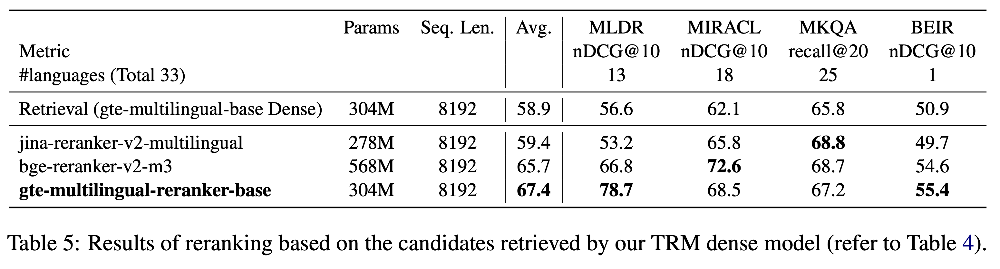

## gte-multilingual-reranker-base

The **gte-multilingual-reranker-base** model is the first reranker model in the [GTE](https://huggingface.co/collections/Alibaba-NLP/gte-models-6680f0b13f885cb431e6d469) family of models, featuring several key attributes:
- **High Performance**: Achieves state-of-the-art (SOTA) results in multilingual retrieval tasks and multi-task representation model evaluations when compared to reranker models of similar size.
- **Training Architecture**: Trained using an encoder-only transformers architecture, resulting in a smaller model size. Unlike previous models based on decode-only LLM architecture (e.g., gte-qwen2-1.5b-instruct), this model has lower hardware requirements for inference, offering a 10x increase in inference speed.
- **Long Context**: Supports text lengths up to **8192** tokens.
- **Multilingual Capability**: Supports over **70** languages.


## Model Information
- Model Size: 306M
- Max Input Tokens: 8192


### Usage
- **It is recommended to install xformers and enable unpadding for acceleration,
refer to [enable-unpadding-and-xformers](https://huggingface.co/Alibaba-NLP/new-impl#recommendation-enable-unpadding-and-acceleration-with-xformers).**
- **How to use it offline: [new-impl/discussions/2](https://huggingface.co/Alibaba-NLP/new-impl/discussions/2#662b08d04d8c3d0a09c88fa3)**


Using Huggingface transformers (transformers>=4.36.0)
```
import torch
from transformers import AutoModelForSequenceClassification, AutoTokenizer

model_name_or_path = "Alibaba-NLP/gte-multilingual-reranker-base"

tokenizer = AutoTokenizer.from_pretrained(model_name_or_path)
model = AutoModelForSequenceClassification.from_pretrained(
    model_name_or_path, trust_remote_code=True,
    torch_dtype=torch.float16
)
model.eval()

pairs = [["中国的首都在哪儿","北京"], ["what is the capital of China?", "北京"], ["how to implement quick sort in python?","Introduction of quick sort"]]
with torch.no_grad():
    inputs = tokenizer(pairs, padding=True, truncation=True, return_tensors='pt', max_length=512)
    scores = model(**inputs, return_dict=True).logits.view(-1, ).float()
    print(scores)

# tensor([1.2315, 0.5923, 0.3041])
```

Usage with infinity:

[Infinity](https://github.com/michaelfeil/infinity), a MIT Licensed Inference RestAPI Server.
```
docker run --gpus all -v $PWD/data:/app/.cache -p "7997":"7997" \
michaelf34/infinity:0.0.68 \
v2 --model-id Alibaba-NLP/gte-multilingual-reranker-base --revision "main" --dtype bfloat16 --batch-size 32 --device cuda --engine torch --port 7997
```

Usage with [Text Embeddings Inference (TEI)](https://github.com/huggingface/text-embeddings-inference):

- CPU:

```bash
docker run --platform linux/amd64 \
  -p 8080:80 \
  -v $PWD/data:/data \
  --pull always \
  ghcr.io/huggingface/text-embeddings-inference:cpu-1.7 \
  --model-id Alibaba-NLP/gte-multilingual-reranker-base
```

- GPU:

```
docker run --gpus all \
  -p 8080:80 \
  -v $PWD/data:/data \
  --pull always \
  ghcr.io/huggingface/text-embeddings-inference:1.7 \
  --model-id Alibaba-NLP/gte-multilingual-reranker-base
```

Then you can send requests to the deployed API via the `/rerank` route (see the [Text Embeddings Inference OpenAPI Specification](https://huggingface.github.io/text-embeddings-inference/) for more details):

```bash
curl https://0.0.0.0:8080/rerank \
  -H "Content-Type: application/json" \
  -d '{
    "query": "中国的首都在哪儿",
    "raw_scores": false,
    "return_text": false,
    "texts": [ "北京" ],
    "truncate": true,
    "truncation_direction": "right"
  }'
```

## Evaluation

Results of reranking based on multiple text retreival datasets



**More detailed experimental results can be found in the [paper](https://arxiv.org/pdf/2407.19669)**.

## Cloud API Services

In addition to the open-source [GTE](https://huggingface.co/collections/Alibaba-NLP/gte-models-6680f0b13f885cb431e6d469) series models, GTE series models are also available as commercial API services on Alibaba Cloud.

- [Embedding Models](https://help.aliyun.com/zh/model-studio/developer-reference/general-text-embedding/): Three versions of the text embedding models are available: text-embedding-v1/v2/v3, with v3 being the latest API service.
- [ReRank Models](https://help.aliyun.com/zh/model-studio/developer-reference/general-text-sorting-model/): The gte-rerank model service is available.

Note that the models behind the commercial APIs are not entirely identical to the open-source models.


## Citation

If you find our paper or models helpful, please consider cite:

```
@inproceedings{zhang2024mgte,
  title={mGTE: Generalized Long-Context Text Representation and Reranking Models for Multilingual Text Retrieval},
  author={Zhang, Xin and Zhang, Yanzhao and Long, Dingkun and Xie, Wen and Dai, Ziqi and Tang, Jialong and Lin, Huan and Yang, Baosong and Xie, Pengjun and Huang, Fei and others},
  booktitle={Proceedings of the 2024 Conference on Empirical Methods in Natural Language Processing: Industry Track},
  pages={1393--1412},
  year={2024}
}
```