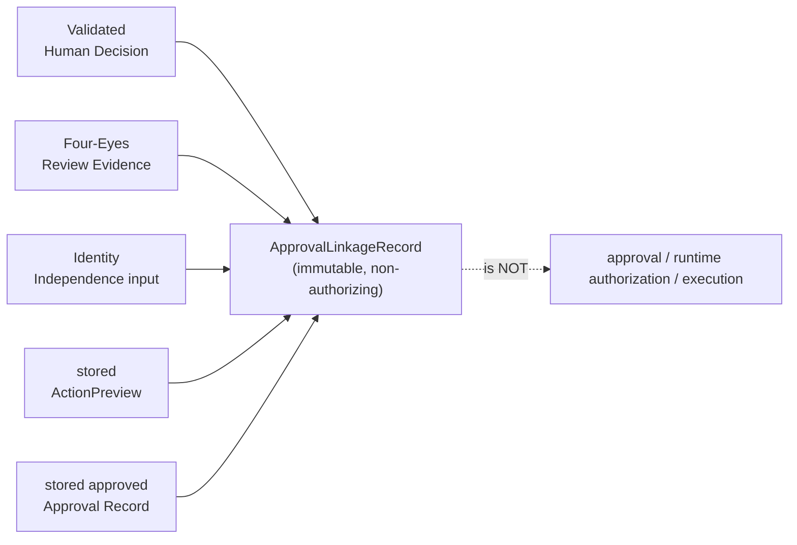
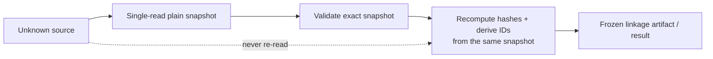
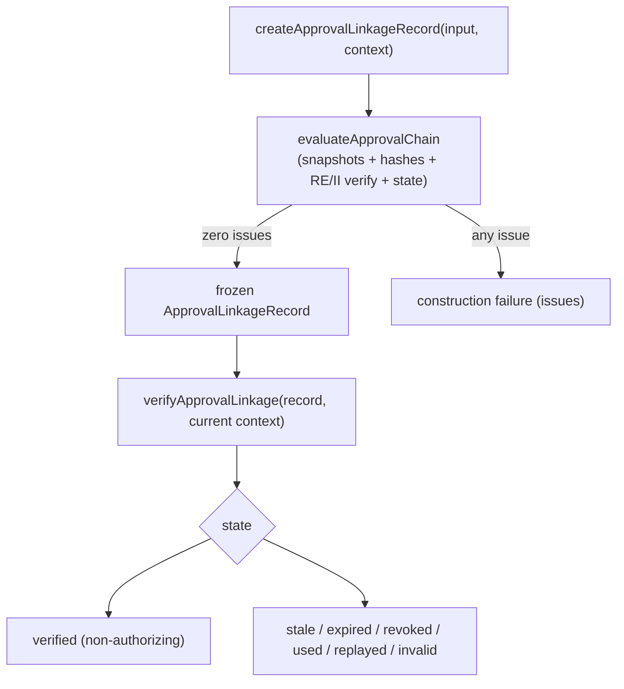

# Approval Chain Linkage Contract

**Status: CANONICAL — CURRENT PRODUCT-INDEPENDENT SAFETY CONTRACT.** Product authority: NONE.

**Phase:** P6-FIX-011 (Issue #144). **Module:** `app/lib/phase6/approvalLinkage/`.

Defines the pure, non-authorizing `ApprovalLinkageRecord`: immutable historical evidence
that, at one instant, one Validated Human Decision, one active Four-Eyes Review Evidence
artifact, one successful internally-evaluated Identity Independence input, one stored
ActionPreview, and one stored approved Approval Record all bound to the same chain.
Grounded in
[`HUMAN_DECISION_RECORD_CONTRACT.md`](./HUMAN_DECISION_RECORD_CONTRACT.md),
[`FOUR_EYES_REVIEW_EVIDENCE_CONTRACT.md`](./FOUR_EYES_REVIEW_EVIDENCE_CONTRACT.md), and
[`CANONICAL_IDENTITY_INDEPENDENCE_CONTRACT.md`](./CANONICAL_IDENTITY_INDEPENDENCE_CONTRACT.md).

---

## 1. Purpose

Review Evidence proves two humans reviewed one exact hash; Identity Independence proves
the actors are distinct canonical users; the ApprovalStore records one approved
ActionPreview. Nothing yet ties all of these to ONE chain. This contract defines a
separate immutable artifact that binds the five source objects together by content hash,
so a later runtime gate (Issue #145) can verify "this exact decision was reviewed by two
independent humans, approved by a distinct authenticated approver, over this exact
preview" as a single verifiable fact — never an assertion assembled from record IDs.

## 2. The five linked source objects



A linkage record is **not** an ApprovalStore record, approval creation, approval status,
runtime authorization, execution permission, persistence, a one-time-use claim, or an
external action. It does not extend `ApprovalRecordRow` or `ActionApprovalRecord`, and it
adds no database migration.

## 3. Hash domains and algorithms

All hashes are **unkeyed SHA-256** over the shared `atra-sorted-json-v1` canonicalization
(key-sorted, `undefined`-stripped, insertion-order independent), via the established
`hashField` leaf. A hash here is an **integrity identifier, never a MAC and never
authorization**. The P7.1 `CanonicalApprovalPayload`/MAC module is deliberately not reused
and not imported.

| Domain constant | Version | Purpose |
| --- | --- | --- |
| _(none — direct `hashField`)_ | — | **Human Decision hash** over the single-read HD snapshot |
| `atra.approval-review-envelope` | `1` | **Review Envelope hash** — what the reviewers reviewed |
| `atra.approval-identity-chain` | `1` | **Identity Chain hash** — the independent-actor binding |
| `atra.approval-linkage` | `1` | **Linkage hash** — the whole chain |

- `hash_algorithm = "sha256"`, `canonicalization_algorithm = "atra-sorted-json-v1"`.
- Every hash is 64 lowercase hexadecimal characters.

### 3.1 Approval Review Envelope V1

Exact canonical fields (no optional/ambiguous fields, no raw target/payload, no role,
email, session, or token):

```text
hash_domain, hash_version, tenant_id, human_decision_id, human_decision_hash,
workunit_id, action_preview_id, action_type, target_hash, payload_hash
```

`review_envelope_hash = SHA-256(canonical ApprovalReviewEnvelopeV1)`. **For an approval
linkage, Review Evidence `reviewed_payload_hash` must equal this envelope hash.** The
envelope binds the Human Decision hash and the exact ActionPreview — it is not merely the
body/payload hash.

### 3.2 Identity Chain V1

Canonical fields bind the successful identity-independence evaluation: `tenant_id`; the
requester / creator / first-reviewer / second-reviewer / approver canonical user IDs; the
creator's source ActionPreview ID; each identity source; each actor kind; and the domain
+ version. **Only the approver ID is stored in the clear on the Linkage Record** (Issue
#144 requirement); every other actor identity is represented only through
`identity_chain_hash` and is never exposed by audit events.

### 3.3 Approval Linkage V1

The linkage payload contains the linkage domain/version, `approval_linkage_id`, tenant,
the Human Decision ID + hash, Review Evidence ID + hash, review-envelope hash, both
attestation IDs, identity-chain hash, WorkUnit ID, ActionPreview ID, Approval Record ID,
action type, target hash, payload hash, approver ID, the preview/review/approval
timestamps, `linked_at`, the derived `linkage_expires_at`, and the algorithm constants.
`linkage_hash = hashField(payload)`. **The payload never includes `linkage_hash` itself**
(a hash never covers itself).

## 4. Single-read snapshot rule



Every source is snapshotted exactly once (P6-FIX-010 precedent): the constructor input,
the context, Human Decision, Review Evidence, ActionPreview, Approval Record, the Identity
Independence input, every nested Canonical Identity, and the six revoke/consume
collections. A hostile getter or `ownKeys` trap fails closed and never escapes. Validation,
hashing, comparison, construction, and audit projection all read the same snapshots.

## 5. Stored ActionPreview integrity

For every construction and verification the module parses `targetPreview` and
`payloadPreview` (both must be plain records), **recomputes** `hashActionTarget` /
`hashActionPayload` from the current content, and requires the recomputed hashes to match
both the stored `ActionPreviewRow` hashes and the Approval Record hashes. The two stored
hash strings are never trusted alone, so a content edit that leaves the stored hash stale
is caught. Malformed JSON, non-object JSON, getter failures, or hash mismatches fail
closed. Raw target/payload content never appears in the Linkage Record, issues, audit
events, or messages.

## 6. Internal Review Evidence and Identity Independence verification

The module calls `verifyFourEyesReviewEvidence` and `verifyIdentityIndependence`
**internally** — it never accepts a caller-supplied result, a `review_verified: true`
flag, an `{ ok: true, issues: [] }` object, or an audit event as proof. The Review
Evidence context is built from server-owned snapshots with `current_payload_hash` set to
the review-envelope hash. Identity Independence additionally requires: expected tenant /
Human Decision / WorkUnit / ActionPreview all match; the stored preview creator is present
and `creator_identity.user_id === ActionPreviewRow.creatorUserId` and
`creator_identity.source_record_id === ActionPreviewRow.id`;
`approver_identity.user_id === ApprovalRecordRow.approvedByUserId`; and the approver is an
authenticated-session identity.

## 7. Lifecycle and expiry precedence



`linkage_expires_at = min(review_expires_at, preview_expires_at, approval_expires_at)`,
derived and never caller-owned. Every expiry is **inclusive-fail**: `evaluated_at >=
boundary` is expired, and `evaluated_at` is supplied (no clock is read). The timeline is
validated deterministically over the pinned ISO-8601 UTC profile: preview creation
precedes preview expiry; review completion precedes review expiry; approval creation does
not follow approval time; approval time precedes approval expiry; `linked_at` is not
before review completion or approval time and is before all active expiry boundaries.

## 8. Revoke / consume / replay model

Because the Approval Record schema has no revoked status, the context carries six
immutable server-owned ID snapshots: `revoked_review_evidence_ids`,
`consumed_review_evidence_ids`, `revoked_approval_ids`, `consumed_approval_ids`,
`revoked_approval_linkage_ids`, `consumed_approval_linkage_ids`. Malformed collections fail
closed; the verifier never mutates them and performs no I/O. Record status and external
snapshots are both checked: a used Approval Record (status `used` or non-empty `usedAt`, or
a consumed-approval ID) → `used`; a revoked source → `revoked`; a consumed Linkage ID →
`replayed`. Persistence and the atomic immediately-before-use claim are **not** implemented
here — they belong to Issue #145.

## 9. Mutation and re-approval matrix

| Change | Requires new … |
| --- | --- |
| Human Decision content | Human Decision, Review Evidence, Approval, Linkage |
| ActionPreview ID | Review Evidence, Approval, Linkage |
| action type | Review Evidence, Approval, Linkage |
| target | Review Evidence, Approval, Linkage |
| payload | Review Evidence, Approval, Linkage |
| Review Evidence | Linkage |
| approver | Approval, Linkage |
| Approval Record | Linkage |
| expiry / revoke / used / replay | old chain can never become valid again |

The historical Linkage Record is **never mutated** to make it valid again; a broken chain
requires a freshly constructed record.

## 10. Stable issue codes

One canonical exported list `APPROVAL_LINKAGE_ISSUE_CODES` (in `validation.ts`):
`invalid_approval_linkage_input`, `approval_linkage_state_missing`,
`approval_linkage_tenant_mismatch`, `approval_linkage_workunit_mismatch`,
`approval_linkage_human_decision_mismatch`, `approval_linkage_review_evidence_mismatch`,
`approval_linkage_identity_mismatch`, `approval_linkage_action_preview_mismatch`,
`approval_linkage_approval_record_mismatch`, `approval_linkage_action_type_mismatch`,
`approval_linkage_target_hash_mismatch`, `approval_linkage_payload_hash_mismatch`,
`approval_linkage_review_envelope_mismatch`, `approval_linkage_approver_mismatch`,
`approval_linkage_hash_mismatch`, `approval_linkage_stale`, `approval_linkage_expired`,
`approval_linkage_revoked`, `approval_linkage_used`, `approval_linkage_replayed`,
`approval_linkage_validation_exception`. Messages are stable `code:field` strings that
never echo IDs from malformed fields, hashes, target/payload, user or session identity,
roles, secrets, tokens, or any raw value.

## 11. Audit redaction

`createApprovalLinkageAuditEvent(linkage, context)` runs `verifyApprovalLinkage`
internally and emits a frozen event kind (`approval_linkage_verified` / `_stale` /
`_replayed` / `_rejected`) carrying ONLY the record identifiers (linkage, Human Decision,
Review Evidence, WorkUnit, ActionPreview, Approval), the state, the boolean outcome, the
allowlisted issue codes, and `evaluated_at`. It **never** exposes target/payload content,
any hash (human-decision / review-envelope / identity-chain / target / payload / linkage),
any actor identity (requester / creator / reviewer / approver), session IDs, roles, email,
tokens, secrets, ApprovalStore contents, or authorization material. Verification and
projection read the same snapshots; malformed input yields a redacted rejected event; no
runtime audit logger is called.

## 12. Existing ApprovalStore responsibility

The live ApprovalStore and the Approval / ActionPreview routes are **unchanged** and
remain defense-in-depth: the route derives hashes from the stored preview, derives the
approver from the authenticated session, binds tenant / WorkUnit / ActionPreview / action
type / target hash / payload hash / status / expiry / used state, and enforces its own
four-eyes creator-vs-approver check. This linkage module is pure and is **not wired** into
any route, store, resolver, adapter, or executor in this patch.

## 13. Issue #145 responsibility

Runtime wiring, the final runtime authorization gate, and the atomic
immediately-before-use one-time-use claim belong to Issue #145. A `verified` linkage is
input to that gate, never a substitute for it.

## 14. Non-authorization statement

Constructing or verifying an Approval Chain Linkage is not approval, not ApprovalStore
approval, not runtime authorization, and not execution permission. Hash equality alone is
non-authorizing; record existence alone is non-authorizing; a caller-supplied boolean or
result object never satisfies linkage; missing, stale, malformed, cross-tenant, expired,
revoked, used, or replayed state fails closed. AI proposes. Rules guard. Humans decide.
