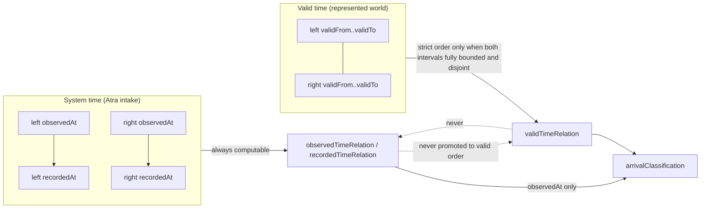
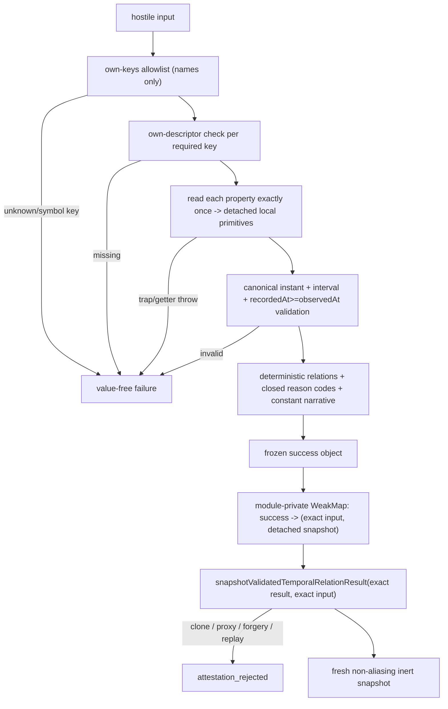

# HTPE H1A Temporal Relation Contract

**Status:** PROPOSED RUNTIME CONTRACT — SHADOW ONLY
**Authority:** NONE
**Production consumer:** NONE
**Persistence:** NOT AUTHORIZED
**H0 dependency:** docs/PROVENANCE_CLAIM_CONTRACT.md (vocabulary only; unchanged by H1A)

## 1. Purpose

H1A is the first bounded runtime slice after the H0 Provenance Claim Contract. It is a
deterministic, read-only, shadow-only evaluator that compares exactly two bounded temporal
observations across four axes: valid time, observation time, recording time, and arrival
order. Its output is evidence about time relations. It is never proof that either
represented proposition is true.

## 2. Exact scope

- `app/lib/phase6/temporalContract/types.ts` — closed types and vocabularies.
- `app/lib/phase6/temporalContract/evaluate.ts` — `evaluateTemporalRelation` and
  `snapshotValidatedTemporalRelationResult`. Imports only `./types`.
- `tests/phase6TemporalContract.test.mts` — permanent tests, inline bounded constants.
- This document.

No existing file changes. No consumer, route, UI, provider adapter, Claim/ClaimBinding
runtime type, migration, schema change or persistence surface is introduced.

## 3. Bounded H1A decisions (adopted by dispatch authorization)

1. H1A is shadow-only and candidate-only; every success carries literal
   `candidateOnly: true`, `shadowOnly: true`, `humanReviewRequired: true`.
2. Only canonical UTC instants `YYYY-MM-DDTHH:mm:ss.sssZ` are accepted.
3. A missing valid-time boundary means **unknown** — never "now", infinity, open-ended
   validity, beginning of time or end of time.
4. Within one observation `recordedAt < observedAt` is invalid and fails closed. This is an
   H1A input-sanity invariant, not a claim about provider timestamps at large.
5. A valid-time order is proven only from two fully bounded, disjoint valid intervals.
6. Observation order and recording order are never promoted into valid-time order.
7. H1A cannot prove a transition or supersession relation; those dimensions are constant
   `not_established`.

## 4. Two axes: valid time versus system time

Valid time is the interval a proposition is represented as holding for. System time is
when Atra observed (`observedAt`) and recorded (`recordedAt`) it. The axes never mix:
system-time comparisons describe Atra's intake order only.

## 5. Null-boundary semantics

`validFrom: null` or `validTo: null` means that boundary is unknown. Any unknown boundary
makes the valid-time relation `unresolved`, and therefore makes arrival classification
`unresolved`. Nothing may resolve an unknown boundary: not the other side's interval, not
system time, not argument position.

## 6. Canonical UTC representation

An instant is accepted only when it matches `YYYY-MM-DDTHH:mm:ss.sssZ` and round-trips
exactly through `new Date(value).toISOString() === value`. Offsets, missing milliseconds,
lowercase `z`, date-only forms, local datetimes, leap-normalized dates, whitespace, numeric
timestamps and `Date` objects are rejected. Nothing is silently normalized; the caller must
supply the canonical value. Canonical four-digit-year strings order lexicographically as
they order chronologically, so comparisons never materialize numeric epochs.

## 7. Interval relations

With all four boundaries known (`validFrom <= validTo` per side, point intervals allowed):

| Condition | `validTimeRelation` |
| --- | --- |
| identical boundaries | `same_interval` |
| `left.validTo < right.validFrom` | `left_before_right` |
| `right.validTo < left.validFrom` | `right_before_left` |
| any other intersection (touching included) | `overlaps` |
| any boundary unknown | `unresolved` |

`observedTimeRelation` and `recordedTimeRelation` are each `left_before_right`,
`right_before_left` or `same_instant`, always computable, always reported separately.

## 8. Arrival classification

Arrival uses `observedAt` only — recording delay is never late-arriving evidence:

- `in_order`: proven valid order and observation order agree.
- `left_late_arriving`: valid time proves `left_before_right`, observation order is
  `right_before_left` (and symmetrically `right_late_arriving`).
- `unresolved`: overlaps, identical intervals, unresolved valid relation, same observed
  instant, and every other case.

## 9. Transition and supersession non-authority

Every success carries literal `transitionEvidence: "not_established"` and
`supersessionOrder: "not_established"`. H1A never infers a transition or supersession from
intervals, system times, late arrival, adjacency, position or shared values, and never
emits changed/unchanged/created/corrected/superseded/newer/older/latest/conflict/
authoritative except inside the two bounded constant sentences stating the relation is not
established.

## 10. Runtime validation and output attestation

Failures use the closed vocabulary `invalid_input`, `input_unreadable`, `unknown_field`,
`missing_field`, `invalid_instant`, `invalid_valid_interval`, `recorded_before_observed`
and never echo a caller key or value. Unknown own properties are rejected by name; their
values are never read. Reason-code order is fixed: valid, observed, recorded, arrival,
`transition_not_established`, `supersession_not_established`. Swapping left and right
produces the exact inverse relations; symmetry is pinned by permanent metamorphic tests.

## 11. Output safety

Success, failure and snapshot outputs contain no tenant, user, provider, source, claim,
subject, actor, authority, title, summary, text, URL, raw payload, timestamp, instant
string, duration, count, index, score, priority, confidence, rank, conflict, approval or
execution data; no numeric value at all; no field name ending in `hash`. There is no LLM
context path and no provider import.

## 12. No production consumer

Nothing imports this module. It is not wired into routes, hopper, formation, ranking,
decomposition, persistence or any candidate pipeline. A permanent test pins this.

## 13. Deferred H1B capabilities

All deferred, none implemented, no placeholder branches: typed provider transition events;
human-attested transition events; claim-specific supersession evidence; immutable revision
identity; correction chains; replay reconstruction; point-in-time claim projection;
provider-specific ordering policy; temporal ClaimBinding; transition authority; conflict
integration; PR #211 consumption. Each remains `PRODUCT_DECISION_REQUIRED` or
`SEPARATE_REVIEWED_CONTRACT_REQUIRED`.

## 14. PR #211 non-dependency

PR #211 (F6A) is blocked and unmerged; H1A neither reads from nor feeds it, and F6A
conflict semantics cannot consume H1A until both have their own reviewed contracts.

## 15. Alternatives considered

- **Claim-id-aware comparison** — rejected: Claim identity is H0 vocabulary only; binding
  ids here would smuggle ClaimBinding runtime ahead of its contract.
- **Open intervals for null boundaries** (null `validTo` = "still valid") — rejected: it
  silently converts absence of evidence into an assertion, the defect class F5 removed.
- **Epoch-millisecond inputs** — rejected: loses canonical-form validation and invites
  loose `Date.parse` acceptance. **Combined systemTimeRelation** — rejected: collapsing
  the observed and recorded axes hides recording delay and invites misuse as arrival
  evidence.

## 16. Review requirements

This contract carries no authority until a separate-session security and repository
architecture review of the exact head, followed by human ratification. Next owner:
`HTPE_H1A_SEPARATE_SESSION_SECURITY_AND_REPOSITORY_ARCHITECTURE_REVIEWER`. The implementer
session is permanently disqualified from independently reviewing this head.
