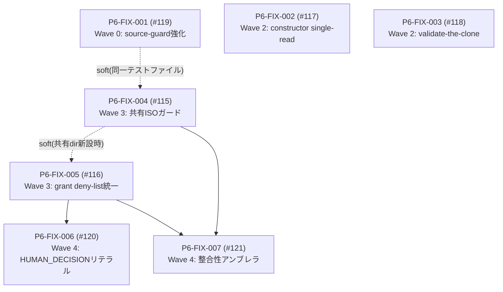

# P6-A0 fabel5 Patch Sequence Plan

**Repository:** haya10hikawa-hub/Atra-workunitOS
**Audit SHA:** d37ff15eab635ca711b8e4310a25a4a1a734f314
**Source:** docs/P6_A0_FABEL5_PHASE6_CROSS_LANE_AUDIT.md(fabel5 Pass A–E)

本計画は計画のみであり、パッチを実装しない。本計画の存在・承認は、runtime許可・approval・execution・Evidence Ledger append・Graph Model write・persistence・production readinessのいずれの許可でもない。全パッチは個別ブランチ・個別explicit human Go・個別PR・CI成功・4監査・人間のマージ判断を必要とする。無関係なIssueカテゴリをPR数削減のために束ねてはならない。

## 1. Issue-to-patch map(Issue対パッチ対応)

| Issue | Patch ID | Sev | Wave | 要旨 |
|---|---|---|---|---|
| #119 | P6-FIX-001 | P3 | 0 | I5Sソースガードneedle強化+getter全フィールド回帰 |
| #117 | P6-FIX-002 | P3 | 2 | precheck constructorのsingle-read化 |
| #118 | P6-FIX-003 | P3 | 2 | recorder/adapterのvalidate-the-clone化 |
| #115 | P6-FIX-004 | P2 | 3 | 共有スカラーガード+ISO-8601意味検証 |
| #116 | P6-FIX-005 | P2 | 3 | FORBIDDEN_GRANT_FIELDS正準スーパーセット統一 |
| #120 | P6-FIX-006 | P3 | 4 | HUMAN_DECISIONリテラル不変条件固定 |
| #121 | P6-FIX-007 | P3/Obs | 4 | 整合性アンブレラ(007a〜eの独立小PR群) |

## 2. Patch IDs(パッチID)

P6-FIX-001(#119)、P6-FIX-002(#117)、P6-FIX-003(#118)、P6-FIX-004(#115)、P6-FIX-005(#116)、P6-FIX-006(#120)、P6-FIX-007(#121、内訳: 007a barrel迂回、007b freeze統一、007c dead定数、007d harnessラベル、007e no_go対称性)。

## 3. Patch dependency DAG(依存DAG)

Wave 1(P0/P1ブロッカー)は空 — 本監査でP0/P1所見はゼロ。低重大度のクリーンアップがブロッキング認可欠陥に先行する構図は存在しない(ブロッキング欠陥自体が不在)。

## 4. Merge waves(マージ順序)

- **Wave 0 — テスト・観測前提:** P6-FIX-001(#119)。実装変更に先立ちガードの検出力を引き上げる。
- **Wave 1 — P0/P1セキュリティ・承認ブロッカー:** なし(該当所見ゼロ)。
- **Wave 2 — シーケンス/状態是正:** P6-FIX-002(#117)∥ P6-FIX-003(#118)。
- **Wave 3 — 依存/アーキテクチャ是正:** P6-FIX-004(#115)∥ P6-FIX-005(#116)。
- **Wave 4 — P2/P3ハードニング・文書:** P6-FIX-006(#120)、P6-FIX-007(#121)。

推奨着手: **P6-FIX-001(#119)**。

## 5. Parallelization plan(並列化計画)

- 並列群G1(Wave 2): P6-FIX-002 ∥ P6-FIX-003(ファイル集合が互いに素: app/constructors系 vs tests/harness系)。
- 並列群G2(Wave 3): P6-FIX-004 ∥ P6-FIX-005(validatorファイルは重なるが編集行が異なる — 衝突回避のため同時着手時はrebase順序を人間が決定。共有dirを新設する場合は004→005のsoft順序)。
- 並列群G3(Wave 4): P6-FIX-006 ∥ P6-FIX-007(007はartifacts/validators.tsを触らない項目から着手)。
- P6-FIX-001はWave 0単独(後続の全実装パッチのガード前提)。

## 6. Per-patch allowed files(パッチ別許可ファイル)

- **P6-FIX-001:** tests/phase6RecorderAuditSummaryEvidenceLedgerNoAppendValidator.test.mts、tests/phase6RecorderAuditSummaryValidators.test.mts
- **P6-FIX-002:** app/lib/phase6/recorderAuditSummary/constructors.ts、tests/phase6RecorderAuditSummaryConstructors.test.mts
- **P6-FIX-003:** tests/harness/phase6/inMemoryPersistenceAuditEvidenceRecorder.mts、tests/harness/phase6/inMemoryPersistenceTargetDecisionAdapter.mts、tests/phase6InMemoryPersistenceAuditEvidenceRecorder.test.mts、tests/phase6InMemoryPersistenceTargetDecisionAdapter.test.mts
- **P6-FIX-004:** 共有ガード1ファイル(app/lib/phase6/shared/ 新設または artifacts/validation.ts)、4 validatorファイル(artifacts/validation.ts、persistenceTargetDecision/validators.ts、persistenceAuditEvidence/validators.ts、recorderAuditSummary/validators.ts)、対応validatorテスト4件
- **P6-FIX-005:** persistenceTargetDecision/validators.ts、persistenceAuditEvidence/validators.ts、recorderAuditSummary/validators.ts、artifacts/validators.ts+validation.ts、対応テスト4件
- **P6-FIX-006:** app/lib/phase6/artifacts/validators.ts、tests/phase6SharedTypesValidators.test.mts(C-2同梱時: linkage validators.ts+テスト)
- **P6-FIX-007:** 項目別(a: linkage types.ts/validators.ts import行のみ / b: 4 resultOf+テスト / c: persistenceAuditEvidence/types.ts・recorderAuditSummary/types.ts / d: tests/harness/phase6/recorderAuditSummaryHarness.mts+テスト / e: recorderAuditSummary/validators.ts+テスト or docのみ)

## 7. Per-patch forbidden files(パッチ別禁止ファイル)

全パッチ共通: migrations/、package.json、package-lock.json、.github/workflows/、UI、Electron、app/lib/persistence/、app/lib/security/、docs/ALPHA_EVIDENCE_LEDGER.md、docs/GRAPH_MODEL.md、P6-I5R契約リスト(linkageのP6-I5R §9固定部)。個別: P6-FIX-001はapp/全域禁止。P6-FIX-002はvalidators/types/index/harness禁止。P6-FIX-003はapp/全域禁止。P6-FIX-004はconstructors/harness/linkage禁止。P6-FIX-005はlinkage契約リスト禁止。P6-FIX-006はpersistenceTargetDecision/persistenceAuditEvidence禁止。P6-FIX-007は項目外ファイル禁止。

## 8. Per-patch tests(パッチ別テスト)

- P6-FIX-001: 追加needleの現ソース非マッチ確認+必須フィールド全件getterループ(既存41/55構造維持)
- P6-FIX-002: 両precheck constructorのgetter-TOCTOU(読取1回計数・precheck値保持)+既存51回帰
- P6-FIX-003: validate→store間で値が変わるgetterの保存内容不変+既存40/30回帰
- P6-FIX-004: 月13・2月30日・時25の拒否×4モジュール+既存有効値回帰
- P6-FIX-005: 正準リスト全項目の専用コード拒否ループ×4モジュール
- P6-FIX-006: 固定対象フィールドの安全でない値の拒否+既存71回帰
- P6-FIX-007: 項目別(isFrozen、ラベル分離、対称規則)
- 全パッチ共通: 全phase6テスト、npm test、alpha:safety-gate、lint、build、cf:build、electron:build:check、ソースガード継続合格

## 9. Per-patch audits(パッチ別監査)

全パッチ: security / test-validation / architecture / product-release の4監査(read-only、逐次、PASS必須)。test-validation監査の変異プローブは本監査(P6-A0)外の各パッチセッション内でのみ許可し、shasum復元検証を必須とする。

## 10. Runtime capability impact(ランタイム能力影響)

全7パッチ: ランタイム能力の追加なし。approval・execution・persistence・D1/SQL・Evidence Ledger・Graph Model・external actionsのいずれにも触れない(P6-FIX-004/005/006はvalidatorの記述的厳格化のみ、P6-FIX-001/003はtests/のみ、P6-FIX-002は内部読取順序のみ、P6-FIX-007は整合性のみ)。ランタイム消費者を導入するパッチはゼロ。

## 11. Required human-Go points(必要なhuman Goポイント)

パッチごとに新規explicit human Goが必須(7+アンブレラ内訳ごと)。特にP6-FIX-006はリテラル固定対象フィールドの仕様確定自体をhuman Goに記録すること。P6-FIX-004の「意味検証の厳格度」(うるう年扱い等)もGoに明記。マージ判断はすべて人間が行う。

## 12. Rollback plan(ロールバック計画)

全パッチは単一PR構成であり、`git revert <merge-commit>` で独立に巻き戻せる。P6-FIX-005→006の順序依存があるため、005をrevertする場合は006を先にrevertする。Wave内並列パッチは相互独立revert可能。revert後は全phase6テスト+npm testで基線復帰を確認する。

## 13. Stop conditions(停止条件)

以下のいずれかで即停止しNo-Go報告: 許可ファイル外の変更が発生 / 禁止capability(runtime消費者・persistence・D1/SQL・append・graph write・ApprovalStore配線・外部アクション)が混入 / いずれかの監査FAIL / CIfail / パッチ間の暗黙依存が発見されDAGが破綻 / P6-I5R契約リストの変更が必要と判明(その場合は契約改定ループを別途human Goで先行)/ 変異プローブ後のshasum不一致。
