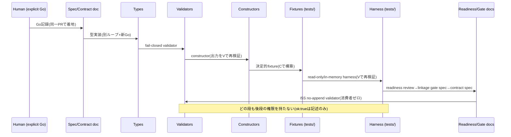
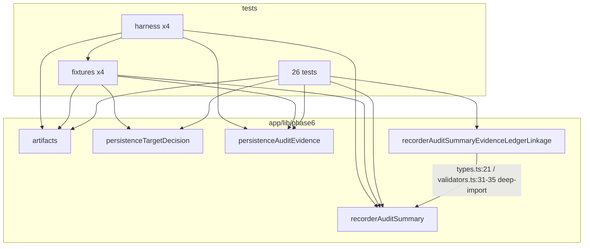

# P6-A0 fabel5 Phase 6 Cross-Lane Audit

本監査報告は記述的であり、いかなる権限も付与しない。監査PASSは、runtime許可・approval・execution・Evidence Ledger append・Graph Model write・persistence・production readinessのいずれの許可でもない。

## 1. Audit snapshot(監査スナップショット)

- repository: haya10hikawa-hub/Atra-workunitOS
- audit SHA: d37ff15eab635ca711b8e4310a25a4a1a734f314(main、PR #113マージコミット)
- tree SHA: 6801bb64d35fc71c7360cc6893fe12ddd5e45c3b
- date: 2026-07-10(開始 06:10:11Z UTC)
- Node: v22.22.3 / npm: 10.9.8
- PR #113: MERGED(2026-07-10T05:12:07Z)、CI validate: pass(2m25s)
- Phase 6チェックサムマニフェスト: 106ファイル(SHA-256、マニフェストハッシュ 67bae45bd1cc2a906da32bc857cbaaeb4d35ac48bf428aeaa4a163b2473aaca0)

## 2. Audit methodology(監査方法論)

fabel5による5つの逐次パス(Pass A: Sequence、Pass B: Security、Pass C: Approval-flow、Pass D: Dependency、Pass E: Adjudication)を、同一の不変コミットに対して読み取り専用で実行した。各パスの前後で `git status --short`・`git diff --exit-code`・106ファイルのチェックサムマニフェスト・HEAD SHAを検証した。並行実行は行わず、変異プローブは全面禁止した。例外事象: Pass Dは実行途中でモデル使用量上限に到達し一時停止した(読み取り13操作のみ実施済み)。停止時点でチェックサム・diff・SHAの完全一致を検証し(変異ゼロ)、上限リセット後に同一エージェントをコンテキスト保持のまま再開して完了した。変異ウィンドウは発生していない。

## 3. fabel5 availability confirmation(fabel5可用性確認)

タスク指定の `fabel5` は、本環境で利用可能なモデル **Fable 5(model ID: claude-fable-5)** と明示的に解釈した(サイレント代替ではない)。事前プローブでエージェント自身が「powered by the model named Fable 5. The exact model ID is claude-fable-5」とシステムプロンプトから自己申告し、監査SHAのHEAD一致とファイル読取(app/lib/phase6/recorderAuditSummaryEvidenceLedgerLinkage/validators.ts 先頭5行の逐語再現)を実証した。全5パスおよびプローブはAgentツールの `model: "fable"` 指定で実行した。オーケストレータ(本セッション)自体もclaude-fable-5で動作。

## 4. Immutable-read procedure(不変読取手続き)

1. main を d37ff15e に固定し、開始時に PR #113 マージ・CI成功・作業ツリー清浄(tracked変更ゼロ)を確認。
2. Phase 6表面106ファイルのSHA-256マニフェストをリポジトリ外(scratchpad)に作成。
3. 各パスは開始時に `git rev-parse HEAD` の一致を自己検証。不一致なら即停止する指示を付与。
4. 各パス完了後にオーケストレータが diff清浄・マニフェスト完全一致・HEAD不変を再検証(プローブ後、Pass A/B/C/D/E後の計6回、全て一致)。
5. 変異プローブ・条件弱化・マーカー注入・ソース書換テスト・ブランチ変更・stash・commitを全パスで禁止。各パスは終了時に「何も変更していない」旨と `git status --short` を報告。
6. 並行セッション由来の汚染対策: 前セッションのP6-I5S変異プローブレース痕跡(`append_allowed`の一時弱化観測)は既知の偽陽性として各パスに周知し、Pass B/Eが現コードの正しさ(linkage validators.ts:212-213)を独立に再確認した。

## 5. Phase 6 scope map(スコープマップ)

- app/lib/phase6/artifacts/(P6-I0系: candidate/draft/evidence/human-decision等の共有型・validator・constructor)
- app/lib/phase6/persistenceTargetDecision/(P6-I5A..E)
- app/lib/phase6/persistenceAuditEvidence/(P6-I5F..J)
- app/lib/phase6/recorderAuditSummary/(P6-I5K..P)
- app/lib/phase6/recorderAuditSummaryEvidenceLedgerLinkage/(P6-I5Q..S)
- tests/phase6*.test.mts(26ファイル)、tests/fixtures/phase6/(4)、tests/harness/phase6/(4)
- docs/P6_I5*.md(explicit human Go 25件+仕様/実装doc)、PHASE6_IMPLEMENTATION_DECISION_RECORD.md、PHASE6_LOOP_ENGINEERING_PLAYBOOK.md、ALPHA_EVIDENCE_LEDGER.md、GRAPH_MODEL.md
- 認可境界の隣接: app/lib/security/(approvalMac、approvalStore、externalActions、auditPersistence)、scripts/alpha-safety-gate.mjs、package.jsonスクリプト
- git履歴: PR #86〜#113のマージ系譜

## 6. Sequence audit(シーケンス監査 — Pass A)

P0–P3欠陥なし。全25ループでexplicit human Goがコードと同一PRで着地し、依存PRのマージ順序は単調(#86→#113)。validate-before-accept/storeが全レーンで成立、blocked/duplicateはfail-closed、リトライ・冪等再送で状態順序は変わらない。書込可能状態はtests/harness配下に限定され、app/lib/phase6は純関数のみ。app/(app/lib/phase6外)からのphase6参照ゼロ。将来D1の誤前提なし(deferredターゲットクラス文字列とdocのみ)。Observations: A-1(no_go対称性が一方向)、A-2(harnessのissueラベル不正確)、A-3(not-found意味論の分岐間差)、A-4(squashマージのため「Go作成がコードより先」はGo文書の自己証明に依拠)。読み取り専用でテスト4本を実行(22/40/41/14 全pass)。

## 7. Security audit(セキュリティ監査 — Pass B)

exploitable-now所見ゼロ。所見: B-1(P3/High: test harnessのvalidate-then-reclone TOCTOU — 保存物が検証物と乖離可能)、B-2(P3/High: precheck付きconstructorの二重読取、single-read宣言と矛盾)、B-3(P3/Med: ISO_8601_UTC正規表現が構造検査のみ、月99通過 — D-1に統合)、B-4(P3/High: I5Sソースガードのneedle欠落 node:fs/import(/require(/computed-global)、B-5(Obs: getter読取回数回帰が単一フィールド)、B-6(Obs: freezeの不統一 — linkageのみ凍結)、B-7(P3/Med: HUMAN_DECISIONのgrant隣接booleanがshape検査のみ)、B-8(Obs: clearAllAuditEventsに呼出者同一性なし — doc/validatorで多重フェンス済み)。健全性確認: 全validatorのfail-closed・非echo(`code:field`のみ)・prototype/symbol密輸不能・phase6のimport隔離(ApprovalStore/kill switch/session/RBAC/audit persistenceへの参照ゼロ)・linkage `append_allowed===false` 検査の健在(validators.ts:213)。P7レーン残余(audit persistence fail-open、unkeyed approval hash、DeepSeek unfenced)は既知・既文書化でありPhase 6の新規所見ではない。

## 8. Approval-flow audit(承認フロー監査 — Pass C)

17段フローマップを作成(§15参照)。phase6(candidate〜linkage candidate)とsecurityレーン(preview〜external action)を接続するコードエッジは存在しない。13境界すべてholds-in-code(§17マトリクス)。バイパス候補: なし。ApprovalStoreはserver解決のtarget/payloadハッシュ+tenant secret MAC+timingSafeEqualで承認をバインドし、phase6の`payload_hash`は正準フィールドもMACも持たない裸の記述的sha256参照であるためApprovalStore要件を構造的に満たせない。所見: C-1(=B-7の承認フロー視点)、C-2(Info: I5S non_authorization_statementが存在検査のみ)、C-3(Info: artifactsのgrant名フィールド拒否が汎用unknown_field — D-2の是正に統合)。曖昧な権限所在: `payload_hash`の同名異義(phase6記述ハッシュ vs ApprovalStore server-boundハッシュ)は現状悪用不能だが配線前にdoc注記が望ましい。

## 9. Dependency audit(依存関係監査 — Pass D)

モジュール間エッジは2本のみ(linkage→recorderAuditSummaryのtypes.ts/validators.ts直接import)。循環なし。app→tests importゼロ、appランタイム消費者ゼロ。重複契約: ISO_8601_UTC×4(D-1/P2)、FORBIDDEN_GRANT_FIELDS乖離13/17/20(D-2/P2、Pass E訂正値)、raw-payload拒否リスト差、snapshot()×7箇所、SHA256_HEX×4等。orphan: DEFERRED/REJECTED_TARGET_CLASSES定数4件(消費者ゼロ)、artifacts/validation.ts共有ツールキット(兄弟未使用)。パッチ独立性: recorderAuditSummaryのみlinkageからのdeep-importにより自由に変更不可。npm testグロブは全26 phase6テストを網羅。alpha-safety-gateの「phase6b/phase6c」識別子は無関係のalpha-D1レーンで名前空間衝突(Obs)。リポジトリ改名の残滓はリモートURLのみ(ツリー外)。

## 10. Cross-pass adjudication(クロスパス裁定 — Pass E)

Pass Eが全候補所見(A-1..4、B-1..8、C-1..3、D-1..10)を対象ファイルの再オープンにより再検証した。統合: B-3+D-1→FINAL-1、D-2+C-3→FINAL-2、B-7+C-1→FINAL-6、B-6+D-7→FINAL-8(b)。訂正: D-2の項目数14/19/22→13/17/20、B-5のgetterテスト所在(tests/phase6RecorderAuditSummaryValidators.test.mts:748-763 test 49 = summary_scope計数、I5S test 32 = summary_id計数)、D-9のテスト数28→26。最終所見8件: FINAL-1(P2/High)、FINAL-2(P2/High)、FINAL-3(P3/High)、FINAL-4(P3/High)、FINAL-5(P3/High)、FINAL-6(P3/High所見・Med是正)、FINAL-7(P3/Med)、FINAL-8(Obs束)。Issue化7ユニット(U1〜U7)。P0/P1はゼロ。

## 11. Rejected false positives(棄却された偽陽性)

- **stale `append_allowed` dead-branch**(前セッションの変異プローブレース痕跡): Pass BとPass Eが独立に app/lib/phase6/recorderAuditSummaryEvidenceLedgerLinkage/validators.ts:212-213 の `if (value !== false)` の健在を再確認し棄却。関連する別セッションのフォローアップ修正タスク(task_7d264d30)は前提が偽陽性であることを本監査でも確認。
- **Pass D初期カウント(14/19/22)**: Pass E再検証で13/17/20に訂正(所見自体は維持、数値のみ訂正)。
- **「保存アダプタが検証しない」との強読み**: B-1は「検証はする(ただし保存物と検証物が別読取)」であることをPass Eが明確化 — fail-open誤読を排除。
- 変異ウィンドウ由来の所見: ゼロ(全パス後チェックサム一致のため発生し得ない)。

## 12. Existing Issues/PRs reused(再利用した既存Issue/PR)

open Issue #3(mock execution model)・#4(dry-run/execution境界doc)、closed Issue #2、open PR #114(Smart Tab docs)・#53(P7 securityレーンのred-team hardening)を照合した。本監査の8所見を追跡する既存Issue/PRは存在しない(重複ゼロ)。P7レーン残余はPR #53系譜およびリポジトリ内文書で既追跡のためIssue化対象外(§7)。

## 13. New Issues created(新規作成Issue)

7件(上限15以内)。すべてPass E裁定済み・重複チェック済み。

| Issue | Unit | Sev/Conf | タイトル要旨 |
|---|---|---|---|
| #115 | U1 | P2/High | ISO_8601_UTC正規表現×4重複・意味検証欠如 |
| #116 | U2 | P2/High | FORBIDDEN_GRANT_FIELDS乖離(13/17/20)+artifacts専用コード不在 |
| #117 | U3 | P3/High | precheck constructorの二重読取(single-read違反) |
| #118 | U4 | P3/High | recorder/adapterのvalidate-then-reclone TOCTOU |
| #119 | U5 | P3/High | I5Sソースガードneedle欠落+getter回帰単一フィールド |
| #120 | U6 | P3/High | HUMAN_DECISION grant隣接booleanのリテラル固定なし |
| #121 | U7 | P3/Med+Obs束 | 整合性アンブレラ(barrel迂回/freeze/dead定数/ラベル/no_go対称) |

## 14. Sequence diagram(シーケンス図)

## 15. Approval-flow diagram(承認フロー図)

```mermaid
flowchart LR
    subgraph P6[Phase 6 — inert・消費者ゼロ]
    sig[signal: 型のみ] --> cand[candidate] --> ev[evidence] --> ptd[persistence target decision] --> pae[persistence audit evidence] --> ras[recorder audit summary] --> lc[ledger linkage candidate<br/>append_allowed=false固定]
    end
    subgraph SEC[securityレーン — 別系統]
    pv[preview] --> as[ApprovalStore<br/>hash+MAC bound] --> ex[execution authorization<br/>kill switch] --> ea[external action] --> al[audit log]
    end
    lc -.->|コードエッジなし<br/>human review必須・自動append禁止| pv
```

## 16. Dependency graph(依存グラフ)

循環なし。app→tests エッジなし。appランタイム→phase6 エッジなし。

## 17. Authorization boundary matrix(認可境界マトリクス)

| 境界 | 判定 | 主要証拠 |
|---|---|---|
| 自動Formal WorkUnit昇格なし | holds-in-code | promotion経路ゼロ、grant名拒否 |
| evidence ≠ truth | holds-in-code | CLAIM_PHRASES拒否・非認可文言強制 |
| human review ≠ ApprovalStore approval | holds-in-code | phase6にApprovalStore import ゼロ |
| human decision ≠ execution permission | holds-in-code | 記録shapeのみ・消費者ゼロ |
| preview ≠ approval | holds-in-code(不在) | phase6にpreview表面なし |
| validation success ≠ authorization | holds-in-code | 結果は{ok,issues}のみ |
| summaries ≠ ledger entries / append不能 | holds-in-code | writer不在(grep 0) |
| ok:true を許可として扱う呼出者なし | holds-in-code | 呼出者はtests/harnessのみ |
| ApprovalStoreハッシュバインド | holds-in-code | server解決hash+MAC+timingSafeEqual |
| 期限切れ/消費済み/不一致/越境tenant拒否 | verify論理はcode、耐久storeはspec-only(defaultDeny) | approvalStore.ts:95-171 |
| kill switch権威 | holds-in-code | default-off、verifyApproval前段 |
| クライアント承認フラグ無効 | holds-in-code | approvedByPm不参照・grant拒否 |
| 間接バイパスなし | holds-in-code | barrel再輸出はtypes/validatorsのみ |

## 18. Finding matrix(所見マトリクス)

| FINAL | 統合元 | Sev | Conf | 区分 | Issue |
|---|---|---|---|---|---|
| FINAL-1 | D-1+B-3 | P2 | High | correctness/dependency | #115 |
| FINAL-2 | D-2+C-3 | P2 | High | security defense-in-depth | #116 |
| FINAL-3 | B-2 | P3 | High | state/contract | #117 |
| FINAL-4 | B-1 | P3 | High | state(test infra) | #118 |
| FINAL-5 | B-4+B-5 | P3 | High | test-weakness | #119 |
| FINAL-6 | B-7+C-1 | P3 | High(所見)/Med(是正) | approval defense-in-depth | #120 |
| FINAL-7 | D-3 | P3 | Med | architecture/doc | #121(a) |
| FINAL-8 | A-1,A-2,A-3,A-4,B-8,B-6/D-7,D-5,D-6,D-8,D-9,D-10,C-2 | Obs | High/Med | consistency/process | #121(束)+報告のみ |

主要証拠パス(Pass E再検証済み・パスレベル):

- FINAL-1: app/lib/phase6/artifacts/validation.ts:64、app/lib/phase6/persistenceTargetDecision/validators.ts:101、app/lib/phase6/persistenceAuditEvidence/validators.ts:131、app/lib/phase6/recorderAuditSummary/validators.ts:129
- FINAL-2: app/lib/phase6/persistenceTargetDecision/validators.ts:174-188、app/lib/phase6/persistenceAuditEvidence/validators.ts:225-243、app/lib/phase6/recorderAuditSummary/validators.ts:195-216、app/lib/phase6/artifacts/validation.ts:104
- FINAL-3: app/lib/phase6/recorderAuditSummary/constructors.ts:7,172,225-247,266-292
- FINAL-4: tests/harness/phase6/inMemoryPersistenceAuditEvidenceRecorder.mts:201-222、tests/harness/phase6/inMemoryPersistenceTargetDecisionAdapter.mts:190-211
- FINAL-5: tests/phase6RecorderAuditSummaryEvidenceLedgerNoAppendValidator.test.mts:483-500,514-535、tests/phase6RecorderAuditSummaryValidators.test.mts:748-763
- FINAL-6: app/lib/phase6/artifacts/validators.ts:357-361
- FINAL-7: app/lib/phase6/recorderAuditSummaryEvidenceLedgerLinkage/types.ts:21、同 validators.ts:31-35
- FINAL-8: 各項目はIssue #121のチェックリストに行番号付きで記載

reachable-now(exploitable)の所見はゼロ。全所見はlatent / test-only / doc-onlyのいずれか。

## 19. Residual risks(残余リスク)

- 字句ソースガードは難読化を検出しない(多層防御の一層に留まる — #119で強化するが完全にはならない)。
- squashマージ下では「Go文書がコードより先に書かれた」ことはGo文書の自己証明に依存する(A-4、プロセス統制)。
- phase6は現在inertだが、将来ループが配線した瞬間に本監査のlatent所見(#115/#116/#120)が実効化する — 配線前のWave消化が前提。
- `payload_hash`の同名異義(phase6記述参照 vs ApprovalStore束縛ハッシュ)は配線時の混同リスク。
- P7レーン残余(audit persistence fail-open、unkeyed approval hash、DeepSeek unfenced)はPhase 6外で未解消のまま存在する(既追跡)。

## 20. What the audit proves(本監査が証明すること)

不変SHA d37ff15eにおいて: 25ループ全てにexplicit human Goが存在し依存順序が保たれていること、Phase 6がimport隔離されたinert表面であること(appランタイム消費者ゼロ・security境界への参照ゼロ)、全validatorがfail-closed・非echoであること、承認チェーンへのコードバイパスが存在しないこと、検出された欠陥がP2以下でありexploitable-now所見がゼロであること、および所見8件が行番号レベルの証拠で再検証済みであること。

## 21. What the audit does not prove(本監査が証明しないこと)

将来配線後の安全性(本監査はinert状態のスナップショット)。難読化されたcapability混入の不在(字句検査の限界)。P7 securityレーン全体の健全性(境界確認のみ、深部再監査はしていない)。実persistence・D1/SQL・Evidence Ledger runtime・Graph Model・本番tenant強制・並行性の挙動(存在しないため)。監査PASSは、runtime許可・approval・execution・append・persistence・production readinessのいずれの許可でもない。

## 22. Go / No-Go

**Go**(監査は完了し、所見はIssue化され、修正は未実装 — 設計どおり)。fabel5使用・同一不変SHA・変異レースなし・全所見独立再検証・重複チェック完了・Issueに証拠とパッチ計画同梱・許可された4ファイルのみ作成、の全条件を満たす。
