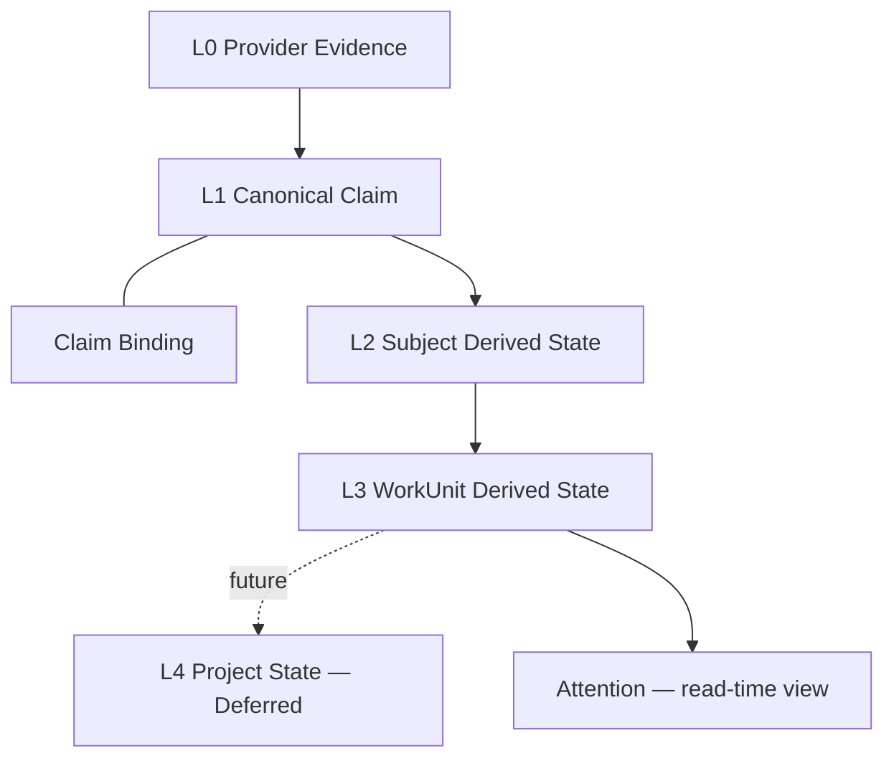
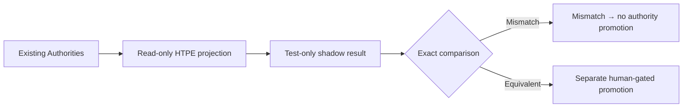

# Provenance Claim Contract

**Status:** PROPOSED CONTRACT — HUMAN REVIEW REQUIRED
**Phase:** HTPE H0
**Runtime implementation:** NONE
**Persistence:** NOT AUTHORIZED
**Authority promotion:** NOT AUTHORIZED
**Formation dependency:** ACTIVE_UNMERGED_CHANGE

**Baseline:** `main` @ `2669f2ea5da052e801cb3a49251c96a34ec20939`.

HTPE = **H**ierarchical **T**emporal **P**rovenance **E**ngine, the planning name for the
proposed claim-and-derived-state layer described here. H0 is its first slice: vocabulary
only — no runtime code, no type, no table, no capability.

## 0. How To Read This Document

Every substantive statement carries one of the following tags. A statement without a tag
inherits the tag of the nearest enclosing tagged block or section heading.

| Tag | Meaning |
| --- | --- |
| `[FACT]` | Verified in this repository at the baseline commit, with an exact path or ref. |
| `[CONTRACT]` | An existing, already-accepted repository authority. Binding today. |
| `[PROPOSAL]` | Proposed by the HTPE plan. **Not accepted.** Not implemented. |
| `[HYPOTHESIS]` | A planning belief that has not been validated against the repository. |
| `[PRODUCT_DECISION_REQUIRED]` | Deliberately unresolved. No default is implied. |
| `[ACTIVE_UNMERGED_CHANGE]` | Exists only on a branch that is not merged to `main`. |

`[PROPOSAL]` never becomes `[CONTRACT]` by appearing in this document, by being merged as
documentation, or by being cited elsewhere. Promotion requires a separate human-gated
review. Conversely, nothing here downgrades an existing repository authority: where this
document and a `[CONTRACT]` source disagree, the `[CONTRACT]` source wins and this document
is the defect. Type shapes are illustrative only, are marked
`[PROPOSAL — NOT IMPLEMENTED]`, and exist nowhere in the codebase.

## 1. Purpose And Non-Goals

### 1.1 Purpose `[PROPOSAL]`

Establish one shared vocabulary, and the authority boundaries around it, for:

- **canonical evidence** — the immutable reference to already-validated source material;
- **canonical claims** — typed propositions asserted about a subject;
- **claim bindings** — the separate records that attach a claim to an actor, an authority,
  a decision scope, a time, or an evidence item;
- **evidence classes** — how a claim came to exist, which is *not* how far it is trusted;
- **dual-axis temporal validity** — valid time and system time as independent axes;
- **deterministic identity and digest naming** — stable identifiers and integrity terms;
- **future derived-state provenance** — regenerable projections that cite their inputs;
- **shadow-only adoption** — the sole authorized early-adoption mode.

Vocabulary is fixed *before* code so that every later HTPE module cites these terms rather
than reinventing them, and names the existing authority it defers to rather than
recomputing it.

### 1.2 Non-Goals — This Document Authorizes None Of The Following `[CONTRACT]`

This list is normative. Each item is forbidden until separately and explicitly approved.

- a second Done Condition evaluator;
- a second grouping authority;
- semantic conflict detection;
- supersession-cycle conflict promotion;
- persistence of any kind;
- any migration;
- any `schemaVersion` change;
- dynamic rule loading;
- query-plan persistence;
- a graph database;
- embeddings;
- LLM authority over any decision;
- approval or execution.

## 2. Canonical Layering

### 2.1 The Layers `[PROPOSAL]`

| Layer | Name | Canonical? | Status |
| --- | --- | --- | --- |
| L0 | Provider Evidence | Canonical | `[PROPOSAL]` |
| L1 | Canonical Claim + Claim Binding | Canonical | `[PROPOSAL]` |
| L2 | Subject Derived State | Derived, regenerable | `[PROPOSAL]` |
| L3 | WorkUnit Derived State | Derived, regenerable | `[PROPOSAL]` |
| L4 | Project State | — | `[PRODUCT_DECISION_REQUIRED]` — DEFERRED |
| — | Attention | Read-time query view | `[PROPOSAL]` — not a stored layer |



### 2.2 Layering Rules `[PROPOSAL]`

1. **L0 and L1 are canonical.** They must never be discarded, compacted away, or
   overwritten because a derived cache exists. A derived layer is an optimization; losing
   it must never lose information.
2. **L2 and L3 are regenerable.** Any stored derived state must be reproducible from its
   cited claims plus an exact rule version. If it is not reproducible, it is a defect, and
   the system fails closed rather than trusting the cache.
3. **Attention is a query result**, computed at read time from L3. It is not a canonical
   layer and — in this proposal — is not stored. Whether it is ever materialized is
   `[PRODUCT_DECISION_REQUIRED]` (§17).
4. **No derived layer may become a competing source of truth.** A derived state may not be
   cited as evidence for a claim, may not feed back into L1, and may not be used to
   overrule the canonical claims it was computed from.
5. **Layer direction is one-way.** L0 → L1 → L2 → L3. There is no upward write path.

## 3. Provider Evidence (L0)

### 3.1 Definition `[PROPOSAL]`

`ProviderEvidence` is an **immutable, bounded reference to already-validated source
material**. It is a pointer plus capture metadata — never a copy of the provider payload.

*Already-validated* is load-bearing: L0 performs no source validation, it references
material a validating authority already accepted — on the formation branch, F1A
(`app/lib/application/formation/sourceContract.ts`) `[ACTIVE_UNMERGED_CHANGE]`.

### 3.2 Requirements `[PROPOSAL]`

- **Provider-native source identity** — the provider's own identifier for the object,
  retained verbatim, never re-minted by HTPE.
- **Validated evidence reference** — a reference to material that already passed validation.
- **Capture/observation metadata** — when the material was observed and recorded (§7).
- **No raw provider payload.** Message bodies, titles, HTML, and file contents are not
  carried. This is not a style preference: `P0_FORBIDDEN_CONTEXT_KEYS` in
  `app/lib/application/safety/p0Policy.ts` already forbids `rawPayload`, `rawBody`, `body`,
  `html`, `message`, `text`, and `fileContent` in a context pack `[FACT]`.
- **No tenant id in frontend-visible shapes.** `tenantId` is itself a forbidden context key
  in the same list `[FACT]`. It lives in a server-side envelope only (§4.3).
- **No authority derived from provider identity.** That a record came from a given provider
  establishes nothing about who may decide anything (§6.4).
- **No trust upgrade caused by persistence or serialization.** Writing a record down, or
  round-tripping it through JSON, does not make it more true.

### 3.3 Attestation Versus Digest `[PROPOSAL]`

Two distinct integrity mechanisms are in play, and they are **additive, never substitutes**:

- **Process-local attestation** — an in-process gate that admits only the *exact object* a
  validating authority produced, e.g. the formation branch's
  `attestValidatedGroupingComparison` `[ACTIVE_UNMERGED_CHANGE]`.
- **Persistent digest verification** — a future, separately gated content digest that
  survives a process boundary.

**Normative:** a digest must never weaken an exact-object in-process attestation gate. A
future digest check is an *additional* requirement layered on top; it may never be accepted
as a reason to admit an object the in-process gate would have rejected. Reconstructing an
equal-looking object is not the same as holding the attested one.

## 4. Canonical Claim (L1)

### 4.1 Definition `[PROPOSAL]`

A **Canonical Claim** is an immutable, typed proposition asserted about one subject, carrying
its own evidence class and its own temporal validity. A claim records *that something was
asserted*, never *that something is true*.

### 4.2 Proposed Shape

```text
[PROPOSAL — NOT IMPLEMENTED]

Claim {
  claimId                 ClaimId
  tenantId                TenantId          // server-side envelope only
  subjectRef              SubjectRef
  predicate               ClaimPredicate    // closed union
  value                   ClaimValue        // predicate-specific, closed
  evidenceClass           EvidenceClass     // closed union, §5
  evidenceRef             EvidenceRef       // L0 reference
  validFrom               Instant | null
  validTo                 Instant | null
  observedAt              Instant
  recordedAt              Instant
  actorBindingRef         ClaimBindingRef | null
  authorityBindingRef     ClaimBindingRef | null
  decisionScopeBindingRef ClaimBindingRef | null
  supersedesClaimRef      ClaimId | null
  schemaVersion           string
  ruleVersion             string | null
}
```

### 4.3 Field Contract

| Field | Purpose | Authority | Visibility | Req. | Validation | Class |
| --- | --- | --- | --- | --- | --- | --- |
| `claimId` | Stable identity | HTPE (content-derived) | Internal | Required | Prefixed `claim_`, content-derived, deterministic (§9) | `[PROPOSAL]` |
| `tenantId` | Isolation envelope | Request context only | **Server-side only** | Required | Never caller-supplied; never in a context pack or frontend shape | `[PROPOSAL]` |
| `subjectRef` | What the claim is about | Canonical object key | Internal | Required | Collision-safe canonical key (§4.4) | `[PROPOSAL]` |
| `predicate` | Which proposition | Closed union | Internal | Required | Member of a closed, reviewed vocabulary | `[PROPOSAL]` |
| `value` | The asserted content | Predicate-specific | Internal | Required | Closed per predicate; no unbounded free text (§4.5) | `[PROPOSAL]` |
| `evidenceClass` | How the claim arose | Closed union | Internal | Required | Member of §5; **not** a trust level | `[PROPOSAL]` |
| `evidenceRef` | L0 linkage | L0 | Internal | Required | Must resolve to an existing L0 record | `[PROPOSAL]` |
| `validFrom` | Valid-time start | Source-asserted | Internal | Optional | Absent means unknown, never "now" (§7) | `[PROPOSAL]` |
| `validTo` | Valid-time end | Source-asserted | Internal | Optional | Absent means open or unknown — the two are distinguished by predicate | `[PROPOSAL]` |
| `observedAt` | System-time observation | Atra | Internal | Required | When Atra saw it | `[PROPOSAL]` |
| `recordedAt` | System-time record | Atra | Internal | Required | When Atra wrote it; `recordedAt >= observedAt` | `[PROPOSAL]` |
| `actorBindingRef` | Who | Binding record (§6) | Internal | Optional | Absence = unbound actor, never a default | `[PROPOSAL]` |
| `authorityBindingRef` | Who may decide | Binding record (§6) | Internal | Optional | Absence = unbound authority; never inferred from provider | `[PROPOSAL]` |
| `decisionScopeBindingRef` | Scope of decision | Binding record (§6) | Internal | Optional | Taxonomy is `[PRODUCT_DECISION_REQUIRED]` | `[PROPOSAL]` |
| `supersedesClaimRef` | Claimed predecessor | Source or human | Internal | Optional | A *claim about order*, not proof of order (§8) | `[PROPOSAL]` |
| `schemaVersion` | Shape version | HTPE | Internal | Required | Changing it is a gated event (§14) | `[PROPOSAL]` |
| `ruleVersion` | Deriving rule | Rule registry | Internal | Required iff `evidenceClass = derived_rule` | Exact version string | `[PROPOSAL]` |

### 4.4 Identity Requirements `[PROPOSAL]`

- **`claimId` is content-derived and prefixed.** Two identical assertions from the same
  evidence under the same rule version yield the same id; nothing else does.
- **`subjectRef` is a collision-safe canonical object key.** Naive concatenation of a
  provider name and a provider object id is not collision-safe when either part may contain
  the separator. The formation branch already solves exactly this with
  `canonicalObjectKey(provider, sourceObjectId)` in
  `app/lib/application/formation/goalIdentity.ts` `[ACTIVE_UNMERGED_CHANGE]`. HTPE must
  reuse that canonicalization rather than write a second one (§10).
- **`predicate` is a closed union**, reviewed as a vocabulary change.
- **`value` is predicate-specific and closed.**

### 4.5 Free Text Is Not A Claim Value `[PROPOSAL]`

Free text must not be introduced as an unbounded generic claim value. A `value` of
"whatever the provider said" reintroduces raw payload through the back door, defeats the
`P0_FORBIDDEN_CONTEXT_KEYS` boundary `[FACT]`, and makes downstream comparison
non-deterministic. A human sentence that genuinely matters belongs to the validated L0
source material under existing intake and redaction rules — not to a claim value.

### 4.6 Predicate Vocabulary Is Not Settled `[PRODUCT_DECISION_REQUIRED]`

This document does **not** assert a final predicate vocabulary. The repository does not
establish one at the baseline commit. Any concrete predicate list is a later, separately
reviewed decision. Naming a predicate in discussion does not accept it.

## 5. Evidence Class

### 5.1 Definition And The Central Boundary `[PROPOSAL]`

`evidenceClass` records **how a claim came to exist**. It is a closed union.

**Normative:** evidence class is *not* trust, and it is *not* authority.
`docs/PROVENANCE_MODEL.md` §9 already establishes exactly this distinction for provenance —
source type records *where* information came from, trust level records *how far* it has been
verified `[CONTRACT]`. `evidenceClass` is the claim-level analogue of source type. It does
**not** replace, rename, or override `source_type` or `trust_level`, which remain owned by
`docs/PROVENANCE_MODEL.md` §5 and §6.

### 5.2 The Closed Proposed Vocabulary `[PROPOSAL]`

| Value | Origin | Admissible use | May affect state directly? | Human confirmation |
| --- | --- | --- | --- | --- |
| `attested_source` | Validated source material | Strongest input to deterministic rules | Only via a rule that owns the decision | Not by itself |
| `asserted_provider` | A provider/source asserts the relation | Recall and review | No | For any promotion to fact |
| `derived_rule` | A deterministic rule over other claims | Deterministic derivation | Only within the rule's own authority | No, if the rule is already gated |
| `inferred_llm` | Model inference | Proposal only | **Never** | **Always** |
| `human_input` | A person asserted it | Authoritative for what the person asserted | Within that person's granted authority | N/A |
| `feedback_signal` | Feedback about a suggestion | Tuning, ranking review | **Never** | Yes, for any factual promotion |

### 5.3 Per-Class Boundaries `[PROPOSAL]`

- **`attested_source`** records that source material was validated. It does **not**
  automatically establish claim-specific authority. That a calendar event was validly read
  says nothing about who may close a Done Condition.
- **`asserted_provider`** records that an assertion was made. Assertion is not canonical
  truth. This mirrors the existing treatment of `third_party_text`, which "is never promoted
  to 'true' by default" (`docs/EVIDENCE_STANDARD.md` §7, `docs/PROVENANCE_MODEL.md` §9)
  `[CONTRACT]`.
- **`derived_rule`** must cite the **exact rule id, rule version, and input claims**. A
  derived claim that cannot name its inputs is not reproducible and is therefore invalid.
- **`inferred_llm`** is always proposal-only and is never promoted automatically, under any
  confidence value. Confidence is not evidence.
- **`human_input`** must remain attributable and must not rewrite source history. A person
  may add a correcting claim; a person may not edit or delete the superseded one (§7.4).
- **`feedback_signal`** describes feedback *about a suggestion* — it is a fact about a
  reaction, not a fact about the world. Feedback that a suggestion was unhelpful is never
  evidence that the underlying proposition is false.

### 5.4 The Escalation Prohibition `[CONTRACT]`

No evidence class may imply **approved**, **complete**, **executable**, or
**authoritative** without the existing authority gate that owns that decision. Evidence
class is an input to those gates, never a substitute for them.

## 6. Claim Binding

### 6.1 Definition `[PROPOSAL]`

A **ClaimBinding** is a **separate immutable record** that attaches a claim to one
dimension. Bindings are deliberately *not* fields inlined on the claim, because a binding
carries its own evidence class and its own justification: knowing *that* an actor is bound
is useless without knowing *on what basis*.

```text
[PROPOSAL — NOT IMPLEMENTED]

ClaimBinding {
  bindingId      ClaimBindingId   // prefixed `cbind_`
  tenantId       TenantId         // server-side envelope only
  claimId        ClaimId
  kind           BindingKind      // closed union, §6.2
  targetRef      BindingTargetRef
  basis          BindingBasis     // what justifies the binding
  evidenceClass  EvidenceClass    // §5
  recordedAt     Instant
  schemaVersion  string
}
```

### 6.2 Binding Kinds `[PROPOSAL]`

| Kind | Target category | Acceptable basis | Forbidden basis | Absence semantics |
| --- | --- | --- | --- | --- |
| `subject` | Canonical object key | Canonical key equality | Title or lexical similarity | Claim has no subject → invalid |
| `actor` | Identity record | Resolved identity | Display-name equality | Actor unbound — not "unknown person", not "the author" |
| `authority` | Authority grant | Explicit granted authority | Provider identity; source role alone | Authority unbound — no decision may be taken |
| `decision_scope` | Scope record | Explicit scope | Inferred from container | Scope unbound; taxonomy undecided (§17) |
| `temporal` | Instant or interval | Typed temporal contract | Timestamp proximity; array order | Time unbound — never "now" |
| `evidence` | L0 record | Validated reference | Co-presence in one source | Evidence unbound → claim invalid |

### 6.3 The Governing Rule `[PROPOSAL]`

> A claim without a binding is **unbound** for that dimension.
> **Absence must remain absence.** No default binding may be synthesized.

This is the single most important rule here: an unbound dimension is a first-class,
reportable state, never filled in with a plausible guess, a fallback, or "the only
candidate available".

### 6.4 Explicitly Forbidden Bases `[CONTRACT]`

Each of the following is forbidden as the basis for a binding. Each corresponds to a real
defect shape already identified in this repository's formation work.

1. **Display-name equality as actor identity.** Two people may share a display name; one
   person may have several. A name is not an identity.
2. **Provider identity as authority.** That GitHub reported it does not make GitHub the
   authority over the decision.
3. **Same-source co-presence as semantic relation.** Two things mentioned in one message are
   not thereby related.
4. **Timestamp proximity as Goal identity.** Two events near in time are not the same Goal.
5. **`SourceRole` alone as contradiction authority.** The `FORMATION_SOURCE_ROLES` vocabulary
   (`app/lib/application/formation/workUnitFormationAggregate.ts`)
   `[ACTIVE_UNMERGED_CHANGE]` classifies a member's role in a formation; it does not
   establish that one member contradicts another.
6. **Current status coexistence as event or conflict.** That two claims currently hold
   different statuses is not an event, not a transition, and not a conflict. This is the F5
   correction shape: coexistence, current state, and another factor's uncertainty never
   establish a relation `[ACTIVE_UNMERGED_CHANGE]`.
7. **`sourceObjectId` reuse as proof of immutable revision identity.** A provider reusing an
   object id does not prove the object is the same immutable revision; providers mutate
   objects in place.

## 7. Two-Axis Temporal Model

### 7.1 The Two Axes `[PROPOSAL]`

| Axis | Fields | Meaning |
| --- | --- | --- |
| **Valid time** | `validFrom`, `validTo` | When the claim is asserted to hold **in the represented world**. |
| **System time** | `observedAt`, `recordedAt` | When **Atra** observed or recorded the claim. |

The axes are independent. Neither may be derived from the other. A claim may be recorded
long after it became valid, and a claim may be recorded about a future validity.

### 7.2 `updatedAt` Is Forbidden `[PROPOSAL]`

This contract does not define and must not use a generic `updatedAt`. The name is ambiguous
across both axes — it silently conflates "the world changed" with "we noticed" — and it
implies mutation of an immutable record. Claims are appended, never updated.

### 7.3 Required Temporal Situations `[PROPOSAL]`

| Situation | Representation |
| --- | --- |
| **Current-state claim** | `validFrom` set, `validTo` absent-open. Not a transition. |
| **Meaningful update** | A new claim whose value differs, with its own valid time. Matches the existing F5 factor `meaningful` in `STATE_PREDICTION_UPDATE_FACTORS` `[ACTIVE_UNMERGED_CHANGE]`. |
| **Unchanged** | A new observation with the same value; system time advances, valid time does not. Matches F5's `unchanged`. |
| **Late-arriving evidence** | `observedAt` is late; `validFrom` remains the world time. Recording order is irrelevant to validity. |
| **Out-of-order evidence** | Two claims arrive in the reverse of their valid order. Arrival order confers nothing (§7.5). |
| **Correction** | A new claim asserting the corrected value, referencing what it corrects. The original is retained. |
| **Superseded claim** | Recorded via `supersedesClaimRef` as a *claim about order*, subject to §8. |
| **Point-in-time reconstruction** | Query: claims whose valid interval contains time *T*, as known at system time *S*. |
| **Replay** | Re-deriving L2/L3 from the same claims and the same `ruleVersion`, yielding identical output. |

### 7.4 Immutability And Correction `[PROPOSAL]`

Correction is additive. A correcting claim is a new record; the corrected claim is retained
and remains visible. This preserves the existing repository principle that transformation
history is "appended, never overwritten" (`docs/PROVENANCE_MODEL.md` §7) `[CONTRACT]`, and
that contradictions stay visible "with both sides' origins intact (never silently merged)"
(`docs/PROVENANCE_MODEL.md` §10) `[CONTRACT]`.

### 7.5 The Ordering Boundary `[CONTRACT]`

**No temporal ordering is inferred merely from array order, arrival order, provider
identity, `sourceObjectId` reuse, or timestamp proximity.**

A missing transition remains **missing evidence**. It is not an inferred transition, not a
zero-length interval, and not a reason to assume continuity. Where the ordering evidence is
absent, the correct output is an explicit unresolved dimension (§11).

## 8. Supersession Policy Boundary

### 8.1 What H0 Does Not Decide `[PRODUCT_DECISION_REQUIRED]`

**The H0 contract does not yet decide which provider signals prove a strict supersession
order.** Providers expose sequence numbers, edit timestamps, revision ids, and thread
positions with materially different guarantees, and no repository authority at the baseline
commit establishes which of them proves order.

The exact provider ordering policy is classified `[PRODUCT_DECISION_REQUIRED]`.

### 8.2 Rules Until A Temporal-Order Contract Exists `[CONTRACT]`

Until a **separately reviewed temporal-order contract** exists:

- supersession records are **claims or observations**, not proven order;
- an **inferred** supersession requires human confirmation;
- a **cycle** may be surfaced as *requiring review*;
- **a cycle alone must not promote a WorkUnit to `conflict`**;
- **latest-wins is forbidden**;
- **authority-wins is forbidden** without claim-specific authority;
- **timestamp-wins is forbidden** without a typed temporal binding;
- **role mutation is forbidden** — resolving an ordering dispute by rewriting a member's
  `SourceRole` is not a resolution;
- **automatic resolution is forbidden**.

### 8.3 Relationship To PR #211 `[ACTIVE_UNMERGED_CHANGE]`

PR #211 (`feat/f6-formation-findings`, head `f84dd017`) is **OPEN, DRAFT, BLOCKED, and NOT
AN AUTHORITY**. It is not modified by this document and this document does not review it.

One boundary must nonetheless be stated explicitly, because the vocabulary overlaps:

> **PR #211 must not use this H0 document as proof that its current cycle-to-conflict
> behavior is authorized.**

This H0 document authorizes no cycle-to-conflict promotion (§8.2, §1.2). Note also that
`conflict` is a **reserved** formation state at the plan branch:
`RESERVED_FORMATION_STATES = ["conflict"]`, excluded from `F4_EMITTABLE_STATES`
(`app/lib/application/formation/states.ts`) `[ACTIVE_UNMERGED_CHANGE]`. Reserving a state
is not the same as authorizing a path into it. Whether any input may produce `conflict`
remains a separate, unresolved decision.

## 9. Identity And Digest Naming

### 9.1 Proposed Identifier Prefixes `[PROPOSAL]`

| Prefix | Applies to |
| --- | --- |
| `claim_` | Canonical Claim |
| `cbind_` | Claim Binding |
| `subj_` | Subject |
| `sugg_` | Suggestion candidate |

### 9.2 Digest Terms `[PROPOSAL]`

| Term | Meaning |
| --- | --- |
| `claimDigest` | Deterministic digest over a claim's canonical serialization. |
| `inputDigest` | Deterministic digest over the exact inputs to a derivation. |
| `integrityRef` | A reference to a stored integrity value. |

### 9.3 The `hash` Naming Prohibition `[CONTRACT]`

**No proposed field name in this contract may contain `hash`, in any casing.** Field names
ending in `Hash` or `hash` are forbidden for this proposed contract; the digest-oriented
terms in §9.2 are used instead.

This is not cosmetic. `isForbiddenContextKey` in
`app/lib/application/safety/p0Policy.ts` returns `true` for any key whose normalized form
ends with `hash`, and `P0_FORBIDDEN_CONTEXT_KEYS` lists `hash`, `targetHash`, and
`payloadHash` explicitly `[FACT]`. Such a field would be structurally barred from any LLM
context pack; the `Digest` terms keep the vocabulary usable without weakening that policy.
This paragraph discusses that policy and introduces no such field name.

### 9.4 Digest Requirements `[PROPOSAL]`

- **canonical deterministic serialization** — a fixed field order and encoding, never
  `JSON.stringify` over an unordered object;
- **tenant-scoped identity where needed** — identity must not collide across tenants;
- **constant-time verification** where a keyed digest is later introduced;
- **no digest in an LLM context** (§9.3, §13);
- **no digest as an authority signal** — matching a digest proves byte equality, not
  permission;
- **no digest as a replacement for attestation** (§3.3);
- **no raw payload contribution** to a digest unless separately authorized — digesting a
  raw body reintroduces the body.

### 9.5 Keyed Digest Scheme `[PROPOSAL]`

H0 does **not** select an exact persistent HMAC scheme. The repository has established work
on keyed approval digests (`docs/APPROVAL_HASH_KEYING_PLAN.md`,
`docs/APPROVAL_MAC_ROLLOUT_CONTRACT.md`, `docs/TENANT_SECRET_PROVIDER_DESIGN.md`) `[FACT]`,
but it governs approvals, not claims, and does not extend to a claim ledger by implication.
Any claim-digest scheme is `[PROPOSAL]` and requires its own review.

## 10. Authority Non-Duplication

Every row below is an authority that already exists. HTPE **consumes** these outputs; it
does not recompute them. Where a row says **HTPE NEVER RE-DERIVES THIS AUTHORITY**, a later
HTPE module that recomputes it is a defect regardless of whether its answer agrees.

| # | Authority | Location | HTPE may copy | HTPE must never recompute | On `main`? |
| --- | --- | --- | --- | --- | --- |
| 1 | `evaluateDoneConditionDraft` | `app/lib/application/decomposition/doneConditionGate.ts` | Its status output as a claim input | Done Condition status. **HTPE NEVER RE-DERIVES THIS AUTHORITY** | Yes |
| 2 | `detectForbiddenPromotion` | `app/lib/application/decomposition/promotionRules.ts` | Its reason list | Promotion legality | Yes |
| 3 | `runRuleGate` | `app/lib/application/decomposition/ruleGate.ts` | Its gate result | Rule-gate outcome | Yes |
| 4 | `p0Policy` forbidden vocabulary | `app/lib/application/safety/p0Policy.ts` | The exported lists, by import | The key/text policy. **HTPE NEVER RE-DERIVES THIS AUTHORITY** | Yes |
| 5 | `scanLlmContextExclusions` | `app/lib/application/llmContext/exclusionScanner.ts` | Its scan result | Exclusion scanning | Yes |
| 6 | `buildLlmContextPack` | `app/lib/application/llmContext/buildLlmContextPack.ts` | Its pack output | Context-pack assembly. **HTPE NEVER RE-DERIVES THIS AUTHORITY** | Yes |
| 7 | `projectSafeWorkUnitCandidate` | `app/lib/application/candidate/safeWorkUnitCandidate.ts` | Its projected candidate | The safe-projection chokepoint. **HTPE NEVER RE-DERIVES THIS AUTHORITY** | Yes |
| 8 | `evaluateLlmProviderBoundary` | `app/lib/application/llmProvider/llmProviderBoundary.ts` | Its verdict | Provider-boundary evaluation | Yes |
| 9 | `evaluateRealLlmReadiness` | `app/lib/application/llmReadiness/realLlmReadinessGate.ts` | Its readiness result | Real-LLM readiness | Yes |
| 10 | `validateMockDecompositionLlmOutput` | `app/lib/application/decomposition/mockDecompositionLlm.ts` | Its validation result | LLM output validation | Yes |
| 11 | `resolveLlmProviderConfig` / `resolveLlmProvider` | `app/lib/llm/providerConfig.ts` | The resolved config | Provider resolution | Yes |
| 12 | `calculatePriorityScore` / `clampScore` | `app/lib/llm/scoreWorkUnit.ts` | The score | Ranking. **HTPE NEVER RE-DERIVES THIS AUTHORITY** — no second ranking formula | Yes |
| 13 | `SAFE_ERROR_CODES` | `app/lib/security/safeErrors.ts` | The codes, by import | The safe-error vocabulary | Yes |
| 14 | `classifyDecompositionCandidate` | `app/lib/application/decomposition/decompositionClassifier.ts` | Its classification | Decomposition classification | Yes |
| 15 | `deriveAtraWorkspaceViewModel` | `app/lib/application/atra/deriveAtraWorkspaceViewModel.ts` | Its view model | Workspace projection | Yes |
| 16 | F1A source validation | `app/lib/application/formation/sourceContract.ts` | Attested validated source | Source validation | **No — plan branch only** |
| 17 | F1B Goal / Done Condition adaptation | `app/lib/application/formation/goalDoneConditionAdapter.ts`, `goalIdentity.ts` | `canonicalObjectKey`, the adapted candidate | Goal identity; canonical object key. **HTPE NEVER RE-DERIVES THIS AUTHORITY** | **No — plan branch only** |
| 18 | F1C membership and `SourceRole` | `app/lib/application/formation/workUnitFormationAggregate.ts` | Attested formation result | Membership; `SourceRole`. **HTPE NEVER RE-DERIVES THIS AUTHORITY** | **No — plan branch only** |
| 19 | F3 grouping verdict | `app/lib/application/formation/grouping.ts` | The attested comparison | Grouping verdicts. **HTPE NEVER RE-DERIVES THIS AUTHORITY** | **No — plan branch only** |
| 20 | F4 state mapping | `app/lib/application/formation/states.ts` | The subject state | State mapping; the state vocabulary | **No — plan branch only** |
| 21 | F5 state-prediction factors | `app/lib/application/formation/statePrediction.ts` | The prediction result and its factors | Prediction factors | **No — plan branch only** |
| 22 | F6 findings | `app/lib/application/formation/findings.ts` | **Nothing yet** | Findings — **not an accepted authority** | **No — PR #211 only, BLOCKED** |

**Row 22 is not an accepted authority.** F6 authority may not be treated as accepted while
PR #211 remains a blocked Draft (§8.3). It appears here to be explicitly excluded, not to be
relied on.

## 11. Derived State Boundary (L2 / L3)

### 11.1 Definition `[PROPOSAL]`

**DerivedState** is a regenerable projection over claims. It is a cache with provenance,
never a source of truth.

```text
[PROPOSAL — NOT IMPLEMENTED]

DerivedState {
  stateId               StateId
  tenantId              TenantId        // server-side envelope only
  layer                 "subject" | "workunit"
  subjectKey            SubjectRef
  sourceClaimIds        ClaimId[]
  childStateIds         StateId[]
  inputDigest           Digest
  ruleVersion           string
  schemaVersion         string
  payload               LayerPayload
  omittedDimensions     DimensionRef[]
  unresolvedDimensions  DimensionRef[]
  conflictsCarried      ConflictRef[]
  computedAt            Instant
  invalidatedAt         Instant | null
  derivationReasonCodes ReasonCode[]
}
```

### 11.2 Rules `[PROPOSAL]`

1. **Derived state is never canonical.** It may not be cited as evidence, and it may not
   feed back into L1.
2. **Stored state must be reproducible** from its `sourceClaimIds` plus the exact
   `ruleVersion`. Reproducibility is the definition of validity here.
3. **Minority and conflicting claims must not disappear through summarization.** A derived
   state that silently drops the dissenting claim has fabricated agreement. This extends the
   existing rule that contradictions stay visible with both sides intact
   (`docs/PROVENANCE_MODEL.md` §10) `[CONTRACT]`.
4. **Omitted and unresolved dimensions must be explicit.** `omittedDimensions` records what
   the rule deliberately did not consider; `unresolvedDimensions` records what it could not
   resolve. Neither may be represented as absence of a problem.
5. **A consistency mismatch fails closed.** If recomputation from the cited claims does not
   reproduce the stored payload, the stored state is rejected — not preferred, not repaired
   silently.
6. **No runtime or persistence implementation is authorized by H0.**

### 11.3 Project State `[PRODUCT_DECISION_REQUIRED]`

L4 Project State is **DEFERRED — PRODUCT DECISION REQUIRED**. This document deliberately
establishes no Project semantics: not its boundary, not its membership, not its lifecycle,
and not its relationship to a WorkUnit. "Project" is used in this document only as the name
of a deferred layer.

## 12. Shadow-Evaluation Doctrine

### 12.1 The Only Authorized Early Adoption Mode `[CONTRACT]`

**TEST-ONLY_READ-ONLY_SHADOW_PROJECTION** is the only authorized early adoption mode for any
future HTPE projection.



### 12.2 Shadow Rules `[CONTRACT]`

- existing formation and Done Condition authorities run **normally and unchanged**;
- the HTPE projection **reads their attested outputs**;
- HTPE **does not write back**;
- HTPE **does not alter state**;
- HTPE **does not alter membership**;
- HTPE **does not alter ranking**;
- HTPE **does not alter projection**;
- HTPE **does not surface a contradictory runtime decision** — a shadow disagreement is
  never shown to a user as a competing answer;
- fixture comparison is **deterministic and exact** — not approximate, not tolerance-based;
- **disagreement blocks authority promotion**;
- **authority promotion requires a separate human-gated WorkUnit.**

### 12.3 No Silent Flag Promotion `[CONTRACT]`

**No feature flag may silently make shadow output authoritative.** A configuration value,
environment variable, or rollout percentage is not a human gate. Promotion is a reviewed
decision with a recorded human sign-off, consistent with the repository's existing
explicit-human-go convention.

## 13. LLM Boundary

### 13.1 What The LLM May Later Do `[PROPOSAL]`

- propose **inferred claims**, always with `evidenceClass = inferred_llm`, always
  proposal-only (§5.3);
- render **bounded wording** for a deterministic `SuggestionCandidate` — wording only, over
  content the deterministic layer already selected.

### 13.2 What The LLM May Never Decide `[CONTRACT]`

The LLM may never decide: claim membership; claim binding; actor identity; authority; Goal
identity; Done Condition status; conflict; supersession order; eligibility; ranking;
approval; execution; or feedback-to-fact promotion.

### 13.3 Failure Behavior `[CONTRACT]`

Malformed or unavailable LLM output must fall back to **deterministic bounded templates**.
A missing model response degrades wording, never correctness, and never blocks a
deterministic result. This follows the existing candidate-only mock boundary and validation
authorities (§10 rows 8–11).

### 13.4 No New Provider Path `[CONTRACT]`

**No new real-provider path is authorized** by this document. Real-LLM enablement remains
governed by `docs/REAL_LLM_READINESS_GATE.md` and `evaluateRealLlmReadiness` `[FACT]`.

## 14. Persistence Gate

### 14.1 The Prohibition `[CONTRACT]`

**No claim-ledger persistence is authorized by this contract.** No table, no migration, no
repository, no `schemaVersion` change.

### 14.2 Required Before Any Migration Or Repository `[CONTRACT]`

1. **retention** must be decided;
2. **compaction** must be decided;
3. **rollback/recovery** must be decided;
4. **tenant deletion cascade** must be decided;
5. **row-growth and offload assumptions** must be **measured**, not estimated;
6. **`schemaVersion` transition procedure** must be **rehearsed**;
7. a dedicated **persistence-gate ADR** must be **approved by the human owner**;
8. the migration must ship in a **separate PR**.

These are consistent with the existing persistence readiness criteria, which already require
that redaction policy, schema version, idempotency key strategy, duplicate handling,
rollback strategy, and audit strategy each be decided, with "explicit human review before
implementation" (`docs/P6_I5_PERSISTENCE_IMPLEMENTATION_GATE.md` §9) `[CONTRACT]`. The
target-class decision remains governed by `docs/P6_I5A_PERSISTENCE_TARGET_DECISION.md`,
whose selected initial target is an in-memory test-only store `[CONTRACT]`.

### 14.3 Proposed Tables `[PROPOSAL]`

Every table implied by this vocabulary — a claim ledger, a binding ledger, a derived-state
cache — is classified **PROPOSAL — NOT AUTHORIZED**. This document deliberately contains no
executable SQL and no DDL.

## 15. Naming Distinction

The word "evidence" is already used in this repository for **operational assurance
material**. The claim vocabulary must not overwrite it.

| Existing document | What it owns | Relationship to this contract |
| --- | --- | --- |
| `docs/EVIDENCE_STANDARD.md` | What counts as evidence for a product judgment; roles, strength, contradiction handling | This contract layers claims **on top of** it; it does not redefine evidence |
| `docs/PROVENANCE_MODEL.md` | Provenance record fields, `source_type`, `trust_level`, transformation history | **Closest neighbor.** `evidenceClass` is the claim-level analogue of `source_type` and does **not** replace `source_type` or `trust_level` (§5.1) |
| `docs/EVIDENCE_REVIEW_RECORD_CONTRACT.md` | The record of a **review** of evidence | Implementation/review assurance material — a different kind of object entirely |
| `docs/ALPHA_EVIDENCE_LEDGER.md` | A human-readable **review record**, explicitly "not a database" | Operational assurance material; the proposed claim ledger is a product-data concept and must not be confused with it |
| `docs/GRAPH_MODEL.md` | The conceptual node/edge model | **Documentation, not a runtime graph database** — that document itself states the graph is not a runtime graph database `[CONTRACT]` |
| `docs/RELATIONSHIP_SCHEMA.md` | Relationship types and required properties | Conceptual relationship vocabulary; claims and bindings do not replace it |

**Normative distinctions:**

- **Implementation/review evidence is operational assurance material** — it evidences that
  work was done correctly. It is not a proposition about the user's world.
- **Product claims represent source-derived or human-derived propositions** about the user's
  world. They are not assurance material.
- **Graph-model documentation is not a runtime graph database**, and this contract does not
  make it one.
- The new claim vocabulary **must not overwrite existing evidence terminology.** Where a term
  is already owned by a document above, this contract defers to that document.

## 16. Active-Unmerged Dependency Disclosure `[ACTIVE_UNMERGED_CHANGE]`

This section is mandatory disclosure. It must be read before any claim in this document
about a formation module is relied upon.

- **Formation F1A–F5 currently exist on the branch
  `plan/workunit-formation-provider-processing`.**
- **They do not exist on `main`.** At the baseline commit `2669f2ea`, the path
  `app/lib/application/formation/` does not exist `[FACT]`.
- **PR #211 is a blocked Draft** (head `f84dd017`, branch `feat/f6-formation-findings`),
  and F6 exists only there — not on the plan branch, not on `main` `[FACT]`.
- **This H0 document is based partly on forward references.** Every statement about a
  formation module is tagged `[ACTIVE_UNMERGED_CHANGE]` and is a statement about a branch,
  not about the shipped product.
- **No `main` runtime code may import formation modules because of this document.** This
  document grants no import permission and creates no dependency.
- **Future integration requires an explicit branch strategy**, which is unresolved (§17).
- **This document remains valid as a vocabulary contract even when formation code changes**,
  because it defines terms and boundaries rather than module internals. However, **exact
  module claims must be revalidated** against the then-current branch state before being
  relied upon.

No formation source code is copied into this document.

## 17. Unresolved Product Decisions

Each item below is **`[PRODUCT_DECISION_REQUIRED]`**. No default is implied by its position,
its wording, or its omission elsewhere in this document. Listing a decision is not making it.

| # | Decision | Why it cannot be defaulted |
| --- | --- | --- |
| 1 | **Claim retention** | How long claims are kept changes the storage model and the legal posture. |
| 2 | **Compaction** | Any compaction risks violating §2.2 rule 1 (canonical layers are never discarded). |
| 3 | **Rollback and recovery** | Required by the existing persistence gate before implementation. |
| 4 | **Tenant deletion** | Cascade semantics over an append-only ledger are not obvious. |
| 5 | **Project definition** | L4 is deferred (§11.3); defining it here would prejudge it. |
| 6 | **Attention: storage vs. read-time computation** | Currently proposed as read-time only (§2.2 rule 3); materializing it is a separate decision. |
| 7 | **Decision-scope taxonomy** | The `decision_scope` binding has no vocabulary yet (§6.2). |
| 8 | **Cross-WorkUnit tenant-safe references** | Referencing across WorkUnits without weakening isolation is unsolved. |
| 9 | **Provider-specific supersession ordering evidence** | Explicitly deferred by §8.1. |
| 10 | **Feedback tuning policy** | How `feedback_signal` may influence ranking without becoming fact (§5.3). |
| 11 | **Alpha vs. HTPE resource arbitration** | Which program gets capacity is an owner decision. |
| 12 | **Formation-plan-to-`main` merge strategy** | Blocks any real integration (§16). |

## 18. Rejected And Deferred Alternatives

These record the **planning** decisions as they currently stand `[PROPOSAL]`.

| Decision | Item |
| --- | --- |
| **Selected foundation** | Closed canonical Claim Ledger |
| **Selected long-term direction** | Reduced-scope hierarchical derived state (informally "B+") |
| **Rejected as current endpoint** | Hierarchy without versions, digests and dependency tracking |
| **Rejected** | Graph database without a separate graph-store gate |
| **Rejected** | Embedding-centric identity or conflict authority |
| **Rejected** | Dynamic database rule registry |
| **Rejected** | Persisted query plans without consumers |
| **Deferred** | Project State |
| **Deferred** | Persistent Attention State |
| **Deferred** | Decision-scope storage |

**These are planning decisions.** They may require separate human review before runtime
implementation, and a rejection recorded here does not by itself constitute an accepted
architectural constraint on any other program.

## 19. Non-Authorization Statement `[CONTRACT]`

This document is a **proposed vocabulary contract**. It authorizes no runtime code, no type
definition, no persistence, no migration, no `schemaVersion` change, no rule engine, no
derived-state hierarchy, no LLM capability, no approval, and no execution.

It grants no authority to any branch, and it does not make any active unmerged change
integration-eligible. Its enforcement in code — if it is ever accepted — is governed by
separate, future gates with recorded human decisions.
