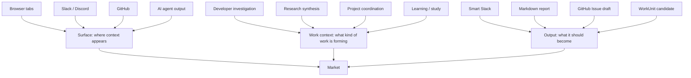
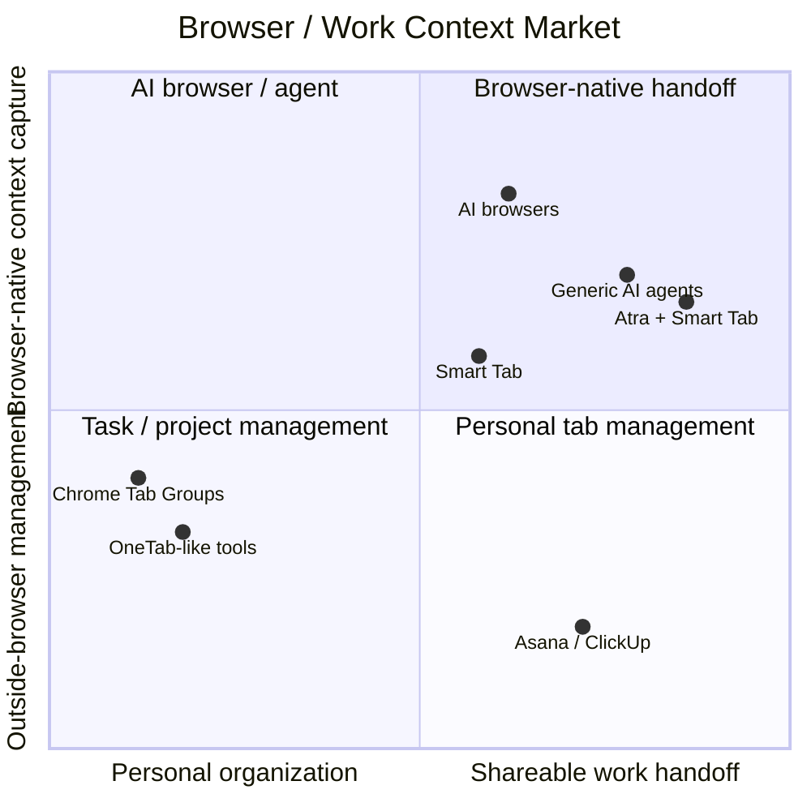
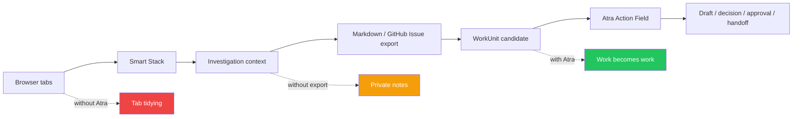

# Smart Tab Browser Entry Strategy

## Status

Strategic product direction note.

This document records the decision to use **Smart Tab** as a browser-extension entry product for Atra, rather than trying to sell Atra first as a broad AI work OS.

This is a docs-only strategy artifact.

---

## 1. Core conclusion

Atra should not initially compete head-on as a generic AI work tool, AI PM tool, AI browser, or project management AI.

The stronger path is:

```txt
Browser context
  -> investigation stack
  -> exportable work context
  -> WorkUnit candidate
  -> Atra Action Field
```

In short:

```txt
Smart Tab captures browser-born work context.
Atra turns that context into work-ready WorkUnits.
```

Smart Tab should be treated as an **entry validation product** for Atra's `Signal -> aggregation -> work context` layer.

---

## 2. PM is not the market definition

Atra should not be defined as a PM-only product.

PMs are only one validation target. The real market changes depending on the combination of:

1. where the context appears,
2. what kind of work context is being formed,
3. what output the user needs.



The first strong combination is:

```txt
Browser x Developer Investigation x Markdown / GitHub Issue Export
```

Later combinations may include:

```txt
Browser x Research x Markdown Report
Browser x AI Agent Output x WorkUnit Candidate
Slack / Discord x Project Coordination x WorkUnit Handoff
```

---

## 3. Why the browser-extension path is stronger than launching Atra directly

Atra's abstract value is difficult to understand at first contact.

Smart Tab gives users a concrete, low-friction entry point:

```txt
Close your tabs. Keep the investigation.
```

The browser is where work context often forms before it becomes a task:

- GitHub repositories and issues
- framework docs
- Stack Overflow / Q&A
- npm / package registries
- localhost and cloud dashboards
- AI assistant tabs
- search results
- design references
- documentation pages

At that moment, the work is not yet a task, project, or formal decision. It is a messy investigation context.

Smart Tab should capture that moment.

---

## 4. Market map

Smart Tab alone sits near tab management. Atra alone sits near abstract work OS. The combined path creates a stronger position.



The open space is not generic tab management and not AI browsing.

The open space is:

```txt
Browser-born investigation context -> shareable work context -> WorkUnit candidate
```

---

## 5. Relationship between Smart Tab and Atra

Smart Tab is not Atra itself.

Smart Tab validates the first layer:

```txt
Signal -> aggregation -> work context
```

Atra owns the later layers:

```txt
Work context -> WorkUnit -> decision -> draft -> approval -> action preparation
```



Smart Tab must not become a dead-end tab organizer. It should become the browser entry point into Atra's WorkUnit layer.

---

## 6. Product thesis

### Smart Tab thesis

```txt
Messy debugging and research tabs should become reusable investigation stacks.
```

### Atra connection thesis

```txt
Reusable investigation stacks should become work-ready WorkUnit candidates.
```

### Combined thesis

```txt
Atra turns scattered browser, tool, and AI contexts into work-ready WorkUnits.
```

---

## 7. What Smart Tab should sell first

Do not sell generic AI productivity.

Do not sell an AI browser.

Do not sell a PM system.

Sell this:

```txt
Close your tabs. Keep the investigation.
```

Then prove the upgrade path:

```txt
Saved investigation -> exported context -> WorkUnit candidate -> Atra
```

---

## 8. Initial target context

The first target context should be:

```txt
Developer investigation
```

This is stronger than starting with PMs because:

- developers naturally open many browser tabs while debugging and implementing;
- the browser already contains GitHub, docs, Stack Overflow, npm, localhost, and AI assistant context;
- Markdown and GitHub Issue export are natural outputs;
- saved investigations can become reusable team artifacts;
- the gap from investigation context to WorkUnit candidate is short.

This does not mean Atra is only for developers. It means Smart Tab should start where the browser-context problem is most visible.

---

## 9. Failure paths and mitigations

### Failure path 1: Smart Tab becomes only a tab organizer

Risk:

```txt
Classify -> group -> save -> resume
```

If this is the whole product, it competes with OneTab-like tools, Chrome Tab Groups, and browser-native features.

Mitigation:

```txt
Make export a first-class success path.
```

The strategic KPI is not only saved stacks. It is whether saved stacks become shareable context.

Watch:

- Markdown export rate
- GitHub Issue export rate
- Atra CTA click rate
- resume rate
- manual edit rate

---

### Failure path 2: It competes as an AI browser

Risk:

```txt
AI understands your tabs.
AI browses for you.
AI works in the browser.
```

This collides with AI browsers and general AI agents.

Mitigation:

```txt
Position Smart Tab as investigation handoff, not AI browsing.
```

Smart Tab should say:

```txt
Turn browser chaos into reusable investigation context.
```

Not:

```txt
Let AI browse for you.
```

---

### Failure path 3: Metadata-only classification is too shallow

The MVP should remain privacy-first and avoid reading page content by default.

However, tab metadata alone may not be enough for high-quality work context.

Mitigation path:

```txt
P0: tab metadata only
P1: user note and selected excerpt
P2: optional page-content permission
P3: Atra WorkUnit conversion
```

Do not add broad host permissions early. Permission creep would damage trust.

---

### Failure path 4: Atra connection comes too late

If Smart Tab succeeds as a standalone tool but never connects to Atra, Atra does not gain compounding strength.

Mitigation:

- P0: measure Pro / Atra CTA clicks.
- P1: expose Atra candidate JSON in the UI.
- P2: import Smart Stack into Atra as WorkUnit candidate.
- P3: convert exported investigation context into Action Field work.

---

### Failure path 5: The target becomes too broad

"Not PM-only" must not become "for everyone."

Mitigation:

```txt
Define markets by combinations, not personas alone.
```

Initial market:

```txt
Browser x Developer Investigation x Markdown / GitHub Issue Export
```

Later markets should be added only when a new combination is validated.

---

## 10. Go / Pivot / Kill interpretation for Atra

Smart Tab metrics should be interpreted as Atra entry-layer validation.

### Go

Go if:

- users save and resume investigation stacks;
- users export stacks as Markdown or GitHub Issue format;
- users manually edit groupings because they care about correctness;
- users click Atra / Pro CTA;
- users say the product helps them avoid re-reading or reconstructing context.

Meaning for Atra:

```txt
Signal -> aggregation -> work context is validated.
```

### Pivot

Pivot if:

- saves happen but resumes do not;
- exports happen more than resumes;
- users treat it as a report generator, not a tab manager;
- classification requires too much manual repair.

Possible pivots:

```txt
Investigation report generator
GitHub Issue context exporter
Research stack generator
Personal developer history/search
```

### Kill

Kill Smart Tab as a product if:

- users do not activate grouping;
- users do not save;
- users do not resume;
- users do not export;
- no one expresses a clear pull for the workflow.

Even then, preserve:

- classifier package learnings;
- SmartStack schema;
- export format;
- AtraWorkUnitCandidate mapping;
- privacy-first extension design.

These remain assets for Atra.

---

## 11. Revised Atra market framing

Atra should be framed as:

```txt
Atra converts scattered context into work-ready WorkUnits.
```

Smart Tab should be framed as:

```txt
Smart Tab captures browser-born investigation context.
```

Combined:

```txt
Browser chaos -> investigation stack -> WorkUnit candidate -> Action Field
```

This is stronger than:

```txt
AI PM tool
AI task manager
AI browser
Generic AI agent
```

---

## 12. Near-term execution plan

### Phase 1: Smart Tab MVP

Build only:

- classify current-window tabs;
- apply Chrome tab groups;
- save Smart Stack;
- resume Smart Stack;
- export Markdown / GitHub Issue format;
- measure activation, save, resume, export, manual edit, Atra CTA.

Do not build:

- LLM summary;
- page content reading;
- broad host permissions;
- direct GitHub OAuth;
- external execution;
- full Atra approval flow.

### Phase 2: Atra bridge

Add:

- AtraWorkUnitCandidate export UI;
- Smart Stack -> WorkUnit candidate import path;
- evidenceRefs preservation;
- Action Field entry from imported WorkUnit candidate.

### Phase 3: WorkUnit conversion

Add:

- Situation;
- Problem;
- Evidence;
- Missing Fields;
- Next Action;
- Draft target;
- Handoff readiness.

---

## 13. Final strategic statement

Atra should not begin by asking users to understand an abstract work OS.

It should begin by solving a concrete browser pain:

```txt
I want to close my tabs, but I do not want to lose the investigation.
```

Then it should compound into Atra's deeper thesis:

```txt
The investigation should become a work-ready unit.
```

The strongest path is:

```txt
Smart Tab gets the browser context.
Atra turns that context into work.
```
