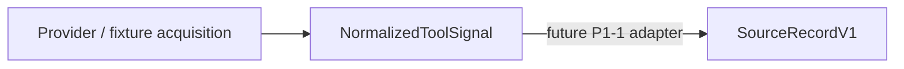

# Phase-1 Value Gate Program

Status: Primary Product / Roadmap Authority, ratified by the human PM.

Decision token: `ATRA_PHASE1_PLAN_AUTHORITY_RATIFIED_WITH_MODIFICATIONS`

Evidence snapshot: `e29f08ccde581f235a0d93eb73a0f145469e16a0` (`main`, 2026-08-09)

Repository: `haya10hikawa-hub/Atra-workunitOS`

Execution boundary: governance and documentation only. This program record changes no `app/**` file, no migration, no runtime configuration, no provider, and no UI. It authorizes no implementation WorkUnit.

## Authority Hierarchy

```text
Human PM
  ↓
Phase-1 Value Gate Program            (this document)
  ├─ product priority / Gates / sequencing
  └─ Canonical WorkUnit Pipeline Refactor Program
       └─ technical / domain architecture
```

This document is the single Primary Product / Roadmap Authority. It owns:

- what to validate
- phase order
- Gate semantics
- investment sequencing
- the Phase-1 critical path
- deferred scope

`docs/architecture/CANONICAL_WORKUNIT_PIPELINE_REFACTOR_PROGRAM.md` is the ratified subordinate Technical / Domain Architecture Authority. It is subordinate to this document on sequencing and product priority, and it remains authoritative for single canonical product-data truth, record ownership, projection boundaries, composition and dependency rules, the `Candidate != ReviewedWorkUnit` / `Preview != Approval` / `Approval != Execution` boundaries, the architecture ratchets, and bounded WorkUnit review discipline.

### What is not Product Authority

No other repository document is Primary Product / Roadmap Authority. In particular:

- The `## Roadmap` list in `README.md` is an unordered engineering-theme list. It carries no phase order, no Gate, and no sequencing authority.
- `docs/architecture/WORKUNIT_OS_ORGANIZATION.md` describes long-range organizational and completion vision. It is not a phase plan and does not sequence Phase-1.
- Historical `docs/PHASE_*`, `docs/P6_*` and `docs/ALPHA_*` records are evidence of past decisions at their own heads. They are not current sequencing authority.

Where any of those disagree with this document on product priority or phase order, this document governs.

## Product Hypothesis

> Can multiple fragmented source records that refer to the same work
> be correlated into one evidence-backed WorkUnit Candidate
> such that the user can understand and begin the work with less effort?

That is the whole Phase-1 hypothesis. It is deliberately narrow. Phase-1 does **not** test autonomous execution, general task management, agent delegation, or a provider write path. Reading the hypothesis wider than this sentence is a scope breach.

## Phase-1 Product Spine


The permanent semantic core before the Value Gate is exactly four concepts:

```text
Canonical Source
Correlation Group
WorkUnit Candidate
Human Correction
```

The UI is a projection of that core. **No parallel validation-only WorkUnit truth may be introduced.** A surface that needs data must read the canonical projection; it may not construct an alternate domain truth to get a demo working.

## Current Implementation State

Every status below was re-verified against the evidence snapshot before being written here. Statuses are evidence-backed, not aspirational.

| Phase | Status | Evidence at `e29f08cc` |
| --- | --- | --- |
| **P0-1** Engineering Authority | `COMPLETE` on merge of this record | The authority hierarchy above is repository-controlled and machine-pinned by `tests/phase1AuthoritySync.test.mts` |
| **P0-2** Branch / Issue / Asset Classification | `COMPLETE` on merge of this record | The asset ledger below classifies every identified critical asset |
| **P0-3** Phase-1 Scope Lock | `COMPLETE` on merge of this record | Spine, deferred scope and semantic authorities are recorded below and pinned |
| **P1-1** Canonical Source V1 | `PARTIAL` | `SourceRecordV1` is declared at `app/lib/domain/source/types.ts` with its validator at `app/lib/domain/source/validateSourceRecord.ts`. No adapter, producer or consumer exists: no file under `app/**` outside `app/lib/domain/source/` imports it |
| **P1-2** Correlation / Grouping + Gold Set | `NOT_STARTED_ON_MAIN` | No correlation or grouping module exists under `app/**`. `app/lib/application/formation` does not exist |
| **P1-3** WorkUnit Candidate | `NOT_STARTED_CANONICALLY` | Several unversioned candidate families exist (`SafeWorkUnitCandidate`, `SanitizedWorkUnitCandidate`, `SourceCandidate`, hopper candidates). None is canonical. `WorkUnitCandidateV1` is declared nowhere |
| **P1-4** Launcher / Context Preview / Open Source | `PARTIAL_SURFACE_ONLY` | `app/page.tsx` → `WorkUnitOSDashboard` → `WorkUnitLauncher` by default. Its data source is the mock candidate pipeline via `candidatesToLauncherWorkUnits`; it reads no canonical Candidate |
| **P1-5** Human Correction + Measurement | `NOT_STARTED` | No correction record exists in `app/lib/domain/**` or `app/lib/infrastructure/**`. Launcher editing state is local React draft state, not persisted authority. No measurement instrument exists |
| **P1-6** Value Gate | `NOT_READY` | P1-1 through P1-5 are incomplete; the Gate has no ratified date and no ratified readiness trigger |

`COMPLETE on merge of this record` is a conditional status, not a claim that the phase was already complete before this pull request. Until this pull request merges, P0-1, P0-2 and P0-3 are `IN_PROGRESS`.

## Semantic Authority Decision

The human PM selected decision **C**: ratify the three Phase-1 semantic authority names now, but expand the machine-enforced canonical-record allowlist only just-in-time, inside the WorkUnit that actually introduces each record.

| Name | Product status | Code status |
| --- | --- | --- |
| `CorrelationGroupV1` | `RATIFIED_PHASE1_SEMANTIC_TARGET` | **NOT YET AUTHORIZED AS A CODE DECLARATION** |
| `WorkUnitCandidateV1` | `RATIFIED_PHASE1_SEMANTIC_TARGET` | **NOT YET AUTHORIZED AS A CODE DECLARATION** |
| `WorkUnitCorrectionV1` | `RATIFIED_PHASE1_SEMANTIC_TARGET` | **NOT YET AUTHORIZED AS A CODE DECLARATION** |

This ratification answers exactly one question:

```text
"What is the intended Phase-1 semantic authority called?"
```

It does **not** answer:

```text
"What exact TypeScript declaration/path/schema is now authorized?"
```

The semantic ratification must not become implementation permission. Declaring any of the three names in `app/**` or `scripts/**` at this head fails the closed allowlist in `tests/architectureBoundaries.test.mts`, and that is the intended behavior.

### Just-in-time allowlist expansion

The only authorized canonical record declaration remains `SourceRecordV1` at `app/lib/domain/source/types.ts`. Allowlist expansion in this WorkUnit is zero.

```text
P1-2 → may authorize CorrelationGroupV1
       exact declaration path and contract reviewed in that WorkUnit

P1-3 → may authorize WorkUnitCandidateV1
       exact declaration path and contract reviewed in that WorkUnit

P1-5 → may authorize WorkUnitCorrectionV1
       exact declaration path and contract reviewed in that WorkUnit
```

No earlier. Each expansion requires a human edit to the source-controlled allowlist literal, reviewed in the same bounded WorkUnit that introduces the record.

### Names that remain unauthorized entirely

These have **no** ratified semantic status and **no** code authorization, and they gain neither from this document:

```text
CanonicalSourceRecordV1
WorkUnitReviewV1
ReviewedWorkUnitV1
ActionPreparationV1
```

Introducing an alias or an alternate name to evade the closed family registry is a governance violation, not a workaround.

### P1-1 consequence

`SourceRecordV1` is already authorized, so the first implementation WorkUnit after P0 closure requires **no** new canonical type. Its expected conceptual boundary is:



This governance record does not implement that arrow, does not authorize it, and does not start P1-1. It records only that P1-1 is the next candidate implementation boundary after P0 closure.

## Value Gate Timing

```text
2026-08-21 Alpha deadline = SUPERSEDED
2026-09-04 Value Gate     = forecast only, NOT ratified
Value Gate DATE           = UNRATIFIED
```

`2026-09-04` must not be entered into any authoritative milestone or date field. No replacement deadline is invented here. The Value Gate has a ratified *position* in the spine and no ratified *date*.

## Deferred Scope

Deferred means: not Phase-1, not on the Phase-1 critical path, and not to be advanced merely because it is written down here.

```text
full provider fleet
advanced LLM
many-source durable product persistence, if the experiment does not require it
ReviewedWorkUnit promotion
ActionPreparation
provider writes
external execution
Graph redesign
advanced Action Field redesign
public multi-tenant onboarding
```

## Asset Ledger

| Asset | Classification | Notes |
| --- | --- | --- |
| Formation F1–F5 | `IMPLEMENTATION_ASSET` / `NON_AUTHORITY` | Unmerged branch work. Not adopted, not transplant-authorized, not canonical authority |
| Formation F3 | `POTENTIAL_P1_2_REFERENCE_INPUT` | Reference input for P1-2 only. Reference input is not adoption |
| PR #211 | `UNMERGED_NON_AUTHORITY_INPUT` | Not merged, not consumed, not copied, not referenced as authority. This document does not authorize merging it |
| HTPE | `CONTRACT_REFERENCE_ASSET` / `NON_CRITICAL_PATH_BEFORE_VALUE_GATE` | Contract and vocabulary reference. No runtime authority |
| Large-SaaS | `INFRASTRUCTURE_SUBPROGRAM` | Safety and security work, subordinate to current product-priority sequencing. Already-merged security controls stay in force and are never deleted or invalidated by this classification. Branch-only refactor work is not advanced by this classification |
| PR #224 | `LEGACY_EXPERIMENT` / `NOT_PHASE1_CRITICAL_PATH` | Open, non-draft, unmerged at head `ddd982f4234b69cf6bb28a999a1ef37e3eb1434c`. Not merged, not extended, not altered by this WorkUnit. Its earlier user-pilot requirement is a different experiment and is **not** P1-6 |
| Current default Launcher | `CURRENT_PRODUCT_PROJECTION_SURFACE` | Not a branch asset, not canonical domain authority, not legacy. P1-4 re-points its data source toward the canonical Candidate projection; it does not redesign the surface |
| Legacy / adopted Dashboard | `LEGACY_PROJECTION_SURFACE` | `AdoptedWorkUnitDashboard`, reachable only behind `NEXT_PUBLIC_WORKUNIT_LEGACY_DASHBOARD`. Not a Phase-1 target surface |

No entry above is an authorization to start work on that asset.

## Open PM Decisions

These are recorded for visibility and have **no binding effect**. They are not requirements, and nothing may be gated on them until the PM ratifies them.

| Open decision | Status |
| --- | --- |
| Value Gate readiness trigger | `OPEN_PM_DECISION` — not ratified |
| 20 engineer-day stop-loss | `OPEN_PM_DECISION` — not ratified |
| Value Gate date | `UNRATIFIED` — no forecast may be promoted to a milestone field |
| Disposition of Issue #207 (remain open vs. close as `not_planned`) | `OPEN_PM_DECISION` — the schedule is superseded, the requirements are retained; no closure authority was given |
| Disposition of Issues #198–#206 | `OPEN_PM_DECISION` — classification is recorded below; no state transition is authorized |
| Disposition of PR #224 | `PR224_DISPOSITION_PENDING_PM_MUTATION_AUTHORIZATION` |

## Issue Classification

Classification here is a record, not a mutation authorization. GitHub metadata writes are a separate authority class from repository writes.

| Issue | Classification | Recorded disposition |
| --- | --- | --- |
| #207 | `REQUIREMENTS_INPUT`, `SUPERSEDED_AS_EXECUTION_SCHEDULE` | Its 4-week schedule, its 2026-08-21 Alpha completion deadline and its W1–W4 execution schedule are superseded. Its requirements are retained: multi-source grouping, false-merge prevention, original-source navigation, correction, eventual live read-only providers, eventual bounded LLM proposal, no autonomous formalization, no provider write. Requirements are **not** completed merely because the schedule is superseded. Open/closed state: `OPEN_PM_DECISION` |
| #198–#202 | Requirements / post-Gate backlog input | Alpha-track requirement issues. Useful requirement text is retained in full. No state transition authorized |
| #203–#206 | Former date-based milestone gates, schedule superseded | Proposed transition: close as superseded / `not_planned`, never as completed. **Not performed** — no explicit PM mutation authorization exists. Recorded as `PM_METADATA_MUTATION_AUTHORIZATION_REQUIRED` |

## Decision History

### `ATRA_PHASE1_PLAN_AUTHORITY_RATIFIED_WITH_MODIFICATIONS`

The human PM ratified the Verification-driven Integration Plan as Primary Product / Roadmap Authority, with modifications:

- The Verification-driven Integration Plan's own historical `Status` values and dates are **not** authority. This document is the repository-controlled expression of that plan.
- `docs/architecture/CANONICAL_WORKUNIT_PIPELINE_REFACTOR_PROGRAM.md` is confirmed as subordinate Technical / Domain Architecture Authority.
- Issue #207 is `REQUIREMENTS_INPUT`; its schedule is superseded.
- The existing asset classifications recorded in the ledger above were ratified.
- The ratification does **not** authorize executing WU-03 through WU-10.

### Decision C — semantic names vs. implementation authorization

The PM chose option **C**: ratify the three Phase-1 semantic authority names now, expand the machine-enforced canonical-record allowlist only just-in-time inside the WorkUnit that introduces each record. Recorded in full under [Semantic Authority Decision](#semantic-authority-decision).

### This record — `P0_AUTHORITY_SYNC`

Bounded governance WorkUnit at base `e29f08ccde581f235a0d93eb73a0f145469e16a0`. Makes the already-ratified PM decisions repository-controlled and internally consistent. Changes governance documentation and one governance test only. Allowlist expansion: **0**. Runtime changes: **0**. It authorizes no implementation WorkUnit, and it does not begin P1-1.
