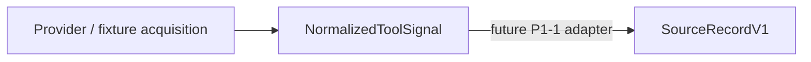

# Phase-1 Value Gate Program

Status: Primary Product / Roadmap Authority, ratified by the human PM.

Decision token: `ATRA_PHASE1_PLAN_AUTHORITY_RATIFIED_WITH_MODIFICATIONS`

Evidence snapshot: `e29f08ccde581f235a0d93eb73a0f145469e16a0` (`main`, 2026-08-09)

Repository: `haya10hikawa-hub/Atra-workunitOS`

Execution boundary: governance and documentation only. This program record changes no `app/**` file, no migration, no runtime configuration, no provider, and no UI. It authorizes no implementation WorkUnit.

The execution boundary above is a standing property of this document, and every later ratification recorded in it carries the same boundary. The header token, evidence snapshot and status field above belong to the founding `P0_AUTHORITY_SYNC` record; later ratifications carry their own decision tokens and are recorded in [Decision History](#decision-history) with the head they were decided at. Where a section is pinned to `e29f08cc`, it says so, and it is not rewritten as the tree moves.

## Authority Hierarchy

```text
Human PM
  ↓
Phase-1 Value Gate Program            (this document)
  ├─ product priority / Gates / sequencing
  └─ Canonical WorkUnit Pipeline Refactor Program
       └─ technical / domain architecture
```

This document is the single Primary Product / Roadmap Authority. It owns:

- what to validate
- phase order
- Gate semantics
- investment sequencing
- the Phase-1 critical path
- deferred scope

`docs/architecture/CANONICAL_WORKUNIT_PIPELINE_REFACTOR_PROGRAM.md` is the ratified subordinate Technical / Domain Architecture Authority. It is subordinate to this document on sequencing and product priority, and it remains authoritative for single canonical product-data truth, record ownership, projection boundaries, composition and dependency rules, the `Candidate != ReviewedWorkUnit` / `Preview != Approval` / `Approval != Execution` boundaries, the architecture ratchets, and bounded WorkUnit review discipline.

### What is not Product Authority

No other repository document is Primary Product / Roadmap Authority. In particular:

- The `## Roadmap` list in `README.md` is an unordered engineering-theme list. It carries no phase order, no Gate, and no sequencing authority.
- `docs/architecture/WORKUNIT_OS_ORGANIZATION.md` describes long-range organizational and completion vision. It is not a phase plan and does not sequence Phase-1.
- Historical `docs/PHASE_*`, `docs/P6_*` and `docs/ALPHA_*` records are evidence of past decisions at their own heads. They are not current sequencing authority.

Where any of those disagree with this document on product priority or phase order, this document governs.

## Product Hypothesis

> Can multiple fragmented source records that refer to the same work
> be correlated into one evidence-backed WorkUnit Candidate
> such that the user can understand and begin the work with less effort?

That is the whole Phase-1 hypothesis. It is deliberately narrow. Phase-1 does **not** test autonomous execution, general task management, agent delegation, or a provider write path. Reading the hypothesis wider than this sentence is a scope breach.

## Phase-1 Product Spine


The permanent semantic core before the Value Gate is exactly four concepts:

```text
Canonical Source
Correlation Group
WorkUnit Candidate
Human Correction
```

The UI is a projection of that core. **No parallel validation-only WorkUnit truth may be introduced.** A surface that needs data must read the canonical projection; it may not construct an alternate domain truth to get a demo working.

## Current Implementation State

Every status below was re-verified against the evidence snapshot before being written here. Statuses are evidence-backed, not aspirational.

| Phase | Status | Evidence at `e29f08cc` |
| --- | --- | --- |
| **P0-1** Engineering Authority | `COMPLETE` on merge of this record | The authority hierarchy above is repository-controlled and machine-pinned by `tests/phase1AuthoritySync.test.mts` |
| **P0-2** Branch / Issue / Asset Classification | `COMPLETE` on merge of this record | The asset ledger below classifies every identified critical asset |
| **P0-3** Phase-1 Scope Lock | `COMPLETE` on merge of this record | Spine, deferred scope and semantic authorities are recorded below and pinned |
| **P1-1** Canonical Source V1 | `PARTIAL` | `SourceRecordV1` is declared at `app/lib/domain/source/types.ts` with its validator at `app/lib/domain/source/validateSourceRecord.ts`. No adapter, producer or consumer exists: no file under `app/**` outside `app/lib/domain/source/` imports it |
| **P1-2** Correlation / Grouping + Gold Set | `NOT_STARTED_ON_MAIN` | No correlation or grouping module exists under `app/**`. `app/lib/application/formation` does not exist |
| **P1-3** WorkUnit Candidate | `NOT_STARTED_CANONICALLY` | Several unversioned candidate families exist (`SafeWorkUnitCandidate`, `SanitizedWorkUnitCandidate`, `SourceCandidate`, hopper candidates). None is canonical. `WorkUnitCandidateV1` is declared nowhere |
| **P1-4** Launcher / Context Preview / Open Source | `PARTIAL_SURFACE_ONLY` | `app/page.tsx` → `WorkUnitOSDashboard` → `WorkUnitLauncher` by default. Its data source is the mock candidate pipeline via `candidatesToLauncherWorkUnits`; it reads no canonical Candidate |
| **P1-5** Human Correction + Measurement | `NOT_STARTED` | No correction record exists in `app/lib/domain/**` or `app/lib/infrastructure/**`. Launcher editing state is local React draft state, not persisted authority. No measurement instrument exists |
| **P1-6** Value Gate | `NOT_READY` | P1-1 through P1-5 are incomplete; the Gate has no ratified date and no ratified readiness trigger |

`COMPLETE on merge of this record` is a conditional status, not a claim that the phase was already complete before this pull request. Until this pull request merges, P0-1, P0-2 and P0-3 are `IN_PROGRESS`.

The evidence column above is pinned to snapshot `e29f08cc` and is not rewritten as the tree moves; changes since that snapshot are recorded below it instead.

### Movement since the `e29f08cc` evidence snapshot

Two separately authorized implementation WorkUnits have since closed the canonical-source vertical slice, so the snapshot sentence "No adapter, producer or consumer exists" no longer describes the tree. **Two** real recorded provider resources now reach `SourceRecordV1` through a production path, one acquisition module each:

```text
retained GitHub issue export
  → app/lib/infrastructure/external/github/recordedIssueCapture.ts        (acquisition + provider profile)
  → app/lib/ports/acquisitionEvidence/types.ts                            (AcquisitionCapture)
  → app/lib/application/source/sourceRecordProduction.ts                  (producer)
  → SourceRecordV1                                                        (namespace github_issue)

retained GitHub pull request export
  → app/lib/infrastructure/external/github/recordedPullRequestCapture.ts  (acquisition + provider profile)
  → app/lib/ports/acquisitionEvidence/types.ts                            (AcquisitionCapture)
  → app/lib/application/source/sourceRecordProduction.ts                  (producer)
  → SourceRecordV1                                                        (namespace github_pull_request)
```

**Two GitHub resource classes, four provider profile gates.** The gates are recorded per resource, in `docs/architecture/GITHUB_ISSUE_ACQUISITION_PROFILE.md` and `docs/architecture/GITHUB_PULL_REQUEST_ACQUISITION_PROFILE.md`, and within each resource the two gates did not land in the same state:

```text
GitHub issue        content-scope = PROVEN     identity = PHASE1_SCOPED_ACCEPTED_WITH_UNPROVEN_RESIDUAL
GitHub pull request content-scope = PROVEN     identity = PHASE1_SCOPED_ACCEPTED_WITH_UNPROVEN_RESIDUAL
GitHub, other resources                        both     = REQUIRED_UNPROVEN
Slack                                          both     = REQUIRED_UNPROVEN
Google Calendar                                both     = REQUIRED_UNPROVEN
```

The two identity gates carry **two separately ratified** scoped exceptions — `SOURCE_RECORD_V1_SEMANTICS.md` §4.1 for issues over residuals R1–R5, §4.2 for pull requests over residuals P-R1–P-R5 — each PM-accepted, resource-scoped and Phase-1-bounded. The pull request exception did not inherit the issue exception, and neither is a template a third resource may fill in.

**Canonical identity namespaces are per resource, not per provider.** The record's `provider` field is the closed `SourceIdentityNamespace` vocabulary, and the two reviewed GitHub resources occupy `github_issue` and `github_pull_request`. A single generic `github` namespace is **rejected** and is not a member of the vocabulary at all, so no producer can reach it and no record can fall back to it. GitHub draws an object's REST `id` from a different table per resource and the two observed key ranges overlap, so one namespace would have manufactured a false merge out of Atra's own vocabulary. The full decision is `SOURCE_RECORD_V1_SEMANTICS.md` §4.3.

P1-2 is untouched, no new canonical record was declared, and the just-in-time allowlist expansion recorded below stays at zero.

## P1-1 Exit Criterion

Decision token: `ATRA_PM_P1_1_EXIT_AND_P1_2_ENTRY_RATIFIED`

Until this section existed, P1-1 had a status and no exit test, so no amount of capability could close it and any amount could be demanded of it. This section is the ratified exit test. It is derived from what P1-1 **is** — Canonical Source V1 — and from nothing else.

P1-1 closes when, and only when, this is demonstrated on `main`:

> Real provider evidence can become a truthful, stable, provenance-preserving canonical `SourceRecord`.

That sentence decomposes into exactly five required capabilities and no others:

```text
P1_1_EXIT_REQUIRED = E1 E2 E3 E4 E5

E1  CANONICAL_RECORD_PATH_TRUTHFUL
    One canonical SourceRecordV1 path exists in which every identity and integrity
    value is carried from provider evidence, never minted, derived or defaulted by Atra.

E2  REAL_RECORDED_PROVIDER_EVIDENCE
    The path is exercised by a real provider object's own retained response bytes,
    not by a fixture authored to satisfy it.

E3  EXACT_BYTE_CONTENT_INTEGRITY
    contentDigest is taken over the retained provider bytes, so any in-scope
    provider-content change changes the digest.

E4  ACQUISITION_PROVENANCE_PRESERVED
    Acquisition mode, observation instant, provider-stated event time and capture
    linkage survive into the record or beside it, and none is invented when absent.

E5  CANONICAL_IDENTITY_DISCRIMINATES
    The canonical identity tuple separates distinct provider key spaces, so no two
    unrelated provider objects can become one canonical identity by Atra's vocabulary.
```

Everything else is classified out, explicitly, so it cannot be demanded later as though it had always been in scope:

| Candidate | Classification | Why |
| --- | --- | --- |
| additional provider resource classes, as breadth | `NOT_REQUIRED_FOR_P1_1` | Breadth is not proof. E5 requires that identity *discriminates*, not that N resources exist. The second resource is what happened to prove E5; a third proves nothing further about the record |
| consumer beyond the producer | `NOT_REQUIRED_FOR_P1_1` | A consumer proves someone reads the record; it does not make the record truthful. The first real consumer is correlation, which is P1-2. Requiring it here would make P1-1 unclosable without P1-2, inverting the spine |
| persistence | `DEFERRED` | Already Deferred Scope. A record's truthfulness is a property of its value, not of its storage. Persistence also reopens both identity exceptions by their own terms, so it must not be dragged in ahead of a decision to reopen them |
| second provider | `NOT_REQUIRED_FOR_P1_1` | A second provider tests breadth of the acquisition layer, not the canonical record. It **is** required for P1-2 entry, and it is recorded there instead |
| live provider acquisition | `DEFERRED` | Recorded acquisition already exercises the whole path. `AcquisitionMode` has no live member and gaining one is a reviewable contract change, not a P1-1 obligation |
| provider identity residual closure | `NOT_REQUIRED_FOR_P1_1` | R1–R5 and P-R1–P-R5 can be closed only by GitHub publishing authority Atra cannot produce. Making them required would gate a phase on a third party's non-action forever. They stay PM-accepted, Phase-1-bounded, and reopen on their own recorded triggers |

## P1-1 Decision at `9eea0d8e`

```text
P1_1_STATUS = COMPLETE
```

Evaluated against the exit criterion above and against nothing else. Every required capability is satisfied on `main` at `9eea0d8edecf9332261bb50b3224594e5bb29a8a`:

| Required | Evidence |
| --- | --- |
| E1 | `sourceRecordProduction.ts` is pure and copies every evidential value byte-for-byte; `validateSourceRecordV1` refuses an unknown namespace as `invalid_provider`; the producer's authorized profile list is a closed set of complete 5-tuples restated independently of the adapters it authorizes |
| E2 | Two verbatim retained captures under `acquisitions/`, both of real objects predating the slices that read them: issue `207` (REST id `4968607486`) and pull request `229` (REST id `4258276579`) |
| E3 | Both content-scope gates `PROVEN`; the digest subject is the retained byte stream with no parse, field selection or reserialization between stream and hash |
| E4 | `AcquisitionCapture` carries a single closed acquisition mode, an acquisition-owned `observedAt`, a provider-stated-or-`null` `sourceEventAt`, and no slot for `recordedAt`; capture linkage is returned beside the record as `SourceRecordProduction.captureId` |
| E5 | `github_issue` and `github_pull_request` are distinct closed-vocabulary members; the generic `github` member does not exist; each acquisition module fail-closes on the retained bytes rather than on the caller's choice, so the namespace half of identity cannot be asserted by whoever ran the module |

`COMPLETE` is a statement about P1-1 and about nothing else. It does not make P1-2 ready, does not authorize any implementation WorkUnit, does not close any identity residual, and does not promote the record to a persisted or live-acquired artifact.

## P1-2 Entry Criterion

Decision token: `ATRA_PM_P1_1_EXIT_AND_P1_2_ENTRY_RATIFIED`

P1-2 measures correlation error. An experiment whose instrument is assembled after its results are visible cannot measure error, so the instrument is fixed as an entry condition rather than built inside the phase.

```text
P1_2_ENTRY_REQUIRED = N1 N2 N3 N4
P1_2_ENTRY_STATUS = NOT_READY

N1  P1_1_COMPLETE                       SATISFIED at 9eea0d8e
N2  ADMISSIBLE_FROZEN_DATASET           NOT SATISFIED
N3  TWO_INDEPENDENT_PROVIDERS           NOT SATISFIED
N4  DATASET_PROVIDER_PROFILE_READINESS  NOT SATISFIED
```

- **N1** — P1-1 complete against its ratified exit criterion. Satisfied above.
- **N2** — an admissible dataset, frozen and declared admissible **before** any grouping logic is written. Frozen means its membership and its gold labels are fixed and recorded; a dataset that grows or is re-labelled once grouping output is visible is not an instrument.
- **N3** — at least two **independent providers** represented in that dataset. Independent means separate provider systems. GitHub issues and GitHub pull requests are two resource classes of **one** provider and do not satisfy N3; a single-provider corpus makes cross-provider correlation unmeasurable, because provider-local structure is then indistinguishable from correlation signal.
- **N4** — every provider represented in the dataset has a reviewed profile pair at the standard GitHub's two resources already meet: content-scope `PROVEN`, and identity either proven or carrying its own separately ratified PM-accepted scoped exception. A provider whose sources cannot become `SourceRecordV1` values contributes nothing to correlate.

### `N4` — what is established, and the exact remaining binding

Decision token: `ATRA_PM_P1_2_GMAIL_PHASE1_SCOPED_IDENTITY_EXCEPTION_ACCEPTED`

```text
N4 = NOT_SATISFIED
N4_DATASET_PROVIDER_PROFILE_PREREQUISITE_SATISFIABLE_FOR_GITHUB_GMAIL_ROUTE
```

Two independent providers now hold a reviewed profile pair at the `N4` standard:

```text
GitHub  issue + pull request   content-scope PROVEN;  identity scoped exception, SOURCE_RECORD_V1_SEMANTICS.md §4.1 / §4.2
Gmail   message                content-scope PROVEN;  identity scoped exception, SOURCE_RECORD_V1_SEMANTICS.md §4.4
```

**`N4` stays `NOT_SATISFIED`, and the reason is structural rather than a shortfall in either profile.**
`N4` is quantified over "every provider represented in **the dataset**". No dataset is frozen — `N2` is
unsatisfied — so there is no provider set to quantify over and the condition cannot be evaluated as met.
A pair of ready profiles is a *prerequisite* the route now clears; it is not the condition itself.

The remaining binding is therefore exact: **`N4` becomes satisfied when, and only when, `N2` freezes a
dataset whose represented providers are drawn entirely from those holding a reviewed pair.** For the
selected GitHub + Gmail route that set is already covered, so no further profile work stands between
this route and `N4`. A dataset that admits a third provider — Slack, Google Calendar or any other —
re-opens `N4` for that provider, because every gate outside the six reviewed profiles stays
`REQUIRED_UNPROVEN`.

Nothing here satisfies `N2` or `N3`, and neither is advanced by a profile: `N3` requires two independent
providers **represented in the dataset**, not two providers holding profiles. `P1_2_ENTRY_STATUS` stays
`NOT_READY`.

The Gmail acceptance is a **third** scoped exception, not either GitHub exception extended. This document
already records that bringing a second provider under `N4` is itself a new scoped-exception decision if
its identity cannot be proven; that decision has now been taken for Gmail, on Gmail's own evidence, and
it reopened neither GitHub residual set. Gmail's own residuals `G-R2`–`G-R5` stay unproven and may not be
promoted, and its one-mailbox, non-draft, REST-hex bounds travel with the exception.

**Gmail acquisition does not exist.** A reviewed profile states what an acquisition would have to
satisfy. It is not a capability and not permission to build one: no Gmail module, capture, transport,
credential flow or `SourceRecordV1` exists, and `ACQUISITION_SCOPE_CHANGE_REQUIRED` stays `YES` for
Gmail.

Dataset acquisition that touches human conversational or calendar content is **human-only work**. Such content is not to be routed through any AI assistant, including the assistant used to author repository changes. This constraint governs how N2 and N3 are satisfied and is not waived by convenience.

Classified out of entry:

| Candidate | Classification | Why |
| --- | --- | --- |
| `CorrelationGroupV1` declaration and allowlist expansion | `P1_2_INTERNAL_WORK` | Just-in-time authorization happens **inside** P1-2, in the WorkUnit that introduces the record. Requiring it before entry would invert the just-in-time rule this document already ratified |
| grouping implementation, evaluation harness, error measurement | `P1_2_INTERNAL_WORK` | This is the phase's content, not its gate |
| GitHub identity residual revisit | `NOT_REQUIRED` | See the ratified reading below. Bounded Phase-1 correlation does not reopen §4.1 or §4.2 |
| persistence, live acquisition, LLM proposal | `NOT_REQUIRED` | None is needed to measure correlation error on a frozen dataset, and each is Deferred Scope or unratified |
| a third GitHub resource class | `NOT_REQUIRED` | N3 requires provider independence, which a third GitHub resource does not supply |

Bringing a second provider under N4 is itself a new scoped-exception decision if its identity cannot be proven — §4.1 and §4.2 name "a second provider seeking the same treatment" as a revisit trigger, and that trigger is about the **new** provider's profile decision, not about reopening GitHub's residuals.

## Ratified P1-2 Semantics

Decision token: `ATRA_PM_P1_1_EXIT_AND_P1_2_ENTRY_RATIFIED`

Four prior P1-2 semantic adjudications existed outside the repository and were therefore unenforceable. All four are **adopted** as repository authority, none is rejected, and none is a licence to start P1-2:

```text
S1  CORRELATION_GROUP_IS_SAME_WORK_REFERENT
    A CorrelationGroup is a set of SourceRecords about the same underlying work
    referent. Not the same topic, not the same participants, not the same time window.

S2  RELATED_CONTEXT_IS_NOT_MEMBERSHIP
    A source that references, discusses or supersedes the referent without being
    about it is related context and is NOT a member. Recall-only relevance never
    becomes membership.

S3  GOLD_LABELS_ARE_EVALUATION_ONLY
    Gold labels are evaluation material only. No runtime path may read them, and
    no grouping decision may depend on them, directly or through a derived feature.

S4  DATASET_IS_NATURAL_MULTI_PROVIDER_RUNTIME_VISIBLE
    The dataset is naturally occurring real work, spans at least two independent
    providers, and every signal a grouping decision uses is runtime-visible
    evidence obtainable independently of the gold labels.
```

S3 and S4 together are what make the P1-2 result interpretable: S3 keeps the answer out of the input, and S4 keeps the input reachable at runtime. A grouping rule that scores well by reading anything unavailable outside the dataset has measured nothing.

## Scoped identity exception — ratified reading

The revisit triggers in `SOURCE_RECORD_V1_SEMANTICS.md` §4.1 and §4.2 read "persisting, correlating or deduplicating on `providerObjectKey` **beyond Phase-1 experimental use**". The qualifier governs all three verbs.

```text
P1_2_DOES_NOT_REOPEN_PHASE1_IDENTITY_EXCEPTIONS
```

Correlating on `providerObjectKey` **within** bounded Phase-1 experimental use therefore does not reopen either exception. Reopening requires leaving Phase-1 bounded experimental use, a profile version bump, a further resource or provider seeking the same treatment, or GitHub publishing authority that closes a residual. This is a reading of text already ratified; it discharges no residual, widens no gate, and grants nothing to any provider.

## Semantic Authority Decision

The human PM selected decision **C**: ratify the three Phase-1 semantic authority names now, but expand the machine-enforced canonical-record allowlist only just-in-time, inside the WorkUnit that actually introduces each record.

| Name | Product status | Code status |
| --- | --- | --- |
| `CorrelationGroupV1` | `RATIFIED_PHASE1_SEMANTIC_TARGET` | **NOT YET AUTHORIZED AS A CODE DECLARATION** |
| `WorkUnitCandidateV1` | `RATIFIED_PHASE1_SEMANTIC_TARGET` | **NOT YET AUTHORIZED AS A CODE DECLARATION** |
| `WorkUnitCorrectionV1` | `RATIFIED_PHASE1_SEMANTIC_TARGET` | **NOT YET AUTHORIZED AS A CODE DECLARATION** |

This ratification answers exactly one question:

```text
"What is the intended Phase-1 semantic authority called?"
```

It does **not** answer:

```text
"What exact TypeScript declaration/path/schema is now authorized?"
```

The semantic ratification must not become implementation permission. Declaring any of the three names in `app/**` or `scripts/**` at this head fails the closed allowlist in `tests/architectureBoundaries.test.mts`, and that is the intended behavior.

### Just-in-time allowlist expansion

The only authorized canonical record declaration remains `SourceRecordV1` at `app/lib/domain/source/types.ts`. Allowlist expansion in this WorkUnit is zero.

```text
P1-2 → may authorize CorrelationGroupV1
       exact declaration path and contract reviewed in that WorkUnit

P1-3 → may authorize WorkUnitCandidateV1
       exact declaration path and contract reviewed in that WorkUnit

P1-5 → may authorize WorkUnitCorrectionV1
       exact declaration path and contract reviewed in that WorkUnit
```

No earlier. Each expansion requires a human edit to the source-controlled allowlist literal, reviewed in the same bounded WorkUnit that introduces the record.

### Names that remain unauthorized entirely

These have **no** ratified semantic status and **no** code authorization, and they gain neither from this document:

```text
CanonicalSourceRecordV1
WorkUnitReviewV1
ReviewedWorkUnitV1
ActionPreparationV1
```

Introducing an alias or an alternate name to evade the closed family registry is a governance violation, not a workaround.

### P1-1 consequence

`SourceRecordV1` is already authorized, so the first implementation WorkUnit after P0 closure requires **no** new canonical type. Its expected conceptual boundary is:



This governance record does not implement that arrow, does not authorize it, and does not start P1-1. It records only that P1-1 is the next candidate implementation boundary after P0 closure.

## Value Gate Timing

```text
2026-08-21 Alpha deadline = SUPERSEDED
2026-09-04 Value Gate     = forecast only, NOT ratified
Value Gate DATE           = UNRATIFIED
```

`2026-09-04` must not be entered into any authoritative milestone or date field. No replacement deadline is invented here. The Value Gate has a ratified *position* in the spine and no ratified *date*.

## Deferred Scope

Deferred means: not Phase-1, not on the Phase-1 critical path, and not to be advanced merely because it is written down here.

```text
full provider fleet
advanced LLM
many-source durable product persistence, if the experiment does not require it
ReviewedWorkUnit promotion
ActionPreparation
provider writes
external execution
Graph redesign
advanced Action Field redesign
public multi-tenant onboarding
```

## Asset Ledger

| Asset | Classification | Notes |
| --- | --- | --- |
| Formation F1–F5 | `IMPLEMENTATION_ASSET` / `NON_AUTHORITY` | Unmerged branch work. Not adopted, not transplant-authorized, not canonical authority |
| Formation F3 | `POTENTIAL_P1_2_REFERENCE_INPUT` | Reference input for P1-2 only. Reference input is not adoption |
| PR #211 | `UNMERGED_NON_AUTHORITY_INPUT` | Not merged, not consumed, not copied, not referenced as authority. This document does not authorize merging it |
| HTPE | `CONTRACT_REFERENCE_ASSET` / `NON_CRITICAL_PATH_BEFORE_VALUE_GATE` | Contract and vocabulary reference. No runtime authority |
| Large-SaaS | `INFRASTRUCTURE_SUBPROGRAM` | Safety and security work, subordinate to current product-priority sequencing. Already-merged security controls stay in force and are never deleted or invalidated by this classification. Branch-only refactor work is not advanced by this classification |
| PR #224 | `LEGACY_EXPERIMENT` / `NOT_PHASE1_CRITICAL_PATH` | Open, non-draft, unmerged at head `ddd982f4234b69cf6bb28a999a1ef37e3eb1434c`. Not merged, not extended, not altered by this WorkUnit. Its earlier user-pilot requirement is a different experiment and is **not** P1-6 |
| Current default Launcher | `CURRENT_PRODUCT_PROJECTION_SURFACE` | Not a branch asset, not canonical domain authority, not legacy. P1-4 re-points its data source toward the canonical Candidate projection; it does not redesign the surface |
| Legacy / adopted Dashboard | `LEGACY_PROJECTION_SURFACE` | `AdoptedWorkUnitDashboard`, reachable only behind `NEXT_PUBLIC_WORKUNIT_LEGACY_DASHBOARD`. Not a Phase-1 target surface |

No entry above is an authorization to start work on that asset.

## Open PM Decisions

These are recorded for visibility and have **no binding effect**. They are not requirements, and nothing may be gated on them until the PM ratifies them.

| Open decision | Status |
| --- | --- |
| Value Gate readiness trigger | `OPEN_PM_DECISION` — not ratified |
| 20 engineer-day stop-loss | `OPEN_PM_DECISION` — not ratified |
| Value Gate date | `UNRATIFIED` — no forecast may be promoted to a milestone field |
| Disposition of Issue #207 (remain open vs. close as `not_planned`) | `OPEN_PM_DECISION` — the schedule is superseded, the requirements are retained; no closure authority was given |
| Disposition of Issues #198–#206 | `OPEN_PM_DECISION` — classification is recorded below; no state transition is authorized |
| Disposition of PR #224 | `PR224_DISPOSITION_PENDING_PM_MUTATION_AUTHORIZATION` |

## Issue Classification

Classification here is a record, not a mutation authorization. GitHub metadata writes are a separate authority class from repository writes.

| Issue | Classification | Recorded disposition |
| --- | --- | --- |
| #207 | `REQUIREMENTS_INPUT`, `SUPERSEDED_AS_EXECUTION_SCHEDULE` | Its 4-week schedule, its 2026-08-21 Alpha completion deadline and its W1–W4 execution schedule are superseded. Its requirements are retained: multi-source grouping, false-merge prevention, original-source navigation, correction, eventual live read-only providers, eventual bounded LLM proposal, no autonomous formalization, no provider write. Requirements are **not** completed merely because the schedule is superseded. Open/closed state: `OPEN_PM_DECISION` |
| #198–#202 | Requirements / post-Gate backlog input | Alpha-track requirement issues. Useful requirement text is retained in full. No state transition authorized |
| #203–#206 | Former date-based milestone gates, schedule superseded | Proposed transition: close as superseded / `not_planned`, never as completed. **Not performed** — no explicit PM mutation authorization exists. Recorded as `PM_METADATA_MUTATION_AUTHORIZATION_REQUIRED` |

## Decision History

### `ATRA_PHASE1_PLAN_AUTHORITY_RATIFIED_WITH_MODIFICATIONS`

The human PM ratified the Verification-driven Integration Plan as Primary Product / Roadmap Authority, with modifications:

- The Verification-driven Integration Plan's own historical `Status` values and dates are **not** authority. This document is the repository-controlled expression of that plan.
- `docs/architecture/CANONICAL_WORKUNIT_PIPELINE_REFACTOR_PROGRAM.md` is confirmed as subordinate Technical / Domain Architecture Authority.
- Issue #207 is `REQUIREMENTS_INPUT`; its schedule is superseded.
- The existing asset classifications recorded in the ledger above were ratified.
- The ratification does **not** authorize executing WU-03 through WU-10.

### Decision C — semantic names vs. implementation authorization

The PM chose option **C**: ratify the three Phase-1 semantic authority names now, expand the machine-enforced canonical-record allowlist only just-in-time inside the WorkUnit that introduces each record. Recorded in full under [Semantic Authority Decision](#semantic-authority-decision).

### `ATRA_PM_P1_1_EXIT_AND_P1_2_ENTRY_RATIFIED`

Decided at `main` `9eea0d8edecf9332261bb50b3224594e5bb29a8a`, after PR #231 merged with post-merge CI passing.

Before this decision P1-1 carried a status with no exit test and P1-2 had no entry test, so neither phase could be closed or entered on evidence, and this document's post-snapshot record had drifted behind the tree. The PM ratified, in one bounded governance WorkUnit:

- the [P1-1 Exit Criterion](#p1-1-exit-criterion) — five required capabilities `E1`–`E5`, with six candidates classified out as `NOT_REQUIRED_FOR_P1_1` or `DEFERRED`;
- `P1_1_STATUS = COMPLETE`, evaluated against that criterion and nothing else;
- the [P1-2 Entry Criterion](#p1-2-entry-criterion) — four conditions `N1`–`N4`, with `P1_2_ENTRY_STATUS = NOT_READY`;
- the four [Ratified P1-2 Semantics](#ratified-p1-2-semantics) `S1`–`S4`, previously held outside the repository and therefore unenforceable;
- the ratified reading that bounded Phase-1 correlation does not reopen the §4.1 or §4.2 identity exceptions;
- correction of this document's post-snapshot facts to the post-PR-#231 tree.

Allowlist expansion: **0**. Runtime changes: **0**. `app/**` changes: **0**. It authorizes no implementation WorkUnit, and `P1_1_STATUS = COMPLETE` is not entry into P1-2.

### `ATRA_PM_P1_2_GMAIL_PHASE1_SCOPED_IDENTITY_EXCEPTION_ACCEPTED`

Decided against the Gmail Message identity determination, and made repository-controlled in a bounded
governance WorkUnit at base `main` `3a2bf3cbbffd304d7db4a0eb5a7d5058ae2d3402`.

Before this decision Gmail's identity and content determinations existed outside the repository, so a
second-provider route rested on evidence no reader of `main` could audit and no test could hold. The PM
accepted a Phase-1 scoped identity exception for the Gmail Message resource, and this WorkUnit recorded
it, independently re-verified the content half against Google's published contract, and pinned both:

- `docs/architecture/GMAIL_MESSAGE_ACQUISITION_PROFILE.md` — the reviewed profile pair, its residual
  registers, the exact approved scope and the revisit triggers;
- `SOURCE_RECORD_V1_SEMANTICS.md` §4.4 — the third scoped identity exception, reviewed on its own
  evidence and inheriting neither GitHub one, with `G-R2`–`G-R5` unproven;
- `SOURCE_RECORD_V1_SEMANTICS.md` §4.3 — the `gmail` placeholder resolved into `gmail_message`, the
  generic member removed from the canonical vocabulary as `github` was;
- the [`N4` binding](#n4--what-is-established-and-the-exact-remaining-binding) above.

Allowlist expansion: **0**. Runtime capability added: **0** — one closed-vocabulary member was resolved,
and no producer, acquisition, transport or credential path exists for Gmail. `N2`, `N3` and `N4` are all
unchanged at `NOT SATISFIED`, and `P1_2_ENTRY_STATUS` stays `NOT_READY`. It authorizes no implementation
WorkUnit and does not begin P1-2.

### This record — `P0_AUTHORITY_SYNC`

Bounded governance WorkUnit at base `e29f08ccde581f235a0d93eb73a0f145469e16a0`. Makes the already-ratified PM decisions repository-controlled and internally consistent. Changes governance documentation and one governance test only. Allowlist expansion: **0**. Runtime changes: **0**. It authorizes no implementation WorkUnit, and it does not begin P1-1.
