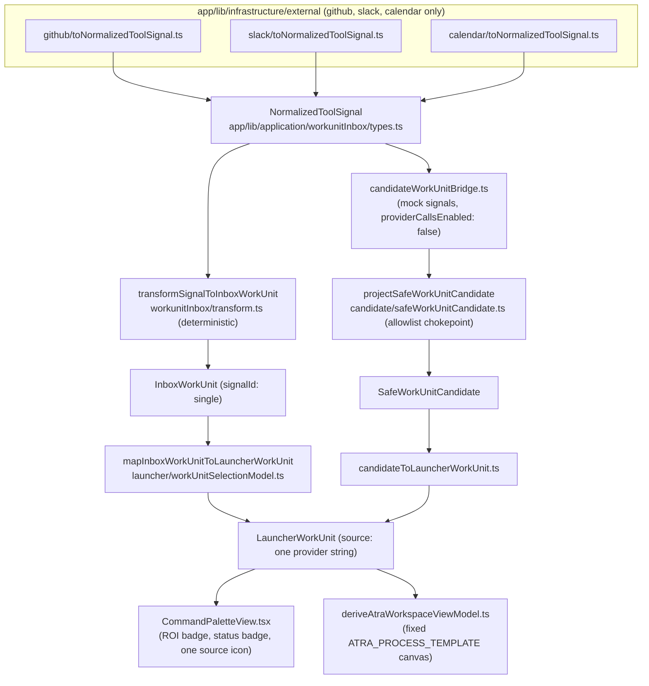
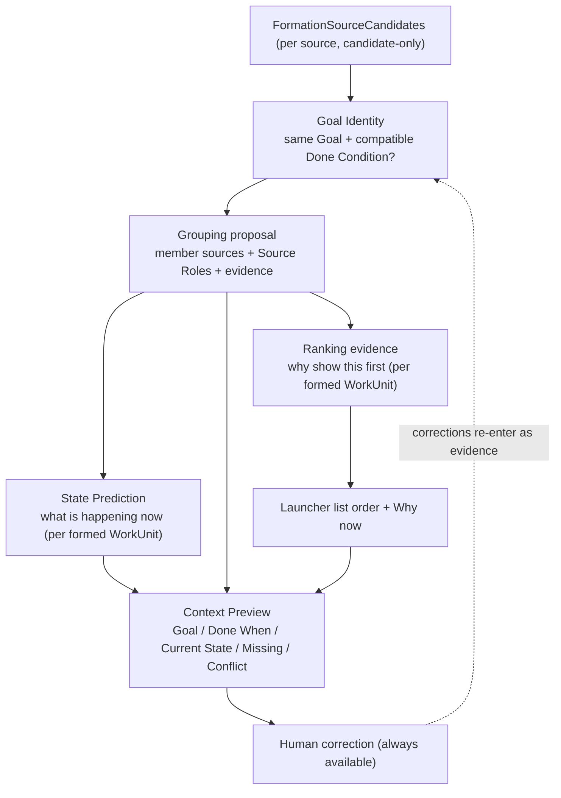
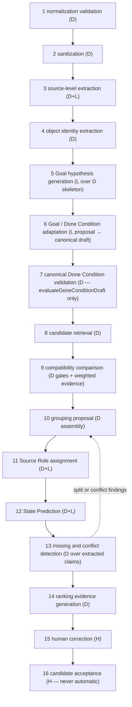
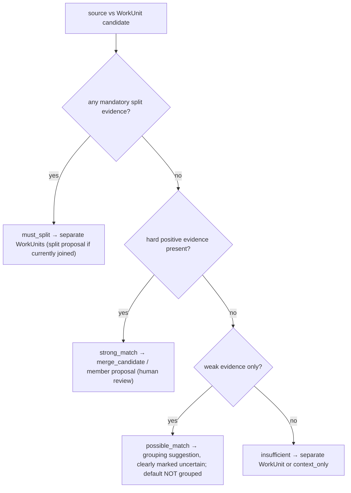
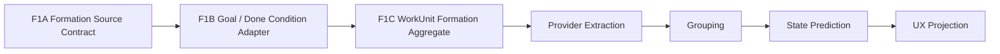

# WorkUnit Formation & Provider Processing Plan

## 0. Status, scope, and provenance

| Item | Value |
| --- | --- |
| Status | Planning document only — no runtime code is changed by this PR |
| Base contract | `docs/specs/WORKUNIT_GOAL_DONE_CONDITION_UX_CONTRACT.md` (PR #173, branch `docs/goal-done-condition-ux-contract`, head `2a5513ca742ce62ebefdd58a7074a689738eec2b` at the time of writing) |
| Planning branch | `plan/workunit-formation-provider-processing` (stacked on the contract branch) |
| Repository state inspected | The exact tree of base commit `2a5513ca` (= `main@0b20218d` + the UX contract document) |
| Out of scope | OAuth, tokens, provider polling/writes, real LLM enablement, approval, dry-run, execution, deployment, D1 contract changes (PR #172 / Issue #155 are owned by separate agents and untouched) |

### 0.1 Evidence conventions

Every claim in this document is tagged:

- **[FACT]** — observed in the repository at base commit `2a5513ca`, with the file path cited.
- **[PROPOSAL]** — a design this plan recommends; not yet accepted.
- **[HYPOTHESIS]** — a product or tuning assumption that requires evaluation evidence before it can be treated as accepted (all numeric weights/thresholds in this document are hypotheses).
- **[CONTRACT]** — a rule inherited from the Goal / Done Condition UX contract; treated as accepted for this planning phase.

The central inherited rule **[CONTRACT]**:

```text
WorkUnit integration = the same Goal + a compatible Done Condition
```

Goal Identity, State Prediction, and Ranking remain separate concerns. ROI must not determine Goal Identity. Timestamp proximity must not determine Goal Identity. Actor overlap must not determine Goal Identity. Provider identity must not equal Source Role or Authority.

---

## 1. Executive decision

### 1.1 Recommended architecture **[PROPOSAL]**

Introduce a new candidate-only application layer, `app/lib/application/formation/`, between the existing normalized-signal layer and the existing safe-candidate boundary:

1. **`FormationSourceCandidate`** — one provider-independent, sanitized, candidate-only model for every provider source (Section 4). It is produced from existing normalized inputs; raw provider payloads never enter it.
2. **A Goal / Done Condition adapter** — formation-specific Goal fields, plural evidence references, and independent-closure information wrap the existing `DoneConditionDraft`; only `evaluateDoneConditionDraft` may assign `complete`, `partial`, `invalid`, or `validForFormalCandidate` (Section 4.3).
3. **`WorkUnitFormationCandidate`** — a minimal multi-source, candidate-only aggregate that binds validated source members to the adapted Goal / Done Condition result and requires human review. Grouping evidence, findings, State Prediction, ranking, and public projection are added only by their later owning slices.
4. **A deterministic-first formation engine** — after the three contracts above exist, provider extraction, object-identity retrieval, and pairwise compatibility comparison use **hard gates that override any weighted similarity** (Sections 5–7). The LLM stays behind the existing mock-only `runDecompositionOrchestrator` seam and may propose fields; deterministic code validates proposals.
5. **An extended safe projection** — only in the later UX-projection slice, add allowlisted display-safe fields through the existing `projectSafeWorkUnitCandidate` chokepoint (`app/lib/application/candidate/safeWorkUnitCandidate.ts`) (Section 11).

The existing one-signal pipeline is **not removed**. The formation layer consumes the same normalized inputs and emits an additional, richer candidate shape; the current `candidateWorkUnitBridge` path stays intact until the formation path is proven by fixtures and golden datasets.

Existing contracts are **reused, not duplicated**:

- `DoneConditionDraft` + `evaluateDoneConditionDraft` (`app/lib/application/decomposition/doneConditionGate.ts`) remain the sole completion contract and deterministic status authority. Formation keeps `evidenceRefs` plurality and `independentClosure` as adapter-side aggregation inputs; it does not introduce `FormationDoneConditionDraft`, `evaluateFormationDoneCondition`, or a second completion status (Section 4.3).
- `detectForbiddenPromotion`, `runRuleGate`, `requiresHumanReview` (`promotionRules.ts`, `ruleGate.ts`) remain the promotion safety spine; merge/split finalization stays forbidden.
- `projectSafeWorkUnitCandidate` remains the single frontend chokepoint; new fields extend its allowlist rather than bypassing it.
- The mock-only LLM boundary (`NO_GO_RUNTIME_CONTROLS` in `decompositionOrchestrator.ts`) remains closed; no phase of this plan enables a real provider.

### 1.2 First implementation sequence **[PROPOSAL]**

The former broad F1 is replaced by three dependency-ordered PRs (details in Section 14):

1. **F1A — Formation Source Contract**: `FormationSourceCandidate` plus source-local validators and forbidden-field tests only. No Goal, Done Condition, aggregate, cross-source evidence/finding, public projection, provider extraction, LLM, or UI types.
2. **F1B — Goal / Done Condition Adapter**: `GoalHypothesis` plus an adapter around the existing `DoneConditionDraft` and `evaluateDoneConditionDraft`. It may report formation-specific aggregation blockers, but it cannot assign or override Done Condition status.
3. **F1C — WorkUnit Formation Aggregate**: the minimal plural-member `WorkUnitFormationCandidate` and `SourceRole` association, with literal candidate-only and human-review requirements. No provider extraction, grouping algorithm, State Prediction, ranking, findings, or public projection.

The first implementation PR is **F1A only**. This keeps the provider-independent input boundary reviewable before completion adaptation or downstream aggregation semantics are introduced.

---

## 2. Current repository state

### 2.1 Observed flow: provider event → Launcher / Atra workspace **[FACT]**



A separate, currently parallel path exists for LLM processing **[FACT]**: `processWorkSignal` (`app/lib/llm/processWorkSignal.ts`) orchestrates `ExternalSignal → sanitizeForLlm → extractSourceCandidate → generateWorkUnitDraftFromCandidate → evaluateWorkUnit`, entirely against domain types (`app/lib/domain/types.ts`), with per-stage character budgets (`app/lib/llm/budget.ts`) and per-stage model routes (`app/lib/llm/modelRouter.ts`, DeepSeek `deepseek-chat` defaults, mock provider available). The decomposition layer (`app/lib/application/decomposition/`) classifies text into candidate targets behind a mock-only LLM boundary (`runDecompositionOrchestrator`).

### 2.2 Exact one-signal assumptions **[FACT]**

These are the concrete points where the current code assumes one signal → one work item; the formation layer must generalize each of them:

| Location | Assumption |
| --- | --- |
| `workunitInbox/types.ts` — `InboxWorkUnit.signalId: string` | One inbox WorkUnit is born from exactly one signal. |
| `workunitInbox/transform.ts` — `transformSignalToInboxWorkUnit` builds `id: "wu:" + signal.id` | WorkUnit identity is derived from a single signal id. |
| `llm/extractCandidate.ts` — `sourceSignalIds: [signal.id]`, `sourceType: signal.sourceType` | `SourceCandidate` has a plural `sourceSignalIds` field but is always constructed as a singleton, and carries exactly one `sourceType`. |
| `llm/generateWorkUnitDraft.ts` — `sourceCandidateIds: [candidate.id]` | A draft aggregates exactly one candidate. |
| `candidate/candidateWorkUnitBridge.ts` — `buildRawCandidateFromSignal(signal)` | One `SafeWorkUnitCandidate` per `NormalizedToolSignal`; `source` is a single provider label; the candidate graph has exactly one `source` node. |
| `launcher/workUnitSelectionModel.ts` — `LauncherWorkUnit.source: string`, `sourceIcon: SourceAppIconView` | The Launcher row shows one provider and one icon. |
| `workunitInbox/types.ts` — `NormalizedToolProvider = "github" \| "slack" \| "calendar"` | Notion, Gmail, and Drive do not exist at the normalized-signal boundary (only as `SourceType` in `domain/types.ts` and as display icons in `launcher/sourceAppIconModel.ts`). |

### 2.3 Current safety boundaries that must be preserved **[FACT]**

| Boundary | Location | Behavior |
| --- | --- | --- |
| Metadata allowlist for LLM input | `llm/sanitize.ts` — `ALLOWED_TEXT_METADATA_KEYS`, `FORBIDDEN_METADATA_KEYS`, homoglyph canonicalization via `normalizeForSecurityScan` | Only named safe metadata keys are ever included in prompt text; body/raw/identity/secret keys are excluded by name, with Unicode-evasion hardening. |
| Sensitive-value + injection scan | `llm/sanitize.ts` — `SENSITIVE_VALUE_PATTERNS`, `PROMPT_INJECTION_PATTERNS`; blocking risk flags in `processWorkSignal.ts` | `prompt_injection_detected`, `source_content_includes_instruction`, `sensitive_data_detected` fail the pipeline closed at the sanitize stage. |
| LLM output bounds | `llm/validateLlmOutput.ts` — `MAX_STRING_FIELD_LENGTH = 8_000`, `MAX_ARRAY_FIELD_ENTRIES = 100` | LLM output is an untrusted channel; strings and arrays are size-bounded before use. |
| Stage budgets | `llm/budget.ts` — `DEFAULT_LLM_BUDGET` (8000/4000/3000/2000 chars) | Oversized inputs never reach a provider. |
| Deterministic Done Condition gate | `decomposition/doneConditionGate.ts` — `evaluateDoneConditionDraft` | Missing outcome/verifier/criteria/evidence ⇒ `partial`; AI verifier or forbidden context ⇒ `invalid`. |
| Forbidden promotion | `decomposition/promotionRules.ts` — `detectForbiddenPromotion` | `merge_candidate → merged`, `split_candidate → finalized_split`, `done_condition → done`, `preview → approval`, `approval → execution` are structurally forbidden. |
| Rule gate | `decomposition/ruleGate.ts` — `runRuleGate` | Blocks `vector_merge_finalization`, `cache_based_approval`, `tool_pin_execution`; `humanReviewRequired` is literal `true` in the result type. |
| Mock-only LLM | `decomposition/decompositionOrchestrator.ts` — `NO_GO_RUNTIME_CONTROLS` | Any non-mock provider fails closed (`real_provider_requires_readiness_gate`) before generating. |
| Context exclusion scan | `application/llmContext/exclusionScanner.ts` + `application/safety/p0Policy.ts` | Forbidden keys/values are scanned recursively; findings block orchestration. Summary text is additionally screened by `FORBIDDEN_SUMMARY_TEXT` in the orchestrator. |
| Frontend allowlist chokepoint | `candidate/safeWorkUnitCandidate.ts` — `SAFE_WORK_UNIT_CANDIDATE_FIELDS`, `FORBIDDEN_CANDIDATE_FIELDS`, `projectSafeWorkUnitCandidate` | Only allowlisted keys are read; `approvalId`, `targetHash`, `payloadHash`, `tenantId`, `actorUserId`, `role`, `rawPayload`, `providerPayload`, `token`, `secret`, `authorization`, `cookie` can never be emitted; `humanReviewRequired`/`candidateOnly` are forced `true`. |

### 2.4 Gap analysis against the UX contract **[FACT vs CONTRACT]**

| UX-contract requirement | Current state | Gap |
| --- | --- | --- |
| Multi-source WorkUnit membership | `signalId` single; `sourceSignalIds` singleton | Formation candidate with plural, role-tagged members is missing. |
| Goal contract (`outcome`, `workObject`, `decisionNeeded`, `scope`, `verifier`, `timeHorizon`) | `DoneConditionDraft` has `outcome`/`verifier`/`acceptanceCriteria`; `WorkUnitDraft` has `title`/`situation`/`problem`/`nextAction` | `workObject`, `decisionNeeded`, `scope`, `timeHorizon`, and a Goal display sentence do not exist as typed fields. |
| Done Condition `evidenceRefs` (plural) + `independentClosure` | `DoneConditionDraft.sourceRef` is optional and singular; no closure field | Composition needed (Section 4.3). |
| Source Roles | Not represented anywhere | New enum + assignment stage. |
| State Prediction (actor/limit/eventTime/update/authority/unresolved/missing/conflict) | `detectedDeadline`, `dueAt`, priority heuristics only | New model (Section 8). |
| Missing / Conflict as product value | `missingFields` exists on drafts and Done Conditions; conflicts only as `contradictionFlags: []` placeholder on `EvidenceCandidate` | Conflict detection and user-visible surfacing are missing. |
| Grouping explanation + correction | `MergeCandidate.sameDoneConditionReason` and `SplitCandidate` exist as classifier outputs; no correction flow or membership explanation | New evidence ledger + correction records (Sections 7, 12). |
| Ranking separated from grouping, explained as "Why now" | `roi` numeric badges (`calculateLauncherRoi`, `deriveRoi`) drive the Launcher directly | Ranking-evidence model with explanation is missing; ROI heuristics conflate priority, status, and kind (Section 9). |
| Notion / Gmail / Drive sources | Absent from `NormalizedToolProvider` | Adapter requirements (Section 5), explicitly marked. |

---

## 3. Goal / State / Ranking separation

Responsibilities **[CONTRACT]**, with the owning proposed modules **[PROPOSAL]**:

| Concern | Question it answers | May use | Must never use | Proposed owner |
| --- | --- | --- | --- | --- |
| Goal Identity | Do these sources describe the same independently closable Goal? | Outcome, Work Object, Decision Needed, Verifier, Acceptance Criteria, Independent Closure, explicit object identity, explicit cross-links | ROI, timestamp proximity alone, actor overlap alone, provider identity | `formation/goalIdentity.ts` |
| State Prediction | What is happening now, and why does it matter now? | Actor roles, Limit/deadline, Event time, meaningful Update, Authority, Unresolved, Missing, Conflict, supersession/version state | Grouping changes (state never regroups sources), ROI | `formation/statePrediction.ts` |
| Ranking | Which formed WorkUnit should be shown first? | ROI, urgency, deadline proximity, meaningful freshness, actionability, external consequence, blocking impact | Goal Identity inputs as outputs — ranking reads formation results, never writes membership | `formation/rankingEvidence.ts` |



Directional rules **[CONTRACT]**:

- Goal Identity precedes and never reads State Prediction or Ranking outputs.
- State Prediction reads a fixed grouping; if its evidence contradicts the grouping (for example two incompatible outcomes surface), it emits a **conflict finding / split proposal** for human review — it does not silently regroup.
- Ranking is computed last, per formed WorkUnit, and is presentation-only.

---

## 4. Provider-independent source contract

### 4.1 `FormationSourceCandidate` **[PROPOSAL]**

One normalized, sanitized, candidate-only record per provider source object, produced *after* the existing acquisition/normalization boundary (this plan assumes provider data has already been acquired and normalized safely enough to enter the candidate-only processing boundary; acquisition is out of scope). Raw provider payloads never appear in this model; `ExternalSignal.rawContentRef` (**[FACT]** `app/lib/domain/types.ts`) stays behind the sanitization boundary exactly as today.

Trust vocabulary used below:

- **untrusted-sanitized** — text that passed `sanitizeForLlm`-class screening (allowlisted keys, sensitive-value scan, injection scan, length caps) but is still untrusted content.
- **deterministic** — derived by pure code from structured provider metadata (ids, timestamps, enumerated states), never from free text.
- **LLM-proposed** — a value the (mock-boundary) LLM may propose; it is always revalidated deterministically and is never load-bearing for safety.

| Field | Purpose | Origin | Trust | LLM-proposed | User-visible | Required | Validation rule |
| --- | --- | --- | --- | --- | --- | --- | --- |
| `provider` | Identify the source system (display + adapter dispatch only, never authority) | Adapter constant | deterministic | No | Yes (badge) | Yes | Closed enum: `github \| slack \| notion \| gmail \| google_calendar \| google_drive` (extends the observed `NormalizedToolProvider`; marked **[ADAPTER-REQ]** for notion/gmail/drive) |
| `sourceRef` | Stable reference to the original object; reuses **[FACT]** `SourceRef` (`domain/types.ts`) | Adapter | deterministic | No | No (drives navigation, not shown raw) | Yes | `source` matches `provider`; `externalId` non-empty, bounded ≤ 256 chars; `capturedAt` ISO-8601 |
| `sourceObjectId` | Provider-native object identity (PR number, message ts, page id, RFC 5322 Message-ID) for **hard** Goal-identity matching | Adapter | deterministic | No | No | Yes | Non-empty, bounded, provider-shape-checked; never constructed from free text |
| `parentObjectId` | Containing object (repo, channel, database/parent page, mailbox thread) for weak co-location evidence | Adapter | deterministic | No | No | No | Bounded; absence allowed |
| `threadId` | Conversation/thread identity (Slack `thread_ts`, Gmail thread id, GitHub issue for its comments) | Adapter | deterministic | No | No | No | Bounded; absence allowed |
| `title` | Human-readable label | Adapter (subject/title/first-line) | untrusted-sanitized | No | Yes | Yes | Non-empty after trim; ≤ 300 chars; injection/sensitive scan |
| `sanitizedSummary` | Short content summary for display and prompt input | Sanitizer over adapter text | untrusted-sanitized | Refinement allowed | Yes | Yes | ≤ 2 000 chars; must pass `FORBIDDEN_SUMMARY_TEXT`-class scan (**[FACT]** pattern in `decompositionOrchestrator.ts`) |
| `actorAssertions` | Who did/asked/owns *as asserted by the source* — role interpretation happens later | Adapter structured fields first; text mentions flagged | untrusted-sanitized | Extraction allowed (from text only) | Partially (names may render) | No | ≤ 20 entries; each `{ name ≤ 120 chars, assertedRelation ∈ closed enum (author, assignee, reviewer_requested, mentioned, owner_claimed, approver_claimed) }`; never mapped to tenant user ids in this layer |
| `timestamps` | Event-time facts: `occurredAt` (source event), `editedAt?`, `capturedAt` (normalization time) | Adapter | deterministic | No | Yes (relative time) | Yes (`occurredAt`, `capturedAt`) | ISO-8601; `capturedAt ≥ occurredAt` not enforced (clock skew) but flagged |
| `explicitDeadline` | A deadline the source *states* (due date, "by Friday", calendar start) | Structured field preferred; text extraction flagged as inferred | deterministic when structured; LLM-proposed when textual | Yes (textual only, with `inferred: true`) | Yes | No | ISO-8601 date or bounded text ≤ 120 chars + `inferred` boolean; inferred deadlines never drive urgency alone |
| `sourceLinks` | URLs the source contains (cross-link evidence) | Adapter link extraction | deterministic (URL syntax) | No | No (used as evidence, rendered as reference chips) | No | ≤ 50 entries; each parses as URL; provider-recognized links normalized to `{provider, sourceObjectId}` pairs; unrecognized hosts kept opaque, never fetched |
| `referencedObjects` | Provider-recognized objects this source explicitly references ("#123", "PR 241", page mention) | Deterministic pattern extraction over sanitized text + `sourceLinks` normalization | deterministic | Candidate mentions may be LLM-flagged, then deterministically verified | Yes (as "grouped because" evidence) | No | ≤ 50; each `{provider, sourceObjectId}`; unverifiable mentions dropped |
| `versionInfo` | Version/revision the source claims (document version, PR head SHA label, "v3") | Structured field preferred; text pattern secondary | deterministic when structured | Yes (textual, `inferred: true`) | Yes | No | ≤ 60 chars; comparison only within the same `sourceObjectId` lineage |
| `supersedes` / `supersededBy` | Explicit replacement claims ("replaces the v2 doc", provider revision chains) | Structured revision data; explicit textual claims flagged | deterministic when structured; LLM-proposed otherwise | Yes (textual, `inferred: true`) | Yes (staleness marker) | No | Each entry `{provider, sourceObjectId}`; cycles rejected; inferred entries require human confirmation before affecting authority |
| `unresolvedMarkers` | Open questions, unresolved review threads, unanswered requests | Structured state first (open review threads, unanswered thread); text question detection secondary | deterministic when structured | Yes (textual) | Yes (unresolved list) | No | ≤ 30; each `{kind ∈ enum (open_question, unresolved_review, unanswered_request, missing_approval, blocker_claim), summary ≤ 200 chars}` |
| `decisionMarkers` | Decision requests or recorded decisions ("please decide", "approved", "we chose X") | Text extraction (flagged) + structured review states | LLM-proposed with deterministic keyword corroboration | Yes | Yes (Decision Needed input) | No | ≤ 10; `{kind ∈ (decision_requested, decision_recorded, approval_recorded), summary ≤ 200 chars, inferred: boolean}` |
| `statusMarkers` | Source-native status (PR open/merged/draft, issue closed, page status property, calendar confirmed) | Adapter structured fields ONLY | deterministic | No | Yes | No | Closed per-provider enums mapped to a shared enum `(open, in_review, changes_requested, approved, merged, closed, draft, scheduled, cancelled, archived, unknown)` |
| `authoritySignals` | Claim-specific authority evidence (accepted/approved status, document ownership, signed-off review, official-communication markers) | Structured metadata first; explicit textual claims flagged `inferred` | deterministic when structured | Yes (textual, `inferred: true`) | Yes (Source Role rationale) | No | ≤ 10; `{kind ∈ (accepted_status, owner_of_record, signed_off_review, decision_maker_named, official_external_communication, superseded_marker), inferred: boolean}`; **provider identity itself is never an authority signal** [CONTRACT] |
| `navigationTarget` | Where "Open source" takes the user | `sourceRef.url` or adapter deep link | deterministic | No | Yes (button) | Yes | Must be a URL already present in normalized input; never synthesized from text; scheme allowlist (`https`) |
| `extractionConfidence` | How reliable this record's *extracted* (non-structured) fields are | Extractor | deterministic aggregation of per-field flags | No (aggregated from flags, not a raw LLM score) | No (internal; bands may drive "inferred" chips) | Yes | `high \| medium \| low` band, derived by counting `inferred` fields — never a free numeric similarity |
Boundary rules **[PROPOSAL]**:

- The model contains **no raw payload field at all** — there is nothing to forbid because the type cannot express it; tests assert the absence of `rawPayload`/`providerPayload`/`body` keys structurally (same style as `FORBIDDEN_CANDIDATE_FIELDS` **[FACT]**).
- `tenantId` exists only on the server-side envelope (as with **[FACT]** `NormalizedToolSignal.tenantId`) and is stripped by the safe projection exactly as `projectSafeWorkUnitCandidate` does today; it is never part of the frontend contract.
- Every free-text field passes the existing sanitizer class before storage in the candidate model (`llm/sanitize.ts` patterns reused, not reimplemented).
- F1A contains source-local facts and sanitized assertions only. Goal `missingFields` belong to F1B; cross-source contradiction findings belong to F6; grouping evidence belongs to F3; public allowlist fields belong to F8.

### 4.2 `SourceRole` **[PROPOSAL, mirrors CONTRACT §11]**

```text
SourceRole =
  implementation | original_request | accepted_specification | decision_record |
  external_context | review_state | evidence | open_question | deadline_context |
  historical_context | contradicting_claim
```

Role is assigned per (source, WorkUnitFormationCandidate) pair — the same source may hold different roles in different WorkUnits, and role never comes from `provider` alone [CONTRACT].

### 4.3 Goal / Done Condition adapter — one canonical authority **[PROPOSAL]**

The UX contract (§5.1) requires `outcome`, `verifier`, `acceptanceCriteria`, `evidenceRefs` (plural), `independentClosure`, plus derived `missingFields`/`conflicts`/`status`. The existing **[FACT]** `DoneConditionDraft` already carries `outcome`, `verifier`, `acceptanceCriteria`, `missingFields`, `status ∈ complete|partial|invalid`, `invalidReasons`, `riskFlags`, `candidateOnly: true` — and its deterministic gate `evaluateDoneConditionDraft` already enforces the AI-verifier ban and forbidden-context invalidation. Rebuilding this would duplicate a security-reviewed gate.

F1B therefore introduces an adapter candidate, not a second Done Condition model:

```text
FormationGoalDoneConditionCandidate = {
  goal: GoalHypothesis
  doneCondition: DoneConditionDraft   // canonical status-bearing draft
  evidenceRefs: readonly SourceRef[]  // aggregation sidecar; includes the primary sourceRef when present
  independentClosure: "independent" | "parent_bounded" | "unknown"
  adapterIssues: readonly FormationAdapterIssue[]
  humanReviewRequired: true
  candidateOnly: true
}
```

`FormationAdapterIssue` is a small closed set for missing Goal fields, evidence-membership mismatch, or unknown independent closure. These issues may block F1C aggregation or request clarification, but they never mutate Done Condition status.

Canonical-authority rules:

- `evaluateDoneConditionDraft(doneCondition)` is the only function that assigns `complete`, `partial`, `invalid`, `validForFormalCandidate`, `missingFields`, or `invalidReasons`.
- The adapter copies the canonical verdict; it cannot upgrade a `partial`/`invalid` draft or downgrade a `complete` draft into a second Done Condition status.
- `DoneConditionDraft.sourceRef` or `humanInputRef` remains the canonical evidence-anchor requirement. Extra `evidenceRefs` do not make a canonically partial draft complete.
- `evidenceRefs` and `independentClosure` affect formation aggregation eligibility only. No `FormationDoneConditionDraft`, `evaluateFormationDoneCondition`, or formation-local completion enum is allowed.
- Every adapter output remains candidate-only and requires human review before F1C aggregation can be formalized, merged, or split.

---

## 5. Provider-specific extraction matrices

Legend: **D** = deterministic from structured metadata; **L** = LLM-proposed from sanitized text, deterministically validated, marked `inferred`; **[ADAPTER-REQ]** = the field does not exist in current normalized inputs (**[FACT]** current adapters cover only `github`/`slack`/`calendar` with 5 signal types) and is a requirement on a future adapter, not an observed capability.

### 5.1 GitHub

| Formation input | Extraction approach |
| --- | --- |
| Work Object identity | **D**: `owner/repo#number` for PR/issue from structured event (**[FACT]** `GitHubNormalizedEvent.repository`, `.number`); commit SHA / file path for review comments **[ADAPTER-REQ]**. The PR/issue is the *object*, not automatically the Goal. |
| Outcome candidates | **L** from PR/issue title+body summary ("make PR mergeable", "fix bug X"); **D** hint: `pull_request_review_requested` implies "ready for review decision" (**[FACT]** signal type exists). |
| Decision Needed candidates | **D**: review request ⇒ approve/request-changes decision; **L**: maintainers' questions in threads **[ADAPTER-REQ: comment threads]**. |
| Verifier candidates | **D**: requested reviewers / CODEOWNERS **[ADAPTER-REQ]**; assignee is *not* automatically verifier. |
| Acceptance Criteria candidates | **L** from PR description checklists (`- [ ]`), linked issue acceptance sections; **D** corroboration: CI required checks list **[ADAPTER-REQ]**. |
| Actor roles | **D** assertions: author, assignee (**[FACT]** `actor`, `assignee` fields), requested reviewer **[ADAPTER-REQ]**; role interpretation deferred to State Prediction. |
| Limit / deadline | **L** only (milestone due date **[ADAPTER-REQ]** is **D**); GitHub rarely carries deadlines — do not invent one. |
| Event time | **D**: event `updatedAt` (**[FACT]** used as both `createdAt`/`updatedAt` in `githubEventToNormalizedToolSignal` — a current simplification to fix **[ADAPTER-REQ]**: distinct created/updated/merged timestamps). |
| Meaningful updates | **D**: new commits after last review, review state change, CI state change **[ADAPTER-REQ]**; a rebase-only push is *not* meaningful — needs diff-stat metadata **[ADAPTER-REQ]**. |
| Unresolved items | **D**: unresolved review threads count, `changes_requested` state **[ADAPTER-REQ]**; **L**: open questions in comments. |
| Authority indicators | **D**: approved review (signed-off), branch-protection required status **[ADAPTER-REQ]**; **L** (`inferred`): "maintainer said" claims. |
| Version / supersession | **D**: PR supersedes PR (`closes #`, "replaces #123" link + closed state); head SHA as revision **[ADAPTER-REQ]**. |
| Explicit cross-links | **D**: issue/PR references (`#123`, full URLs), "Closes/Fixes" keywords **[ADAPTER-REQ: body text access]**. |
| Source Role candidates | `implementation` (PR), `review_state` (reviews/CI), `evidence` (CI logs), `original_request` (issue), `decision_record` (merged+approved PR). |
| Primary Source suitability | High when the WorkUnit's Decision is the review/merge decision itself; low when GitHub is downstream implementation of a Notion/Slack-originated decision. |
| Original-source navigation | **D**: `sourceUrl` (**[FACT]** field exists) to PR/issue/comment anchor. |

### 5.2 Slack

| Formation input | Extraction approach |
| --- | --- |
| Work Object identity | **D**: `channel + thread_ts` **[ADAPTER-REQ]** identifies the *conversation*, which is usually NOT the work object; **L**: the object the thread is about (a PR, doc, customer) via `referencedObjects` verification. |
| Outcome candidates | **L**: what the requester asks to become true; often the clearest statement of the Goal anywhere. |
| Decision Needed candidates | **L**: direct asks ("can we ship Friday?"); **D** corroboration: existing `decision_request` event type (**[FACT]** `SlackNormalizedEvent.eventType`). |
| Verifier candidates | **L**: the person the answer is owed to (requester) or an explicitly named approver; never "most active participant". |
| Acceptance Criteria candidates | **L**: explicit conditions in the ask ("with the error budget attached"); usually sparse ⇒ produces `missingFields` rather than invented criteria. |
| Actor roles | **D** assertions: message author (**[FACT]** `actor`), mentioned users **[ADAPTER-REQ]**; requester/owner interpretation is contextual. |
| Limit / deadline | **L** ("by EOD", "before the release call") always `inferred: true`; **D** only if the workspace uses structured reminders **[ADAPTER-REQ]**. |
| Event time | **D**: message `ts` **[ADAPTER-REQ: currently only `updatedAt`]**. |
| Meaningful updates | **D**: new thread reply after user's last read **[ADAPTER-REQ: read cursor]** is *activity*; **L** decides whether it changes state (answer given vs "+1"). |
| Unresolved items | **D**: thread with an unanswered question from `thread_needs_reply` (**[FACT]** event type exists); **L**: which question remains open. |
| Authority indicators | **L** (`inferred`): explicit decision statements by a named decision maker; Slack formality is claim-specific — an approved decision CAN be recorded in Slack [CONTRACT §8.3]. |
| Version / supersession | **L**: "ignore my last message", "updated plan below" — always `inferred`, human-confirmable. |
| Explicit cross-links | **D**: URLs in messages (GitHub/Notion/Gmail links) — the highest-value Slack grouping evidence. |
| Source Role candidates | `original_request`, `open_question`, `decision_record` (when a named authority records one), `external_context`, `contradicting_claim`. |
| Primary Source suitability | High when the WorkUnit closes by answering the thread; otherwise usually a request/context role. |
| Original-source navigation | **D**: permalink **[ADAPTER-REQ]** (deep link to thread/message). |

### 5.3 Notion

Everything below is **[ADAPTER-REQ]** — no Notion adapter exists (**[FACT]** `infrastructure/external/` contains only `github`, `slack`, `calendar`; `notion` exists as a `SourceType` and a display icon only).

| Formation input | Extraction approach |
| --- | --- |
| Work Object identity | **D**: page id / database row id; the *deliverable the page describes* may differ — **L** distinguishes "the doc is the deliverable" vs "the doc describes the deliverable". |
| Outcome candidates | **L** from page title + intro; **D** hint: database status/target properties when present. |
| Decision Needed candidates | **L**: open-question blocks, "Decision" headings; **D**: a database property literally named decision/status. |
| Verifier candidates | **D**: page owner / property-named approver; **L**: "@name to approve" mentions (`inferred`). |
| Acceptance Criteria candidates | **L**: checklist blocks, "Definition of done" sections — Notion is often the best criteria source. |
| Actor roles | **D**: created-by / last-edited-by assertions; editing ≠ owning. |
| Limit / deadline | **D**: date properties; **L**: inline dates (`inferred`). |
| Event time | **D**: `created_time`, `last_edited_time` — but see meaningful updates. |
| Meaningful updates | `last_edited_time` alone is NOT meaningful (typo edits). **D**: property/status changes; **L**: section-level content change summary (requires revision access — mark as open adapter question, Section 15). |
| Unresolved items | **L**: unresolved comment threads (**D** count if the adapter exposes comments), open question blocks, empty required sections. |
| Authority indicators | **D**: explicit status property = accepted/approved; page in an official space; **L** (`inferred`): "approved on <date> by <name>" lines. A Notion page without these is a *draft*, not a specification [CONTRACT §8.3]. |
| Version / supersession | **D**: explicit "v3" in title + link to v2; page property `superseded-by`; **L**: "replaces" statements (`inferred`). |
| Explicit cross-links | **D**: page mentions, embedded GitHub/Gmail/Slack URLs, relation properties. |
| Source Role candidates | `accepted_specification` (only with authority signals), `decision_record`, `historical_context` (superseded), `evidence`, `open_question`. |
| Primary Source suitability | High when the accepted spec governs the decision; a superseded page must be demoted to `historical_context` even if semantically richest. |
| Original-source navigation | **D**: page URL (block anchor when available). |

### 5.4 Gmail

Everything below is **[ADAPTER-REQ]** — no Gmail adapter exists (**[FACT]** as above).

| Formation input | Extraction approach |
| --- | --- |
| Work Object identity | **D**: RFC 5322 `Message-ID` / thread id identify the *conversation*; **L**: the object under discussion (contract, invoice, PR) via `referencedObjects`. One email may contain several independent objects ⇒ split evidence. |
| Outcome candidates | **L**: what the sender needs to become true ("confirm the revised terms"). |
| Decision Needed candidates | **L**: explicit asks; **D** corroboration: question marks + recipient position in To: (weak). |
| Verifier candidates | **L**: external requester (for responses) or internally named approver; the mail sender is an *assertion*, display names are spoofable — mark authority `inferred` unless domain-verified **[ADAPTER-REQ: authenticated sender metadata]**. |
| Acceptance Criteria candidates | **L**: bulleted conditions in the request; sparse ⇒ `missingFields`. |
| Actor roles | **D** assertions: From/To/Cc; external vs internal from domain **[ADAPTER-REQ]**; Cc presence never implies ownership. |
| Limit / deadline | **L**: stated dates ("by July 25") `inferred`; **D**: calendar invites inside the thread (hand off to calendar seam). |
| Event time | **D**: `Date` header per message; thread has a time *range*, not one time. |
| Meaningful updates | **D**: new message in thread; **L**: whether it answers, escalates, or merely acknowledges. |
| Unresolved items | **D**: last inbound message unanswered by user **[ADAPTER-REQ: reply linkage]**; **L**: open asks per message. |
| Authority indicators | **L** (`inferred`): official external communication (customer/legal), explicit sign-off language; **D**: verified sender domain class **[ADAPTER-REQ]**. Gmail is not always an external formal request — internal chatter flows through it too. |
| Version / supersession | **L**: "please use the attached v2", "disregard my previous email" (`inferred`); attachment lineage **[ADAPTER-REQ: attachment metadata, never content]**. |
| Explicit cross-links | **D**: URLs in body; thread References/In-Reply-To headers. |
| Source Role candidates | `original_request` (external ask), `external_context`, `decision_record` (written approval), `deadline_context`, `contradicting_claim`. |
| Primary Source suitability | High when the WorkUnit closes by sending a response (note: *sending* is outside this phase — the WorkUnit closes at "response approved by verifier", the send itself stays behind the existing approval/execution boundary). |
| Original-source navigation | **D**: Gmail deep link by message/thread id. |

### 5.5 Extension seams: Google Calendar and Google Drive **[PROPOSAL]**

- **Calendar** (adapter exists for one signal type, **[FACT]** `calendar_deadline`): extend as a *Limit/State* evidence provider — events become `deadline_context` sources (`explicitDeadline` **D** from start time, attendees as actor assertions, recurring-meeting id as `parentObjectId`). Calendar events are rarely independent Goals; default classification is `context_only` unless an explicit deliverable is attached.
- **Drive**: files become `evidence` / `accepted_specification` candidates (owner **D**, `modifiedTime` **D**, revision chain **D** as version info, file id as `sourceObjectId`). Drive content extraction is deferred; metadata-only sources are still useful for object identity and freshness. Both seams reuse the same `FormationSourceCandidate` contract — no new model.

### 5.6 False assumptions that must be avoided **[CONTRACT + PROPOSAL]**

| False assumption | Correct treatment |
| --- | --- |
| GitHub is always the Goal | A PR is often the `implementation` of a Goal owned elsewhere; the Goal is where the decision boundary is. |
| Slack is always informal | A named decision maker recording a decision in Slack is a `decision_record` with authority. |
| Notion is always current or authoritative | Without accepted-status/ownership signals a page is a draft; superseded pages are `historical_context`. |
| Gmail is always an external formal request | Internal, informational, and stale threads abound; external+official is an authority *signal*, not a provider property. |
| Newest is correct | Freshness never outranks authority; a new informal message does not supersede an accepted spec without an explicit supersession claim + human confirmation. |
| Most active actor is the verifier | Verifier comes from explicit assignment/ownership evidence; activity volume is not evidence. |
| Same repo/channel/thread ⇒ same WorkUnit | Containers are weak co-location evidence only; one thread can hold many Goals and one Goal can span many containers. |
| Calendar events are tasks | They are usually Limits for other work. |
| A CI log is a WorkUnit | It is `evidence`/`review_state` for an existing WorkUnit (**[FACT]** the UX contract §7.3 lists this exact case as `context_only`). |

---

## 6. Information processing pipeline

### 6.1 Stages **[PROPOSAL]**



| # | Stage | Kind | Behavior |
| --- | --- | --- | --- |
| 1 | Normalization validation | Deterministic | Shape/enum/bounds checks on incoming normalized input; anything malformed is rejected (never "repaired"). |
| 2 | Sanitization | Deterministic | Reuse of the `llm/sanitize.ts` pattern class: key allowlists, sensitive-value scan, injection scan, length caps. Blocking risk flags fail the source closed, as `processWorkSignal` does today **[FACT]**. |
| 3 | Source-level extraction | Deterministic first, LLM-assisted for text | Fill `FormationSourceCandidate` fields; every LLM-derived value carries `inferred: true` and passes bounds validation (`assertStringField` / `assertStringArrayField` class **[FACT]** `llm/validateLlmOutput.ts`). |
| 4 | Object identity extraction | Deterministic | Canonical `{provider, sourceObjectId}` keys; `referencedObjects` verified against known providers; unverifiable mentions dropped. |
| 5 | Goal hypothesis generation | LLM-assisted | Propose `GoalHypothesis` (`outcome`, `workObject`, `decisionNeeded`, `scope`, `verifier`, `timeHorizon`) per source; missing values stay missing [CONTRACT — no invention]. |
| 6 | Goal / Done Condition adaptation | LLM-assisted proposal, deterministic adapter | Propose fields for the existing `DoneConditionDraft`, then build `FormationGoalDoneConditionCandidate`; plural evidence and independent closure remain adapter-side aggregation inputs. |
| 7 | Done Condition validation | Deterministic | Call `evaluateDoneConditionDraft` **[FACT]** as the sole status authority. Adapter issues may block aggregation, but no formation evaluator may alter the canonical verdict; `invalid` blocks formal candidacy and AI verifier remains forbidden. |
| 8 | Candidate retrieval | Deterministic | Fetch comparable existing formation candidates by object keys, verified cross-links, then (only as *recall* aid) bounded lexical similarity. Retrieval widens the comparison set; it never merges. |
| 9 | Compatibility comparison | Deterministic gates + weighted evidence | Section 7. Hard split gates run first and are final; hard positive evidence next; weak evidence only banded. |
| 10 | Grouping proposal | Deterministic assembly | Emit `merge_candidate` / `split_candidate` / new-WorkUnit / `context_only` attachments with the full evidence ledger. Mirrors the existing `MergeCandidate`/`SplitCandidate` types **[FACT]** `decomposition/types.ts` and keeps their `humanReviewRequired: true`. |
| 11 | Source Role assignment | Deterministic mapping over extracted signals; LLM tie-break flagged | Role per (source, WorkUnit); Primary Source recommendation with reason. |
| 12 | State Prediction | Deterministic transforms + LLM narrative | Section 8. Narrative text is generated only from validated evidence fields, never from raw text. |
| 13 | Missing / conflict detection | Deterministic comparison | Section 10 rules over extracted claims; conflicts always surface, never resolved silently. |
| 14 | Ranking evidence | Deterministic | Section 9; consumes formation output, cannot alter membership. |
| 15 | Human correction | Human | Section 11.3/12; corrections recorded as first-class evidence. |
| 16 | Candidate acceptance | Human | Formalization/merge/split finalization remain behind `detectForbiddenPromotion` **[FACT]**; nothing in this pipeline may finalize automatically. |

**Forbidden from automatic finalization** (structurally, via the existing rule gate): merge execution, split execution, formalization, Done marking, approval, external execution — the pipeline's terminal artifact is always a reviewable candidate.

---

## 7. Goal Identity weighting and hard gates

### 7.1 Explainable compatibility model — no opaque score **[PROPOSAL]**

The comparison between a source (or source cluster) and a WorkUnit candidate produces a `GroupingEvidenceLedger`, not a number:

```text
GroupingComparison = {
  hardSplit:    readonly SplitEvidence[]      // any entry ⇒ MUST NOT group (final)
  hardPositive: readonly PositiveEvidence[]   // strong, individually explainable
  weakSupport:  readonly WeakEvidence[]       // never sufficient alone
  verdict:      "must_split" | "strong_match" | "possible_match" | "insufficient"
  reasons:      readonly string[]             // human-readable, rendered in Grouped Because
}
```



### 7.2 Hard positive evidence (individually strong)

| Evidence | Detection |
| --- | --- |
| Exact provider object ID | Same `{provider, sourceObjectId}` (deterministic). |
| Explicit cross-link | Verified `referencedObjects`/`sourceLinks` pointing at a member object (deterministic). |
| Same independently closable Work Object | `GoalHypothesis.workObject` resolves to the same canonical object. |
| Same Outcome | Outcome statements judged equivalent (LLM equivalence proposal + deterministic verifier/criteria corroboration; equivalence alone without corroboration downgrades to weak). |
| Same Verifier | Identical validated verifier reference. |
| Compatible Acceptance Criteria | Criteria sets neither contradict nor describe disjoint deliverables. |
| Same decision boundary | The same single human decision closes both. |

### 7.3 Weak supporting evidence (never sufficient alone) [CONTRACT §6.2]

Actor overlap, repository/channel/container overlap, topic similarity, timestamp proximity, semantic similarity, related deadline. Weak evidence may raise `insufficient → possible_match`; it can never produce `strong_match` and can never auto-merge.

### 7.4 Mandatory split evidence (overrides everything) [CONTRACT §6.3]

Independently closable outcomes; different deliverables; different verifiers; incompatible acceptance criteria; separate approval/decision boundaries; one source containing multiple independent Goals (⇒ the *source* is split into per-Goal claims first, then each claim is compared separately).

### 7.5 Confidence bands **[HYPOTHESIS — initial values requiring gold-label evaluation]**

- `strong_match`: ≥ 1 hard positive AND 0 hard split.
- `possible_match`: 0 hard positive, ≥ 3 distinct weak evidence *kinds* (not 3 instances of one kind), 0 hard split.
- `insufficient`: otherwise.
- Numeric per-kind weights are deliberately NOT proposed; if later evaluation shows band rules are too coarse, weights may be introduced **only inside the weak tier**, with the hard tiers remaining categorical. Threshold "3 kinds" is a hypothesis to be tuned against the false-merge metric (Section 13.4), which takes priority over recall.

Every verdict carries `reasons[]` phrased for the Context Preview ("both reference PR #241"; "different verifiers: reviewer vs customer") — mirroring the UX contract §6.4/§6.5 examples and reusing the `sameDoneConditionReason` convention from **[FACT]** `MergeCandidate`.

---

## 8. State Prediction model

State Prediction runs per formed WorkUnit over its member sources. Per factor:

| Factor | Data inputs | Deterministic transforms | LLM-assisted | Confidence / contradiction behavior | User-visible output | Provider reliability notes |
| --- | --- | --- | --- | --- | --- | --- |
| Actor | `actorAssertions` across members | Role table per assertion kind (author/assignee/reviewer_requested...); dedupe by name | Contextual role interpretation (requester vs owner vs verifier) — flagged `inferred` | Conflicting role claims ⇒ `ambiguous_actor` finding, shown, never guessed | "Reviewer requested changes", Source Roles rationale | GitHub structured roles reliable; Slack/Gmail roles mostly inferred; Notion edit ≠ ownership |
| Limit | `explicitDeadline` entries; calendar sources | Earliest applicable deadline; distinguish hard (contract/release) vs stated | Classify limit kind from phrasing (`inferred`) | Two different deadlines for one Goal ⇒ conflict finding (not min()) | "Release decision tomorrow" | Calendar **D** reliable; Slack/Gmail dates `inferred`; GitHub rarely has deadlines |
| Event Time | `timestamps.occurredAt` per member | Timeline assembly; latest-per-source; thread ranges | None | Clock skew tolerated; ordering ties surfaced as approximate | "Slack request 3h ago" relative times | Message/commit times reliable; Notion `last_edited_time` conflates meaning (see Update) |
| Update | Member timeline + statusMarkers + version info | Diff vs previous prediction snapshot: new member, status change, new version, new unresolved item | Summarize *what* changed in one sentence from validated deltas only | An update that contradicts prior state ⇒ conflict finding + re-prediction | "PR updated after the specification changed" | GitHub status changes **D**; Notion edits need meaningful-change filtering; Slack replies need answered/unanswered classification |
| Authority | `authoritySignals`, `statusMarkers`, supersession chains | Rank claim-specific authority: accepted_status > owner_of_record > signed_off_review > named decision maker > inferred claims; superseded ⇒ demoted | Extract textual authority claims (`inferred`) | Authority tie or contradiction ⇒ `ambiguous_primary_source` finding | Source Role labels; Primary Source recommendation | Never provider-based [CONTRACT §8.3]; Gmail sender authority requires domain verification (adapter req) |
| Unresolved | `unresolvedMarkers` across members | Union, dedupe, count; map to blocking vs non-blocking | Phrase each unresolved item | Unresolved ≠ unread: read-state is never an input | "Error response remains undefined" | GitHub review threads **D**; Slack unanswered **D+L**; Notion open comments adapter-dependent |
| Missing | Goal/Done-Condition gap check (stage 7) + per-source `missingFields` | Deterministic union against required Goal fields | One focused clarification question per missing field [CONTRACT §7.2 — ask, don't invent] | Missing stays missing; no default values | "Missing: verifier · 1 question" | Uniform — derived, not provider-read |
| Conflict | `contradictionMarkers` from Section 10 rules | Pair-wise claim comparison verdicts | Claim extraction only; the contradiction verdict is deterministic | Conflicts always shown; never auto-resolved; may trigger split proposal | "Notion says v3; PR references v2" | Cross-provider conflicts are the primary value case |

### 8.1 Required outputs per formed WorkUnit **[PROPOSAL, mirrors CONTRACT §10]**

`whatIsHappening` (2–4 factual sentences), `whyNow` (one time-sensitive reason), `currentState` (facts only, no recommendation mixed in), `decisionNeeded` (exactly one main decision; a second major decision ⇒ split signal), `nextAction` (one responsible step), `missing[]`, `conflicts[]`, `sourceRoles[]`, `primarySourceRecommendation {ref, reason}`, `groupedBecause[]` (from the evidence ledger).

### 8.2 Mandatory distinctions **[CONTRACT]**

- **event time ≠ update time** — when it happened at the source vs when our model changed;
- **update time ≠ meaningful change** — a typo edit or rebase is not an update;
- **authority ≠ provider** and **authority ≠ freshness** — a newer low-authority message never outranks an accepted spec by recency alone;
- **unresolved ≠ unread** — read state is not evidence;
- **deadline ≠ urgency** — urgency is a ranking output; deadline is a fact;
- **ROI ≠ current state** — ROI never appears inside `currentState`.

---

## 9. Ranking evidence model

Ranking evidence is generated per formed WorkUnit, after formation, and cannot change membership **[CONTRACT §9]**.

### 9.1 Evidence fields **[PROPOSAL]**

| Evidence | Derivation (deterministic) |
| --- | --- |
| impact | Band from external consequence + blocking impact + decision scope; LLM may *suggest*, bands validated like `clampScore` **[FACT]** `generateWorkUnitDraft.ts` |
| urgency | Deadline proximity + limit kind (hard/soft) |
| effort | Suggested band, clamped (existing `suggestedEffort` convention) |
| deadline proximity | Time-to-earliest-validated-limit |
| external consequence | Presence of official external actors/communications among members |
| blocker effect | This WorkUnit's unresolved items appearing as blockers referenced by other WorkUnits (object-id references only) |
| actionability | Done-Condition completeness + decision-ready state (all inputs present for the verifier's decision) |
| meaningful update | Recency of last *meaningful* change (Section 8 Update) |
| actor-context relevance | Whether the user is requester/owner/verifier among validated actor roles |
| unresolved cost | Count/severity of unresolved items |

Rendered as `Why now` (one sentence assembled from the top evidence entries) — never a single unexplained score by default [CONTRACT §9].

### 9.2 Existing ROI logic: retain / replace / defer **[PROPOSAL]**

| Current logic **[FACT]** | Decision |
| --- | --- |
| `calculateLauncherRoi` (`launcher/workUnitSelectionModel.ts`): priorityBase + kindBonus + statusDelta | **Replace** for formation candidates — it conflates triage status with value and its output feeds a bare `ROI n.n` badge. Retained untouched for the legacy one-signal path until that path is retired. |
| `deriveRoi` (`candidate/candidateWorkUnitBridge.ts`): priority base + signal-type bonus | **Replace** identically (same reasoning); kept for the legacy bridge. |
| `calculatePriorityScore` (`llm/scoreWorkUnit.ts`) impact/urgency/actorWeight/effort formula | **Defer** — the input taxonomy overlaps Section 9.1; whether the formula survives as the internal ordering function is an evaluation question (Section 15). A fixed universal `ActorWeight` is explicitly rejected [CONTRACT §14]; `actor-context relevance` replaces it. |
| `SafeWorkUnitCandidate.roi` + `LauncherWorkUnit.roi` + `resultRoi` badge in `CommandPaletteView.tsx` | **Retain the field** for compatibility, populated from ranking evidence ordering; the *presentation* gains `whyNow` so the number stops being the primary explanation. Removal is a later UI decision (Section 15). |

No final universal ranking formula is claimed here; ordering weights are **[HYPOTHESIS]** pending the Section 13 metrics.

---

## 10. Missing, conflict, and supersession rules

Deterministic case → outcome mapping **[PROPOSAL]**. Outcome states reuse the UX contract's formation states (§7) and the existing decomposition vocabulary (**[FACT]** `pending_node_candidate`, `merge_candidate`, `split_candidate`, `EvidenceCandidate`, `HumanReviewFlag`):

| Case | Detection | Outcome |
| --- | --- | --- |
| Missing required Goal field (`workObject`, `outcome`, `decisionNeeded`...) | Stage-7 gap check | `clarification_needed` + one focused question; remains a pending candidate (`PendingNodeCandidate.pendingType = "missing_field"` convention) |
| Missing Done Condition field (verifier, criteria, evidence ref) | `evaluateDoneConditionDraft` ⇒ `partial` **[FACT]** | `clarification_needed`; formal candidacy blocked by the existing gate |
| Contradictory outcomes across members | Outcome equivalence check fails with negation/mutual-exclusion verdict | `conflict` state + split candidate; human review required |
| Contradictory acceptance criteria | Criteria comparison: same deliverable, incompatible conditions | `conflict` state; grouping retained only if evidence ledger still holds, with visible conflict |
| Old authoritative source vs recent informal update | Authority ranking vs freshness divergence | `conflict` surfaced as "authority vs freshness"; authority wins the Primary Source recommendation; never silently resolved [CONTRACT §8.4] |
| Superseded specification | Verified supersession chain | Superseded member demoted to `historical_context` role; if the WorkUnit's criteria cite it ⇒ conflict finding |
| Unresolved thread | `unresolvedMarkers` non-empty | Feeds Current State + unresolved cost; not itself a formation state |
| Stale implementation (object updated after spec change but not since) | Update timeline: spec-change event newer than last implementation update | State Prediction "why now" evidence; conflict only if claims disagree |
| Missing verifier | Done Condition gate | `clarification_needed` (never AI as verifier — `ai_verifier_forbidden` stays **[FACT]**) |
| Ambiguous primary source | Authority tie between members | `human_review_required` flag on the candidate; both candidates shown with reasons |
| Source supports an existing WorkUnit but has no own Done Condition | Stage-9 verdict + no independent closure | `context_only` attachment (evidence role), mirroring **[FACT]** `EvidenceCandidate` |
| One source contains multiple independent Goals | Per-source claim split at stage 5 finds ≥ 2 closable outcomes | `split_candidate` with proposed parts and per-part reasons (**[FACT]** `SplitCandidate.proposedParts` shape reused) |

All conflict/merge/split outcomes are candidate-only and human-reviewed; none finalize automatically (`detectForbiddenPromotion` enforced at the boundary).

---

## 11. UX projection

### 11.1 Launcher row view model **[PROPOSAL]**

Extends `LauncherWorkUnit` (**[FACT]** single `source`/`sourceIcon` today) additively:

| Field | Content | Origin |
| --- | --- | --- |
| `title` | Goal-derived title (falls back to source title) | formation |
| `whyNow` | One-sentence ranking explanation | ranking evidence |
| `providerBadges[]` | One badge per member provider (multi-source replaces single `sourceIcon`; reuses `resolveSourceAppIcon` per badge) | members |
| `updatedAt` + `updateMarker` | Last *meaningful* update time + boolean "changed since last seen" | state prediction |
| `formationState` | `formal_candidate \| clarification_needed \| context_only \| merge_candidate \| split_candidate \| conflict` | formation |
| `missingCount` / `conflictCount` | Compact integers for the row | findings |
| (retained) `roi`, `status`, `statusTone`, `priority`, `ownerLabel` | Compatibility with `CommandPaletteView.tsx` rendering | legacy mapping |

### 11.2 Context Preview view model **[PROPOSAL, order per CONTRACT §10]**

`goalSentence` ("Make [workObject] ready for [verifier] to [decisionNeeded]"), `doneWhen[]` (observable criteria + `3 criteria · 1 missing` compact state), `currentState` (2–4 factual sentences), `whyNow`, `decisionNeeded` (exactly one), `missing[]` (with one clarification question each), `conflicts[]` (claim pair + kind), `sourceRoles[]` (ROLE label before provider name), `groupedBecause[]` (evidence reasons), `nextAction` (one step), `primarySource {navigationTarget, reason}`, `secondarySources[]` (role + navigation), `corrections` (below). No internal scores, no chain-of-thought, no raw model output [CONTRACT §10.8].

### 11.3 Grouping correction controls **[PROPOSAL, CONTRACT §10.10]**

Primary (always visible): `Correct` · `Wrong grouping` · `Missing source`.
Expanded: `Move source` (to another WorkUnit), `Merge WorkUnits`, `Split WorkUnit`, `Remove source`, `Add missing source`.

Every correction produces a **proposal + recorded correction** (Section 12); merge/split corrections still terminate at the human-review boundary — a correction expresses intent, it does not bypass `detectForbiddenPromotion`.

### 11.4 Explicitly outside this phase

Graph rendering (`WorkUnitTreeMap.tsx`, `SafeCandidateGraph` physics), advanced Action Field behavior (`ActionFieldEditor.tsx` beyond its current draft rendering), the fixed Atra process canvas redesign (`ATRA_PROCESS_TEMPLATE` remains as-is), Approval, Dry-run, and External Execution. The Context Preview replaces none of them; it is an additional projection.

---

## 12. Feedback and correction data

### 12.1 Correction record **[PROPOSAL]**

Recorded when a user corrects: Goal (sentence/fields), verifier, acceptance criteria, Source Role, source membership (add/remove/move), primary source, missing source, conflict interpretation, merge proposal (accept/reject), split proposal (accept/reject).

```text
FormationCorrectionRecord = {
  kind: closed enum over the ten cases above
  workUnitCandidateId + affected sourceObjectId refs (never raw content)
  before / after: validated field values only (bounded, sanitized)
  proposalEvidence: the reasons[] the system had shown (so corrections are interpretable)
  correctedAt (ISO) ; candidateOnly: true
}
```

This extends the existing PM-correction taxonomy direction (**[FACT]** `pmCorrectionTaxonomy.ts`, `PMCorrectionType` — currently classifier-target-level) with formation-level cases rather than replacing it.

### 12.2 Product learning vs security audit — separate channels **[PROPOSAL]**

- **Product-learning signals**: correction records above, keyed to evidence shown; used for offline evaluation of grouping/state quality (gold-set curation, threshold tuning). No automatic model training is designed or implied — records feed *human-run* evaluation only [CONTRACT §14].
- **Security audit log**: unchanged existing audit path; correction events that cross safety boundaries (for example a correction attempt containing forbidden fields) go to the audit channel, not to product learning. The two stores share no schema and no identifiers beyond the candidate id.

---

## 13. Test and evaluation strategy

### 13.1 Test classes **[PROPOSAL]**

| Class | Content |
| --- | --- |
| F1A source-contract tests | `FormationSourceCandidate` construction, source-local bounds, enum closure, sanitizer boundary, and forbidden-field rejection; no Goal, Done Condition, aggregate, finding, or public-projection fields |
| F1B adapter tests | `FormationGoalDoneConditionCandidate` delegates every completion verdict to `evaluateDoneConditionDraft`; extra evidence refs cannot upgrade `partial`/`invalid`; adapter issues affect aggregation eligibility only |
| F1C aggregate tests | Plural validated members, Source Role association, literal `candidateOnly: true`, literal `humanReviewRequired: true`, and rejection of formalization/merge/split authorization fields |
| Schema validation tests | Malformed/oversized/unknown-enum inputs rejected, never repaired |
| Allowlist tests | Extended safe projection emits only allowlisted fields; snapshot of the allowlist itself so additions are explicit diffs (style of **[FACT]** `SAFE_WORK_UNIT_CANDIDATE_FIELDS`) |
| P0 forbidden-field tests | Every forbidden key (`FORBIDDEN_CANDIDATE_FIELDS` + `P0_FORBIDDEN_CONTEXT_KEYS`) injected at every nesting level is dropped/blocked; homoglyph variants included (reusing `normalizeForSecurityScan` coverage style) |
| Provider extraction fixtures | Per provider: normalized-input fixtures → expected `FormationSourceCandidate` (deterministic fields exact; `inferred` fields band-checked) |
| Gold-label Goal grouping datasets | Curated multi-provider scenario sets with human-labeled correct WorkUnit membership |
| Merge/split counterexamples | Section 13.2 list as executable fixtures |
| State prediction fixtures | Member sets → expected factor outputs and required distinctions (8.2) |
| Missing/conflict fixtures | Section 10 case table as fixtures |
| UX view-model tests | Launcher/Context Preview projections from formation candidates; ordering explanation presence |
| Correction-flow tests | Each correction kind produces the right record and the right (candidate-only) proposal; no correction finalizes a merge/split |

### 13.2 Required counterexamples (all must be fixtures)

1. Same topic, different Goal — two auth-related sources with independently closable outcomes ⇒ not grouped.
2. Same actor, different deliverable ⇒ not grouped.
3. Same repository, different decision boundary ⇒ not grouped.
4. Same deadline, different verifier ⇒ not grouped.
5. New informal Slack message conflicts with older approved Notion specification ⇒ grouped only on hard evidence, conflict shown, authority wins primary source.
6. Recent low-authority Gmail message ⇒ freshness does not outrank authority; ranking may surface it, grouping unaffected.
7. GitHub CI log with no independent Goal ⇒ `context_only`, never its own WorkUnit.
8. One email containing two independently closable requests ⇒ split proposal with per-part reasons.
9. High-ROI source that does not match the WorkUnit Goal ⇒ stays out; ROI is not grouping evidence.
10. AI proposed as verifier ⇒ `invalid` (`ai_verifier_forbidden`), formal candidacy blocked.
11. Raw payload or forbidden identity field entering a public candidate ⇒ blocked at projection; test asserts absence.
12. Semantically similar sources with no shared Work Object ⇒ at most `possible_match`, default not grouped.
13. Same Goal expressed differently across providers (GitHub PR + Slack ask + Notion spec) ⇒ grouped via cross-links/work-object identity with readable reasons.

### 13.3 Evaluation metrics **[PROPOSAL; targets are HYPOTHESES]**

Grouping precision; grouping recall; **false-merge rate** (sources wrongly joined / all joins); **false-split rate**; Goal contract completion rate (formal-candidate share with complete Done Condition); State-Prediction explanation accuracy (human-judged against gold notes); Missing-detection accuracy; Conflict-detection accuracy; correction time (time-to-correct a wrong grouping); Time to First Action; Source-Hop reduction (opens of original sources before first action vs baseline).

### 13.4 Priority rule **[CONTRACT-aligned]**

In the first grouping phase **false-merge rate dominates recall**: a missed grouping costs one extra hop; a wrong merge corrupts the Goal boundary, the Done Condition, and user trust. Thresholds are tuned to keep false merges near zero even at low recall; recall improvements come later from better hard evidence extraction, not looser gates.

---

## 14. Phased pull-request plan

Dependency-ordered, each PR small and reviewable. Every PR preserves: candidate-only outputs, human review, the mock-only LLM boundary, the allowlist chokepoint, and the forbidden-promotion gates. None touches OAuth/providers-APIs/D1/approval/execution.



This is the non-negotiable dependency spine. In the detailed sequence below, F3–F4 are both within Grouping, F5 is State Prediction, and F8–F9 are UX Projection; F6 findings and F7 ranking refine the formed result without changing that order.

| PR | Objective | Likely files/modules | Types added/changed | Tests | Safety boundary | Acceptance criteria | Depends on | Exclusions |
| --- | --- | --- | --- | --- | --- | --- | --- | --- |
| F1A | Formation Source Contract only | `formation/sourceContract.ts`; `tests/formationSourceContract.test.mts` | `FormationSourceCandidate` and source-local nested enums/records only | shape, bounds, sanitizer-boundary, forbidden-field | Raw/provider payload, tenant/identity, Goal, Done Condition, aggregate, cross-source findings, and public projection are absent | Source-local fixtures validate; forbidden keys are unrepresentable; no downstream semantic type is exported | — | No Goal/Done adapter, Source Role, aggregate, evidence ledger, findings, provider extraction, LLM, safe projection, or UI |
| F1B | Goal / Done Condition Adapter | `formation/goalDoneConditionAdapter.ts`; `tests/formationGoalDoneConditionAdapter.test.mts` | `GoalHypothesis`, `FormationGoalDoneConditionCandidate`, `FormationAdapterIssue`; reuse `DoneConditionDraft`/`DoneConditionStatus` unchanged | canonical-verdict delegation; evidence-sidecar and closure blocker cases; counterexample 10 | `evaluateDoneConditionDraft` is the only completion status authority; literal candidate-only/human-review | Every canonical verdict is preserved exactly; extra evidence cannot upgrade partial/invalid; adapter issues never become a second status | F1A | No `FormationDoneConditionDraft`, no `evaluateFormationDoneCondition`, no aggregate, grouping, provider extraction, LLM call, projection, or UI |
| F1C | WorkUnit Formation Aggregate | `formation/workUnitFormationAggregate.ts`; `tests/workUnitFormationAggregate.test.mts` | `WorkUnitFormationCandidate`, `FormationMember`, `SourceRole` | plural membership, role association, duplicate/member-ref rejection, candidate/human-review literals | Aggregate authorizes no formalization, merge, split, approval, or execution | Aggregate accepts only validated F1A members + one F1B adapter result; human review is mandatory | F1B | No extraction, grouping algorithm, grouping-evidence/finding enums, State Prediction, ranking, public projection, or UI |
| F2 | Deterministic provider extraction over normalized fixtures (github/slack/calendar first; notion/gmail fixture-shaped behind the same interface) | `formation/extract/*.ts`; fixtures under `tests/fixtures/formation/` | Extractor interfaces; per-provider mappers | provider extraction fixtures | Sanitizer class reuse; inferred flags | Matrix rows in Section 5 with **D** implemented; **L** rows stubbed as source-local unknowns | F1C | No live provider, no LLM proposals |
| F3 | Object identity, retrieval, hard gates, evidence ledger, verdicts | `formation/goalIdentity.ts`, `grouping.ts` | `GroupingComparison`, evidence types | gold-label sets, counterexamples 1–4, 9, 12 | Hard gates final; weak-only never merges | Counterexample suite green; false-merge = 0 on gold set | F2 | No auto-finalization; no vector store |
| F4 | Grouping outcomes: formation states and split/merge candidates | `formation/states.ts` | formation-state enum and candidate mappings only | state mapping; counterexample 8; canonical Done Condition status consumed read-only | `detectForbiddenPromotion` reused; F1B canonical verdict cannot be overridden | UX-contract §7 states reproduced without a parallel completion evaluator | F3 | No Done Condition composition/status fork; no formalization path |
| F5 | State prediction factors + outputs | `formation/statePrediction.ts` | factor/result types (8.1) | state fixtures; distinctions (8.2) as tests | Narrative from validated fields only | Fixture outputs match; conflicts never regroup | F4 | No LLM narrative yet (deterministic assembly only) |
| F6 | Missing/conflict/supersession rules | `formation/findings.ts` | finding types; Section 10 mapping | missing/conflict fixtures; counterexamples 5–7 | Conflicts surfaced, never resolved | Case table fully covered | F4, F5 | No auto-resolution |
| F7 | Ranking evidence + whyNow assembly | `formation/rankingEvidence.ts` | evidence types (9.1) | ranking tests; counterexample 9 | Ranking reads formation output only | whyNow deterministic and explainable | F5, F6 | No universal formula claim; legacy ROI untouched |
| F8 | Extended safe projection + launcher/context-preview view models | `candidate/safeWorkUnitCandidate.ts` (allowlist extension), `formation/projection.ts`, `launcher/…` model additions | new allowlisted fields (11.1/11.2) | allowlist + P0 tests re-run over new fields; UX view-model tests | `projectSafeWorkUnitCandidate` remains sole chokepoint | Old fields byte-compatible; new fields allowlisted | F7 | No component changes yet |
| F9 | UI rendering: launcher row additions + Context Preview panel | `components/workunit-os/launcher/*` | props only | component render tests | display-only; no new data access | Contract §10 order rendered; corrections visible | F8 | No Graph/Action-Field/Atra-canvas changes |
| F10 | Correction flow + correction records | `formation/corrections.ts`; UI hooks | `FormationCorrectionRecord` | correction-flow tests | corrections are proposals; audit/product channels separated | Ten correction kinds recorded; none finalizes | F8 | No model training, no automation |

LLM-assisted proposal stages (the **L** cells of Section 5, narrative generation of Section 8) enter *after* F5 as a separate PR series behind the existing mock boundary, each stage individually validated — they are intentionally outside this deterministic dependency spine.

---

## 15. Risks and unresolved decisions

Unresolved product decisions (deliberately not decided here):

1. Whether the Launcher's numeric `ROI` badge survives once `whyNow` ships, or is removed/demoted.
2. Whether `possible_match` suggestions are shown by default or behind a "suggestions" affordance (false-merge-adjacent UX risk).
3. Correction persistence: correction records need durable storage eventually; whether they enter the existing D1 tenant schema (a future migration, out of scope here per the D1 freeze) or stay in-memory for Alpha.
4. Notion/Gmail acquisition shape: this plan assumes safe normalized input exists; the acquisition/normalization layer for both is unplanned (owned by a future provider-integration phase, including revision access for Notion meaningful-change detection and authenticated-sender metadata for Gmail).
5. Whether `calculatePriorityScore` is retired or becomes the internal ordering function over Section 9 evidence.
6. Cross-WorkUnit blocker references (Section 9.1 blocker effect) need an id-reference convention that does not leak across tenants — design open.
7. How the legacy one-signal path is retired: parallel operation end-state and the migration of `InboxWorkUnit` consumers.
8. Japanese/English mixed-language extraction quality (existing classifier heuristics are JP-keyword-based **[FACT]** `decompositionClassifier.ts`); language handling for goal-sentence generation is open.

Technical risks:

- **Contract creep** — the formation layer could grow into a parallel completion model; mitigated by the F1B adapter preserving `DoneConditionDraft` and `evaluateDoneConditionDraft` as the sole completion-status authority (Section 4.3), enforced in review.
- **Weak-evidence drift** — future tuning pressure to let semantic similarity merge; mitigated by the categorical hard-gate architecture and the false-merge-first metric rule.
- **Allowlist erosion** — each new UX field widens the public surface; mitigated by allowlist snapshot tests and P0 re-runs per field (F8).
- **Fixture realism** — gold sets authored in-house may miss real provider messiness; mitigated by counterexample-first curation and by treating metrics as hypotheses.

---

## 16. Explicit non-goals

OAuth; token storage; provider polling; provider writes; real external execution; approval; dry-run; deployment; D1 contract changes (PR #172 / Issue #155 untouched); general task management; project management; Graph redesign; advanced Action Field; automatic merge or split finalization; automated model training; production LLM enablement; raw provider payload access from the UI; a fixed universal ActorWeight; hidden autonomous WorkUnit formalization.

---

## 17. Recommended first implementation PR

**F1A — "Formation Source Contract"** as specified in Sections 1.2 and 14: `formation/sourceContract.ts` + source-contract bounds/sanitizer/forbidden-field tests only, with zero Goal, Done Condition, aggregate, cross-source finding, provider extraction, LLM, public projection, UI, or persistence surface. F1B and F1C must follow as separate dependent PRs; neither may be folded back into F1A.
