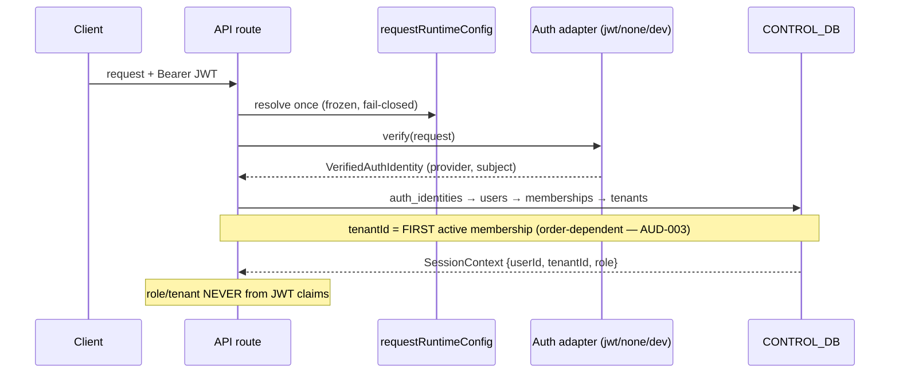
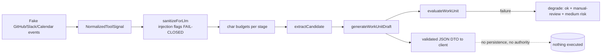
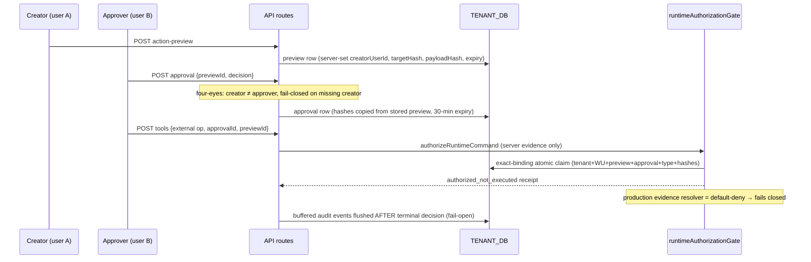
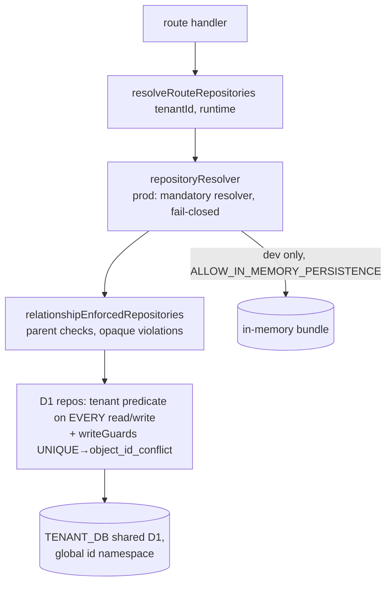
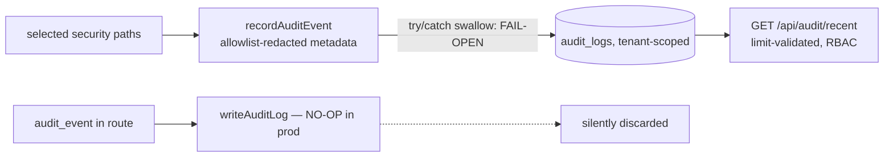
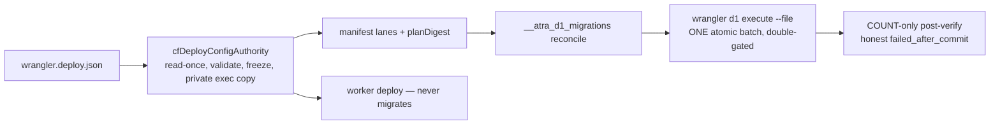

# Data-Flow Map — Large-SaaS Refactor Program

Base: `origin/main` @ `2669f2ea`. Companion to `DEPENDENCY_MAP.md` (module
structure); this file follows the data.

## F1 — Authentication & tenant attribution

## F2 — Signal ingestion & LLM pipeline (advisory only)

Tenant data sent to LLM: sanitized signal content only; provider disabled in
production; mock-only in dev. API key from request-scoped config on the tools
route (`projectLlmEnv`).

## F3 — Preview → Approval → Runtime authorization (no execution)

## F4 — Persistence write path (tenant isolation)

## F5 — Audit data flow (current, defective)

## F6 — Operator deploy/migration flow (no runtime coupling)

## Trust-boundary summary

| Boundary | Enforcement | Gaps |
|---|---|---|
| Client → server fields | `hasClientOwnedFields`, bounded JSON | DTO leakage of server fields tracked in #134 |
| Tenant → tenant | SQL predicates + relationship enforcement + write guards | order-dependent tenant attribution (AUD-003); shared global id namespace (by design, fail-closed) |
| LLM → product state | advisory-only pipeline; no tool authority; injection fail-closed | eval-stage fail-open is deliberate but undocumented for operators |
| App → providers | kill switch + gate; no executor exists | provider tokens global, not per-tenant (R-09) |
| Env → config | request-scoped validated config | module-scope CSRF allowlist (AUD-002); stray direct reads (map §Findings) |
| Operator → remote D1 | double gates, artifact binding, one authority | remote execution never yet exercised (#155) |
