# Dependency Map — Large-SaaS Refactor Program

Base: `origin/main` @ `0b20218d`. Derived from the static import graph rooted at
`app/page.tsx`, `app/layout.tsx`, and the 9 API routes (see
`SYSTEM_INVENTORY.md` §0 for the reachability method).

## Layer map (current, as-built)

```mermaid
graph TD
  subgraph UI
    PAGE[page.tsx → WorkUnitOSDashboard]
    ADOPTED[workunit-os/adopted/*]
    LAUNCHER[workunit-os/launcher/*]
  end

  subgraph API["API routes (9)"]
    TOOLS[/workunit/tools/]
    INBOX[/workunit/inbox/]
    PREVIEW[/action-preview/]
    APPROVAL[/approval + status/]
    DRYRUN[/execution/dry-run/]
    FEEDBACK[/feedback/]
    AUDITR[/audit/recent/]
    INTEG[/integrations/status/]
  end

  subgraph AppServices["Application services"]
    SESSIONR[auth/sessionResolver]
    LLMPIPE[llm/processWorkSignal]
    INBOXAPP[application/workunitInbox/*]
  end

  subgraph Security["Security library"]
    RTCFG[runtime/requestRuntimeConfig ★env authority]
    SESSION[security/session]
    RBAC[security/rbac+policy+tenantAccess]
    CSRF[security/csrfProtection ⚠module-scope env]
    RATE[security/rateLimitGate ⚠in-memory global]
    APPROVALS[security/approvalStore+resolver]
    RUNGATE[security/runtimeAuthorizationGate]
    AUDIT[security/auditLog ⚠no-op + auditPersistence fail-open]
  end

  subgraph Domain
    DTYPES[domain/types + workUnitLifecycle]
    P6[phase6/* evidence artifacts]
  end

  subgraph Persistence
    ROUTEREPO[persistence/routeRepositories ★mandatory resolver]
    RESOLVER[repositoryResolver + tenantDbResolver]
    RELENF[relationshipEnforcedRepositories]
    D1[d1/* repositories + writeGuards]
    INMEM[inMemoryRepositories dev/test]
    CONTROL[infrastructure/persistence/control/*]
  end

  subgraph Providers["Provider adapters"]
    GH[github fake client ⚠direct process.env]
    SLACK[slack fake]
    CAL[calendar fake]
    DEEPSEEK[llm/deepseekProvider — unwired]
    MOCKLLM[llm/mockProvider dev-only]
  end

  PAGE --> ADOPTED --> LAUNCHER
  API --> RTCFG
  API --> SESSION --> SESSIONR --> CONTROL
  API --> RBAC
  TOOLS --> LLMPIPE --> MOCKLLM
  TOOLS --> RUNGATE --> APPROVALS
  INBOX --> GH & SLACK & CAL
  INBOX --> INBOXAPP
  API --> ROUTEREPO --> RESOLVER --> RELENF --> D1
  RESOLVER --> INMEM
  RUNGATE --> P6
  API --> AUDIT
  LLMPIPE --> DTYPES
```

★ = designated authority chokepoint. ⚠ = boundary violation or known defect.

## Findings against the Phase 4 checklist

1. **Circular dependencies:** none critical detected between layers on runtime
   paths. `session.ts ↔ sessionResolver.ts` are mutually aware only via types;
   `requestRuntimeConfig` is imported by both routes and `session`, forming a
   diamond, not a cycle.
2. **Provider code imported into domain code:** none. `app/lib/domain/**`
   imports only `tenant/types`. Verified by grep; to be locked by the
   dependency-direction tests in `refactor/domain-boundaries`.
3. **API routes containing business logic:** `app/api/workunit/tools/route.ts`
   (504 lines) embeds LLM-ingest orchestration, approval-store selection,
   error-mapping tables, and the runtime-authorization driver. Approval route
   embeds the four-eyes rule + approval-row construction. → workstream
   `refactor/domain-boundaries` (extraction to application services).
4. **Repository objects created outside approved factories:**
   `approvalStoreResolver.ts` keeps a module-global dev repo
   (`devInMemoryRepo`); the inbox route hand-builds `TenantDbContext
   { db: null }` (`inbox/route.ts:146`). Both bypass the bundle factory.
5. **Direct database access outside persistence boundaries:** none found —
   all SQL lives in `app/lib/persistence/d1/**` and
   `infrastructure/persistence/control/**`.
6. **Process-global mutable state:** `rateLimitGate.ts` `store` (Map),
   `approvalStoreResolver.ts` `devInMemoryRepo`, `sharedInMemoryStores.ts`
   (dev persistence). On Cloudflare Workers these are per-isolate →
   finding AUD-001.
7. **Request context lost across async boundaries:** none observed — context is
   passed explicitly (no AsyncLocalStorage reliance on runtime paths); the
   injected-env test seam is scoped.
8. **Environment access outside runtime config boundaries:**
   `csrfProtection.ts` (module scope — AUD-002), `resolveGitHubSource.ts`,
   `approvalStoreResolver.ts`, `providerConfig.ts`/`deepseekProvider.ts`
   default-parameter fallbacks, `auditLog.ts`. All are default-parameter or
   dev-path reads except the CSRF module-scope constant, which is load-time.

## Unreachable code (change-cost driver)

- 66 files imported by **nothing** (5 abandoned UI generations —
  `components/{decision,studio,workunit,workunitInbox,legacy,inbox,hopper}` —
  plus orphaned lib modules incl. `app/lib/security/tenantSecret.ts`).
- 120 files reachable **only from tests** (unwired-but-tested: most of
  `application/llmProvider/*` gates, `subagents/*`, parts of `phase6/*`).
- Consolidated under Issue #137 (ratcheted cleanup; deletions require the
  Phase 16 rule 15 proof of unreachability, which the reachability ratchet test
  in `refactor/domain-boundaries` provides).
