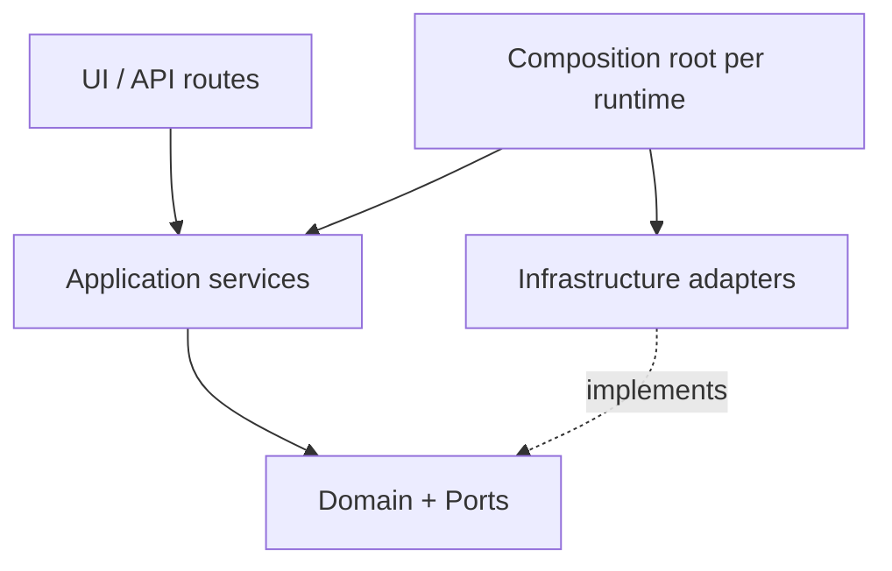

# Target Architecture — Large-SaaS Foundation

Program root: `refactor/large-saas-foundation` (base `origin/main` @ `0b20218d`).
Companion ADRs: `docs/adr/ADR-0001..0004`.

## Layering (required dependency direction)



```text
UI/API
  → Application
    → Domain + Ports
      ← Infrastructure adapters
```

Domain and application modules MUST NOT import: Cloudflare, GitHub, Gmail,
Slack, Google Calendar, Node `process.env`, D1 implementation classes, or LLM
provider SDKs — except through explicit ports wired at composition roots.
This is enforced by dependency-direction tests (first workstream PR), not by
convention.

## Target module layout

| Layer | Location (target) | Contents | Today's source |
|---|---|---|---|
| Domain | `app/lib/domain/**` | entities, lifecycles, invariants, branded IDs | already close; absorb status-transition typing |
| Ports | `app/lib/domain/ports/**` (new) | `ApprovalStore`, repository interfaces, `LlmProviderPort`, `ProviderActionPort`, `AuditEmitterPort`, `RateLimiterPort`, `ClockPort` | interfaces scattered in `persistence/`, `security/`, `llm/` |
| Application | `app/lib/application/**` | route-free use-cases: `ingestSignal`, `createPreview`, `decideApproval`, `authorizeExternalAction`, `fetchInbox` | logic currently inside `app/api/**` routes |
| Infrastructure | `app/lib/infrastructure/**` | D1 repos, control repos, provider adapters (fake + future real), DeepSeek adapter, durable rate limiter | `persistence/d1`, `infrastructure/external`, `llm/deepseekProvider` |
| Runtime/config | `app/lib/runtime/**` | `requestRuntimeConfig` stays the ONLY env authority; per-request composition root builds the port bundle | exists; close stray env reads (AUD-002, R-08) |
| Policy/authorization | `app/lib/security/**` | RBAC, four-eyes, runtime authorization gate, approval MAC | exists; gate stays the sole external-op authority |
| External action executor | `app/lib/application/execution/**` (new, gated) | provider-port executor consuming ONLY gate receipts; idempotency keys; at-least-once with recorded provider refs | does not exist (#152) — built last, behind kill switch |
| Audit/observability | `app/lib/observability/**` (new) | structured emitter with correlation IDs; audit events fail-closed for security decisions (or loss-counted), metrics hooks | `auditLog` no-op + scattered `recordAuditEvent` |
| LLM boundary | `app/lib/llm/**` | pipeline stays advisory-only; provider behind port; token budgets | exists; #135 hardening |

## Composition roots

- **Cloudflare Worker (production):** route handler → `resolveValidatedRequestRuntimeConfig()`
  → `composeRequestServices(runtime)` → application use-case. No other module
  reads env or constructs adapters.
- **Local Node dev:** same composition function, `source: "local"` config.
- **Tests:** compose with fakes/in-memory adapters through the same function —
  no test-only wiring paths inside production modules.

## Authority invariants (unchanged by refactor)

1. Tenant + role come only from control-DB membership (never JWT claims,
   never client fields).
2. Every persistence access goes through the mandatory resolver and
   tenant-scoped repositories; fail closed.
3. External operations require: kill switch on → server-side evidence →
   four-eyes approval → exact-binding atomic claim → (future) executor with
   idempotency key. An LLM output or client request can never authorize
   execution.
4. Migration/deploy authority stays operator-side, double-gated,
   artifact-bound; the runtime never migrates.
5. All dev capabilities remain impossible in Cloudflare production
   (fail-closed `ALLOW_*` rejection).

## Deltas from current state (what actually changes)

| # | Change | Fixes |
|---|---|---|
| 1 | Extract route-embedded orchestration into application services | AUD-008, A/K scores |
| 2 | Ports directory + dependency-direction enforcement | A score, prevents provider/domain coupling |
| 3 | CSRF origin authority moved into `requestRuntimeConfig` (request-scoped, deploy-configurable) | AUD-002 |
| 4 | Durable rate limiting port (DO/KV-backed in production; in-memory only behind dev capability) | AUD-001 |
| 5 | Deterministic tenant selection (explicit tenant claim in session exchange, validated against membership) | AUD-003 |
| 6 | Observability module: correlation IDs, structured emitter, fail-closed/loss-counted security audit | AUD-004, #156, #133 |
| 7 | Contract tests per route (envelope, DTO allowlist, status codes) then DTO tightening | #131, #134, K score |
| 8 | Pagination + bounded batch writes on inbox; perf baselines for 8 critical paths | AUD-006 |
| 9 | CI: tsc gate (after test-file error burn-down), SHA-pinned actions, dependency automation, audit gate | AUD-005, #128, #136 |
| 10 | Staged dead-code deletion under reachability ratchet | AUD-007, #137, #153 |
| 11 | Data lifecycle: PII map, retention, deletion/export, offboarding | AUD-009, P score |
| 12 | (Last) provider executor behind the gate with idempotency + failure injection | #152, #151, F score |

## Non-goals

- No provider execution enablement (kill switch stays off; #152 executor ships
  dark).
- No remote D1 operations (#155 stays open; operator-owned).
- No auth-scheme change (JWT/HS256 stays; rotation is documented, not rebuilt).
- No UI redesign (dashboard wiring gaps #153/#154 are tracked but only the
  dead-tree deletion is in scope).
- No schema rewrite; only additive, manifest-managed migrations.
