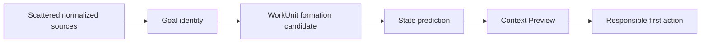
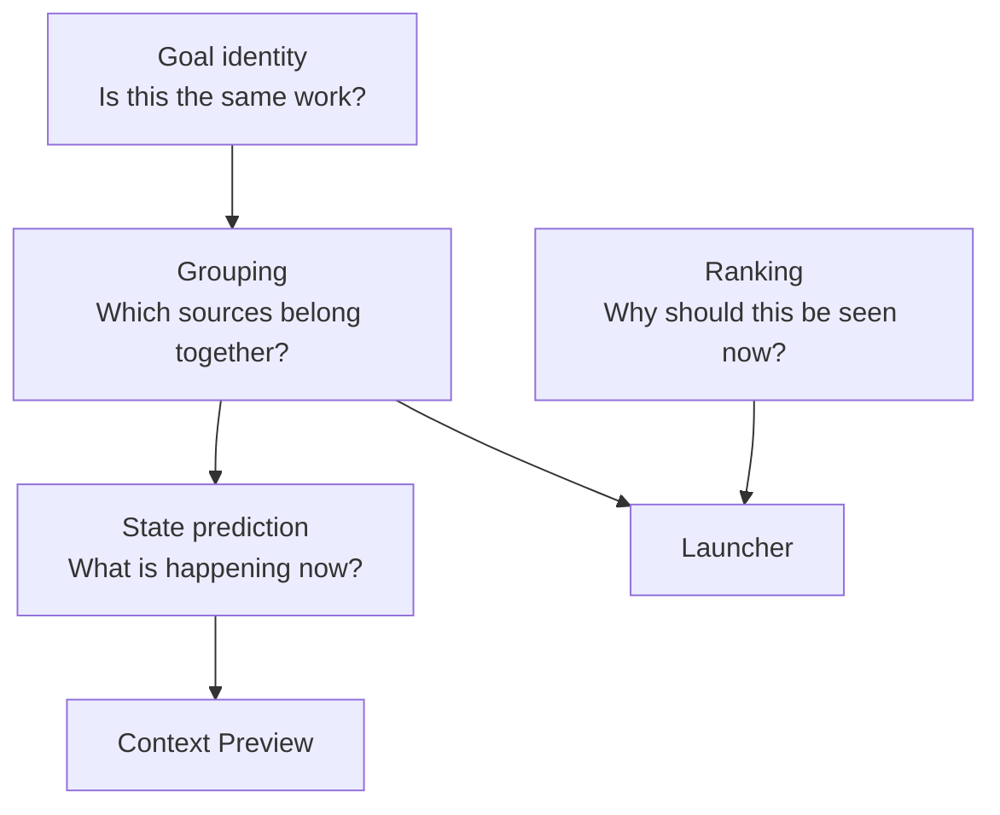
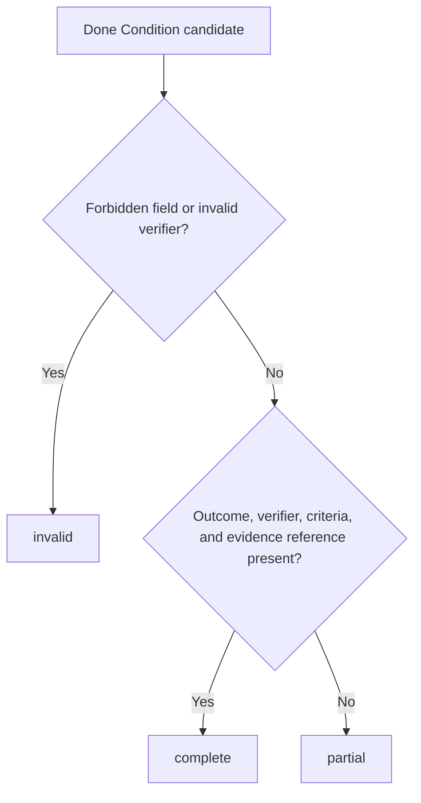
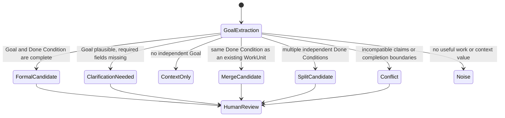

# WorkUnit Goal / Done Condition UX Contract

## 0. Status and scope

This document defines the UX contract used to decide whether one or more normalized sources should become the same WorkUnit candidate.

It is a product and information-design contract. It does not authorize or specify:

- OAuth or provider token handling
- provider write operations
- approval creation
- external execution
- persistence migrations
- a production LLM connection
- automatic merge or split finalization

All outputs covered by this document remain candidate-only and require human review before formalization.

## 1. Product objective

Atra must help a user predict and understand the current state of work before returning to the original source.

The core transformation is:



The product must not merely place GitHub, Slack, Notion, Gmail, Calendar, or Drive items next to each other.

It must answer:

1. Do these sources belong to the same goal?
2. What must become true for that goal to be considered complete?
3. What is the current state of that work?
4. What is missing, unresolved, stale, or conflicting?
5. Which original source should the user open next?

## 2. Canonical separation of concerns

The following concerns must remain separate.



### 2.1 Goal identity

Goal identity decides whether sources may belong to the same WorkUnit.

It is based primarily on:

- outcome
- work object
- verifier
- acceptance criteria
- decision boundary
- independent closure

### 2.2 State prediction

State prediction explains the present condition of an already-grouped WorkUnit.

It is based on:

- actors
- deadline or limit
- event time
- updates
- authority
- unresolved items
- missing information
- conflicts

### 2.3 Ranking

Ranking decides which WorkUnit should appear first in the Launcher.

It may use:

- impact
- urgency
- effort
- freshness
- actionability
- relationship cost
- expected value

Ranking factors must not determine grouping by themselves.

`ROI` is a ranking concept. It is not a Goal identity field and is not the current state itself.

## 3. WorkUnit formation principle

The primary grouping question is:

> Do these sources describe work that aims at the same independently verifiable completion state?

A WorkUnit candidate may be formed only when the sources can be explained under one Goal and one Done Condition boundary.

```text
Same topic != same WorkUnit
Same actor != same WorkUnit
Same deadline != same WorkUnit
Same provider != same WorkUnit
Same independently verifiable Goal + Done Condition = possible same WorkUnit
```

## 4. Goal Contract

A Goal describes the state the WorkUnit is intended to reach. It is not a vague theme or a list of activities.

### 4.1 Required Goal fields

| Field | Meaning | UX question |
| --- | --- | --- |
| `outcome` | The state that must become true | What must be true when this work is complete? |
| `workObject` | The concrete object being changed, reviewed, decided, or prepared | What exactly is this work about? |
| `decisionNeeded` | The human decision enabled by the WorkUnit | What must the user decide? |
| `scope` | The included boundary | What is inside this WorkUnit? |
| `verifier` | The non-AI person or role that can verify completion | Who can confirm completion? |
| `timeHorizon` | Deadline, release gate, review point, or relevant time boundary | By when or before what event? |

### 4.2 Goal display sentence

The user-facing Goal should normally be expressible as one sentence:

```text
Make [workObject] ready for [verifier] to [decisionNeeded].
```

Example:

```text
Make Authentication PR #241 ready for the reviewer to decide whether it can be approved under the current authentication specification.
```

### 4.3 Goal quality rules

A Goal is acceptable when:

- it describes a resulting state, not only an action
- it identifies a concrete work object
- it enables one main decision
- its scope can be distinguished from adjacent work
- it can be closed independently or has an explicit parent boundary
- it does not use the AI or system as the final verifier

Bad Goal examples:

```text
Review Slack.
Check the PR.
Handle authentication.
Look at the specification.
```

Better Goal examples:

```text
Make PR #241 ready for a reviewer to decide whether its error handling conforms to Authentication Policy v3.
Prepare a decision-ready comparison of Postgres and ClickHouse for the analytics architecture owner.
```

## 5. Done Condition Contract

A Done Condition is the verification contract that closes the Goal.

### 5.1 Required Done Condition fields

| Field | Required | Meaning |
| --- | ---: | --- |
| `outcome` | Yes | The resulting state |
| `verifier` | Yes | Human owner or responsible role that verifies the result |
| `acceptanceCriteria` | Yes | Observable conditions used to verify the outcome |
| `evidenceRefs` | Yes | Safe references to original sources or human input |
| `independentClosure` | Yes | Whether this work can close separately from adjacent work |
| `missingFields` | Derived | Required fields that have not been established |
| `conflicts` | Derived | Incompatible claims across sources |
| `status` | Derived | `complete`, `partial`, or `invalid` |

### 5.2 Status rules



- `complete`: all required fields exist and no invalid reason is present
- `partial`: the Goal is plausible, but required information is missing
- `invalid`: safety, trust, or contract constraints are violated

A complete Done Condition is still only a candidate. It does not mean the WorkUnit is reviewed, approved, executed, or done.

### 5.3 User-facing Done Condition

The Context Preview should express the Done Condition as short observable criteria.

```text
DONE WHEN

- PR error responses match Authentication Policy v3
- All blocking review comments are resolved or explicitly deferred
- The reviewer can make an approval decision from the linked evidence
```

Do not expose internal scores or raw model reasoning.

## 6. Goal identity and grouping rules

### 6.1 Strong grouping evidence

The following signals strongly support one WorkUnit:

- same provider object identifier, such as the same PR, issue, thread, document, or email conversation
- explicit cross-source links
- same concrete deliverable or work object
- same outcome
- same verifier
- compatible acceptance criteria
- same decision or approval boundary
- one source explicitly extends or updates another

### 6.2 Weak grouping evidence

The following may support grouping but must not be sufficient alone:

- same actor
- same team
- same topic
- similar wording
- close timestamps
- same deadline
- same repository or channel
- same urgency
- high semantic similarity

### 6.3 Mandatory split indicators

Propose separate WorkUnits when one or more of the following is true:

- different independently closable outcomes
- different deliverables
- different verifiers
- different approval or decision boundaries
- one source contains several major decisions
- research, implementation, and external response can complete independently
- completion of one part does not imply completion of another

### 6.4 Merge candidate

Propose a merge only when an existing WorkUnit and a new candidate appear to share the same Done Condition.

The UI must show the human-readable reason:

```text
Suggested merge because:
- both sources reference PR #241
- both concern Authentication Policy v3
- both require the same reviewer decision
```

### 6.5 Split candidate

A split proposal must show candidate parts and why each part has an independent Done Condition.

```text
Suggested split:
1. Verify authentication error handling
2. Prepare customer response

Reason:
Each part has a different verifier and can close independently.
```

## 7. WorkUnit formation states

The UX must distinguish the following states.



### 7.1 `formal_candidate`

The Goal and Done Condition contract is complete enough for human review.

### 7.2 `clarification_needed`

The system can describe the likely Goal but cannot safely establish one or more required fields.

The UX must ask one focused clarification question, not invent a value.

### 7.3 `context_only`

The source supports an existing WorkUnit but has no independent Done Condition.

Examples:

- CI log for an existing PR review
- additional Slack comment in the same unresolved discussion
- a linked specification excerpt

### 7.4 `merge_candidate`

The source likely belongs to an existing WorkUnit with the same Done Condition.

### 7.5 `split_candidate`

One candidate includes multiple independently closable Goals.

### 7.6 `conflict`

Sources disagree about the current specification, accepted decision, deadline, owner, or completion criteria.

### 7.7 `noise`

The source has no useful Goal or supporting context after normalization.

## 8. State Prediction Contract

State prediction is generated only after provisional grouping.

It answers:

> Given the grouped sources, what is most likely happening now, why does it matter now, and what remains unresolved?

### 8.1 State factors

| Factor | Purpose | Example |
| --- | --- | --- |
| `actor` | Identify requester, owner, contributor, and verifier roles | Reviewer requested changes; customer asked for confirmation |
| `limit` | Identify deadlines, release gates, meetings, or contractual boundaries | Release decision tomorrow |
| `eventTime` | Preserve when each event occurred | Slack request posted 3 hours ago |
| `update` | Explain what changed since the previous state | PR updated after specification change |
| `authority` | Estimate which source can establish a decision or specification | Accepted Notion policy vs informal Slack suggestion |
| `unresolved` | Identify open questions, comments, missing approvals, and blockers | Error response remains undefined |
| `missing` | Identify required but unavailable information | Customer acceptance not found |
| `conflict` | Identify incompatible claims | Notion says v3; PR description references v2 |

### 8.2 Actor is contextual, not a fixed weight

Actor importance must not be a universal static number.

It must be interpreted by role and context:

- requester
- owner
- verifier
- decision authority
- domain expert
- external stakeholder
- participant only

The same person may have high authority for one topic and no authority for another.

### 8.3 Authority is claim-specific

Provider identity does not determine authority by itself.

```text
Notion != always accepted specification
Slack != always informal discussion
Gmail != always formal approval
GitHub != always implementation truth
```

Authority should be inferred from safe metadata and content signals such as:

- explicit accepted or approved status
- document ownership
- latest applicable version
- named decision maker
- signed-off review
- official customer or legal communication
- superseded or stale markers

### 8.4 Time and update are separate

- `eventTime` states when a source event happened
- `update` states what changed in the WorkUnit model

A recent low-value message must not outweigh an older authoritative specification solely because it is newer.

## 9. Ranking Contract

Ranking occurs after WorkUnit formation and must not alter Goal identity.

Possible factors:

- impact
- urgency
- freshness
- actionability
- unresolved blocking state
- deadline proximity
- expected downstream value
- effort
- relationship cost

The Launcher should explain ranking through `Why now`, not expose a single unexplained score by default.

Example:

```text
WHY NOW
The PR changed after the accepted specification update, and the release decision is tomorrow.
```

If a numeric ROI remains internally, it must be treated as a ranking aid and not as grouping evidence, Goal truth, or current state.

## 10. Context Preview UX contract

The minimum Context Preview order is:

```text
GOAL
DONE WHEN
CURRENT STATE
WHY NOW
DECISION NEEDED
MISSING / CONFLICT
SOURCE ROLES
GROUPING EXPLANATION
NEXT ACTION
OPEN SOURCE
GROUPING CORRECTION
```

### 10.1 Goal

Show one human-readable Goal sentence.

### 10.2 Done When

Show observable acceptance criteria and a compact completeness state.

```text
3 criteria · 1 missing
```

### 10.3 Current State

Describe current facts and changes in two to four sentences. Do not mix recommendation into this section.

### 10.4 Why Now

Explain the time-sensitive reason in one short statement.

### 10.5 Decision Needed

Show one main human decision. Multiple major decisions indicate a possible split.

### 10.6 Missing / Conflict

Show missing and conflicting information as product value, not as a generic system error.

### 10.7 Source Roles

Show the role played by each source before the provider name.

```text
IMPLEMENTATION
GitHub PR #241

ACCEPTED SPECIFICATION
Notion · Authentication Policy v3

ORIGINAL REQUEST
Slack thread

EXTERNAL CONTEXT
Gmail thread
```

### 10.8 Grouping explanation

Provide concise, human-readable reasons for the grouping decision.

Do not expose chain-of-thought, embeddings, or hidden model reasoning.

### 10.9 Next Action

Show one responsible next action that advances the decision.

### 10.10 Grouping correction

Always provide a lightweight correction path:

```text
Correct
Wrong grouping
Missing source
```

Expanded operations may include:

- move source
- merge WorkUnits
- split WorkUnit
- remove source
- add missing source

No correction automatically formalizes, approves, or executes a WorkUnit.

## 11. Provider-independent source role model

Provider and source role must remain separate.

Suggested source roles:

- `implementation`
- `original_request`
- `accepted_specification`
- `decision_record`
- `external_context`
- `review_state`
- `evidence`
- `open_question`
- `deadline_context`
- `historical_context`
- `contradicting_claim`

The same provider may supply different roles in different WorkUnits.

## 12. LLM and deterministic processing boundary

The repository currently separates candidate extraction, draft generation, evaluation, decomposition candidates, and safety gates. This contract should be mapped onto those boundaries rather than bypassing them.

Recommended conceptual flow:

```mermaid
flowchart LR
    A["Normalized source"]
    B["Sanitize"]
    C["Source candidate extraction"]
    D["Goal / Done Condition extraction"]
    E["Deterministic contract validation"]
    F["Grouping candidates"]
    G["Source role assignment"]
    H["State prediction"]
    I["WorkUnit formation candidate"]
    J["Human correction"]

    A --> B --> C --> D --> E --> F --> G --> H --> I --> J
```



Rules:

- raw provider payloads are not prompt inputs by default
- sanitized input remains untrusted
- LLM output is never accepted without validation and normalization
- the LLM may propose fields; deterministic logic validates contract completeness and safety
- the AI must not be the final verifier
- missing information must remain missing
- merge and split remain proposals until human confirmation
- candidate-only outputs must not create approvals, execution commands, or external payloads

## 13. Repository alignment

The implementation plan should reuse and extend existing concepts where possible:

- normalized signal models
- `SourceCandidate`
- candidate-only frontend contracts
- decomposition candidate classifications
- `DoneConditionDraft`
- deterministic Done Condition evaluation
- merge and split candidate types
- human review flags
- allowlist projection and forbidden-field exclusion

Do not create a parallel completion model without first explaining why the existing Done Condition model is insufficient.

Known mismatch to address in planning:

- the normal signal-to-WorkUnit path remains primarily one signal to one WorkUnit
- the current launcher model is single-source oriented
- current launcher ranking exposes ROI and fixed status concepts
- the current Atra process-stage canvas is a fixed presentation skeleton
- multi-source membership, source roles, grouping explanations, conflicts, and corrections are not yet represented in the public candidate contract

## 14. Non-goals for the first implementation plan

Do not include the following in the first implementation slice:

- real provider write actions
- approval UI changes
- dry-run or execution changes
- graph physics
- automatic final merge or split
- hidden autonomous WorkUnit formalization
- online learning or vector tuning
- a fixed universal ActorWeight
- production LLM enablement
- raw provider payload access from UI

## 15. Planning requirements for Agents

Agents planning implementation from this contract must produce:

1. current-state map of relevant files and contracts
2. gap analysis between current candidate models and this UX contract
3. proposed domain types for Goal, Done Condition, source membership, source role, state prediction, missing, and conflict
4. deterministic validation rules
5. LLM proposal boundaries and output validation
6. grouping, merge, and split proposal flow
7. Launcher and Context Preview view-model changes
8. grouping correction UX states
9. test strategy with gold-label fixtures
10. phased PR plan with small, reviewable slices
11. explicit safety invariants preserved in every phase
12. explicit non-goals

The plan must not implement code in the planning phase.

## 16. Acceptance criteria for this contract

This contract is correctly applied when:

- two sources are not merged solely because they share a topic, actor, time, or urgency
- a WorkUnit candidate has one understandable Goal and one Done Condition boundary
- missing Goal fields produce clarification rather than invention
- context-only sources do not become independent WorkUnits
- multiple independently closable outcomes produce a split proposal
- the user can understand why sources were grouped
- the user can correct grouping at low cost
- state prediction distinguishes authority, freshness, updates, and unresolved items
- ranking remains separate from grouping
- the UI can return the user to the relevant original source
- all results remain candidate-only until human review
- no approval or external execution boundary is weakened

## 17. Canonical summary

```text
WorkUnit integration condition
= same Goal + compatible Done Condition

Goal identity
= outcome + work object + verifier + acceptance criteria + decision boundary

State prediction
= actor + limit + event time + update + authority + unresolved + missing + conflict

Ranking
= impact + urgency + freshness + actionability + effort + expected value
```

Atra must not optimize only for finding similar information.

It must help the user understand the present state of one real piece of work, identify what is missing, and reach a responsible first action with fewer source hops.
